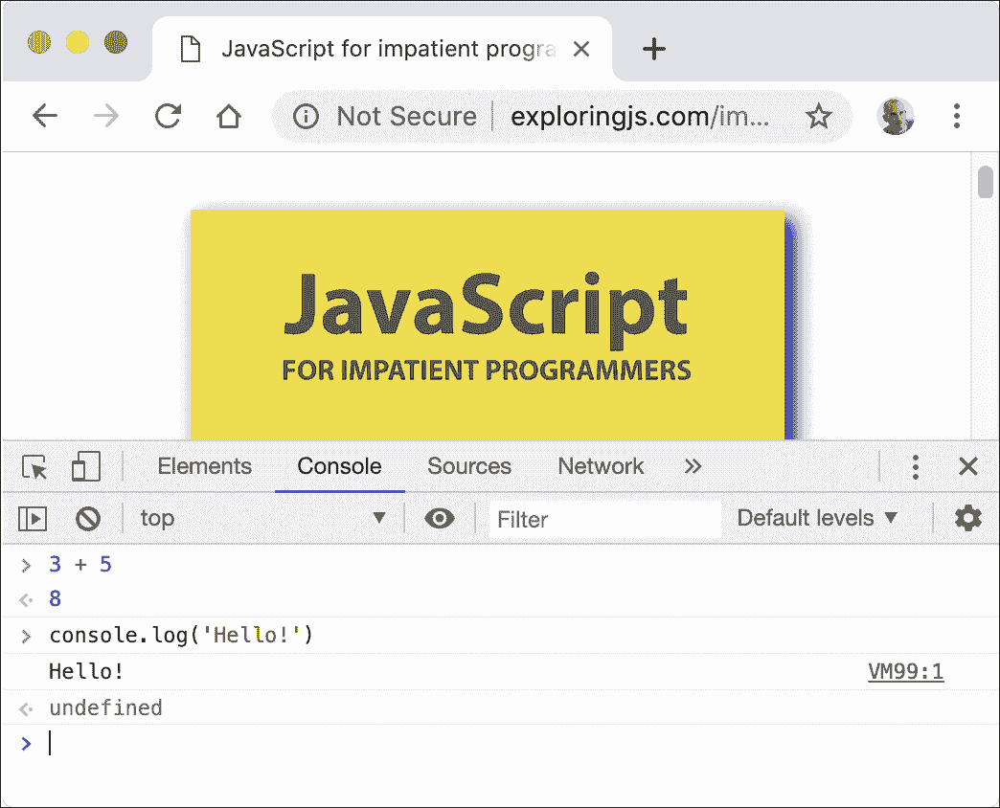
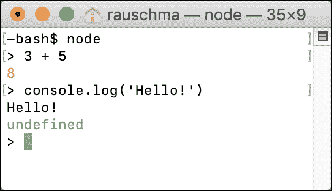

# 10   控制台：交互式 JavaScript 命令行

> 原文：[`exploringjs.com/js/book/ch_console.html`](https://exploringjs.com/js/book/ch_console.html)

1.  10.1   尝试运行 JavaScript 代码

    1.  10.1.1   浏览器控制台

    1.  10.1.2   Node.js 的 REPL

    1.  10.1.3   其他选项

1.  10.2   `console.*` API：打印数据和更多

    1.  10.2.1   打印值：`console.log()` (stdout)

    1.  10.2.2   打印错误信息：`console.error()` (stderr)

    1.  10.2.3   通过`JSON.stringify()`打印嵌套对象

### 10.1   尝试运行 JavaScript 代码

你有很多选项可以快速运行 JavaScript 代码片段。以下小节将描述其中的一些。

#### 10.1.1   浏览器控制台

网络浏览器有所谓的*控制台*：你可以通过`console.log()`向其打印文本的交互式命令行，你可以在其中运行代码片段。打开控制台的方法因浏览器而异。图 10.1 显示了 Google Chrome 的控制台。

要了解如何在你的网络浏览器中打开控制台，你可以通过搜索“控制台 «你的浏览器名称»”来进行网络搜索。以下是一些常用网络浏览器的页面：

+   [Apple Safari](https://developer.apple.com/safari/tools/)

+   [Google Chrome](https://developer.chrome.com/docs/devtools/console/)

+   [Microsoft Edge](https://learn.microsoft.com/en-us/microsoft-edge/devtools-guide-chromium/console/)

+   [Mozilla Firefox](https://firefox-source-docs.mozilla.org/devtools-user/web_console/)



图 10.1：在访问网页时，网络浏览器“Google Chrome”的控制台已打开（在窗口的下半部分）。

#### 10.1.2   Node.js 的 REPL

*REPL*代表*读取-评估-打印循环*，基本上意味着*命令行*。要使用它，你必须首先从操作系统命令行启动 Node.js，通过命令`node`。然后与它的交互看起来如图 10.2 所示：`>`后面的文本是用户输入；其余的都是 Node.js 的输出。



图 10.2：启动和使用 Node.js 的 REPL（交互式命令行）。

 **阅读：REPL 交互**

我偶尔会通过 REPL 交互演示 JavaScript。然后我也使用大于号符号（`>`）来标记输入 - 例如：

```js
> 3 + 5
8

```

#### 10.1.3   其他选项

其他选项包括：

+   有许多网络应用允许你在网络浏览器中尝试 JavaScript - 例如，[Babel 的 REPL](https://babeljs.io/repl)。

+   还有一些原生应用和 IDE 插件可以运行 JavaScript。

 **控制台通常以非严格模式运行**

在现代 JavaScript 中，大多数代码（例如，模块）都是在 严格模式 下执行的。然而，控制台通常以非严格模式运行。因此，当使用控制台执行本书中的代码时，你可能会偶尔得到略微不同的结果。

### 10.2 `console.*` API：打印数据和更多

在浏览器中，控制台是通常隐藏的可以调出的东西。对于 Node.js，控制台是 Node.js 当前运行的终端。

完整的 `console.*` API 文档位于 [MDN 网络文档](https://developer.mozilla.org/en-US/docs/Web/API/console) 和 [Node.js 网站上](https://nodejs.org/api/console.html)。它不是 JavaScript 语言标准的一部分，但许多功能都得到了浏览器和 Node.js 的支持。

在本章中，我们只查看以下两种打印数据的方法（“打印”意味着在控制台显示）：

+   `console.log()`

+   `console.error()`

#### 10.2.1 打印值：`console.log()`（标准输出）

这个操作有两种变体：

```js
console.log(...values: Array<any>): void
console.log(pattern: string, ...values: Array<any>): void

```

##### 10.2.1.1 打印多个值

第一个变体在控制台上打印（值的）文本表示：

```js
console.log('abc', 123, true);

```

输出：

```js
abc 123 true

```

最后，`console.log()` 总是打印一个换行符。因此，如果你不带任何参数调用它，它只会打印一个换行符。

##### 10.2.1.2 打印带有替换的字符串

第二个变体执行字符串替换：

```js
console.log('Test: %s %j', 123, 'abc');

```

输出：

```js
Test: 123 "abc"

```

这些是一些你可以使用的替换指令：

+   `%s` 将相应的值转换为字符串并插入。

    ```js
    console.log('%s %s', 'abc', 123);

    ```

    输出：

    ```js
    abc 123

    ```

+   `%o` 插入对象的字符串表示。

    ```js
    console.log('%o', {foo: 123, bar: 'abc'});

    ```

    输出：

    ```js
    { foo: 123, bar: 'abc' }

    ```

+   `%j` 将值转换为 JSON 字符串并插入。

    ```js
    console.log('%j', {foo: 123, bar: 'abc'});

    ```

    输出：

    ```js
    {"foo":123,"bar":"abc"}

    ```

+   `%%` 插入一个单个的 `%`。

    ```js
    console.log('%s%%', 99);

    ```

    输出：

    ```js
    99%

    ```

#### 10.2.2 打印错误信息：`console.error()`（标准错误）

`console.error()` 与 `console.log()` 的工作方式相同，但它记录的内容被认为是错误信息。对于 Node.js，这意味着输出会发送到 Unix 上的 stderr 而不是 stdout。

#### 10.2.3 通过 `JSON.stringify()` 打印嵌套对象

`JSON.stringify()` 有时对于打印嵌套对象很有用：

```js
console.log(JSON.stringify({first: 'Jane', last: 'Doe'}, null, 2));

```

输出：

```js
{
  "first": "Jane",
  "last": "Doe"
}

```
