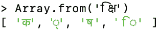
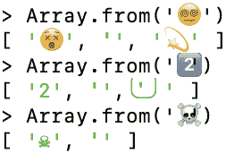
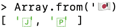

# 21 Unicode – 简要介绍（高级）

> 原文：[`exploringjs.com/js/book/ch_unicode.html`](https://exploringjs.com/js/book/ch_unicode.html)

1.  21.1 码点与码位

    1.  21.1.1 码点

    1.  21.1.2 编码 Unicode 码点：UTF-32，UTF-16，UTF-8

1.  21.2 网络开发中使用的编码：UTF-16 和 UTF-8

    1.  21.2.1 内部源代码：UTF-16

    1.  21.2.2 字符串：UTF-16

    1.  21.2.3 源代码在文件中：UTF-8

1.  21.3 图形群组 – 真正的字符

    1.  21.3.1 图形群组与符号

Unicode 是一个用于表示和管理世界上大多数书写系统的标准。几乎所有处理文本的现代软件都支持 Unicode。该标准由 Unicode 联盟维护。每年发布一个新的标准版本（包括新的表情符号等）。Unicode 1.0.0 版本于 1991 年 10 月发布。

### 21.1 码点与码位

两个概念对于理解 Unicode 至关重要：

+   *码点*是代表 Unicode 文本原子部分的数字。其中大部分代表可见符号，但它们也可以有其他含义，例如指定符号的某个方面（字母的重音，表情符号的肤色等）。

+   *码位*是编码码点的数字，用于存储或传输 Unicode 文本。一个或多个码位编码一个单一的码点。每个码位具有相同的大小，这取决于所使用的*编码格式*。最流行的格式，UTF-8，具有 8 位码位。

#### 21.1.1 码点

Unicode 的第一个版本有 16 位码点。从那时起，字符的数量大幅增长，码点的大小扩展到 21 位。这 21 位被分为 17 个平面，每个平面 16 位：

+   平面 0：**基本多语言平面 (BMP)**，0x0000–0xFFFF

    +   包含几乎所有现代语言的字符（拉丁字符、亚洲字符等）以及许多符号。

+   平面 1：补充多语言平面 (SMP)，0x10000–0x1FFFF

    +   支持历史书写系统（例如，埃及象形文字和楔形文字）以及额外的现代书写系统。

    +   支持表情符号和许多其他符号。

+   平面 2：补充表意文字平面 (SIP)，0x20000–0x2FFFF

    +   包含额外的 CJK（中文、日文、韩文）表意文字。

+   平面 3–13：未分配

+   平面 14：补充特殊用途平面 (SSP)，0xE0000–0xEFFFF

    +   包含非图形字符，如标签字符和符号变体选择器。

+   平面 15–16：补充专用区 (S PUA A/B)，0x0F0000–0x10FFFF

    +   可供 ISO 和 Unicode 联盟以外的各方进行字符分配。未标准化。

平面 1-16 被称为补充平面或**天体平面**。

让我们检查几个字符的代码点：

```js
> 'A'.codePointAt(0).toString(16)
'41'
> 'ü'.codePointAt(0).toString(16)
'fc'
> 'π'.codePointAt(0).toString(16)
'3c0'
> '🙂'.codePointAt(0).toString(16)
'1f642'

```

代码点的十六进制数告诉我们，前三个字符位于平面 0（16 位以内），而表情符号位于平面 1。

#### 21.1.2 编码 Unicode 代码点：UTF-32、UTF-16、UTF-8

编码代码点的三种主要方式是三种*Unicode 转换格式*（UTFs）：UTF-32、UTF-16、UTF-8。每个格式的结尾数字表示其代码单元的大小（以位为单位）。

##### 21.1.2.1 UTF-32 (Unicode 转换格式 32)

UTF-32 使用 32 位来存储代码单元，每个代码点一个代码单元。这是唯一具有*固定长度编码*的格式；所有其他格式都使用不同数量的代码单元来编码单个代码点。

##### 21.1.2.2 UTF-16 (Unicode 转换格式 16)

UTF-16 使用 16 位代码单元。它按以下方式编码代码点：

+   BMP（Unicode 的第一个 16 位）存储在单个代码单元中。

+   阿斯特拉尔平面：BMP 包含 0x10_000 个代码点。鉴于 Unicode 总共有 0x110_000 个代码点，我们还需要编码剩余的 0x100_000 个代码点（20 位）。BMP 有两个未分配的代码点范围，提供了必要的存储空间：

    +   最显著的 10 位（*前导代理*，*高代理*）：0xD800-0xDBFF

    +   最不显著的 10 位（*后缀代理*，*低代理*）：0xDC00-0xDFFF

因此，每个 UTF-16 代码单元要么：

+   BMP 代码点（一个*标量*）

+   一个前导代理

+   一个后缀代理

如果代理单独出现，没有其伙伴，则称为*孤代理*。

这是代码点的位如何分布在代理之间的：

```js
0bhhhhhhhhhhllllllllll // code point - 0x10000
0b110110hhhhhhhhhh     // 0xD800 + 0bhhhhhhhhhh
0b110111llllllllll     // 0xDC00 + 0bllllllllll

```

JavaScript 字符串中的每个字符都是一个 UTF-16 代码单元。例如，考虑代码点 0x1F642（🙂），它由两个 UTF-16 代码单元表示 – 0xD83D 和 0xDE42：

```js
> '🙂'.codePointAt(0).toString(16)
'1f642'
> '🙂'.length
2
> '🙂'.split('')
[ '\uD83D', '\uDE42' ]

```

让我们从代码点推导出代码单元：

```js
> (0x1F642 - 0x10000).toString(2).padStart(20, '0')
'00001111011001000010'
> (0xD800 + 0b0000111101).toString(16)
'd83d'
> (0xDC00 + 0b1001000010).toString(16)
'de42'

```

相比之下，代码点 0x03C0（π）是 BMP 的一部分，因此由单个 UTF-16 代码单元表示 – 0x03C0：

```js
> 'π'.length
1

```

##### 21.1.2.3 UTF-8 (Unicode 转换格式 8)

UTF-8 有 8 位代码单元。它使用 1-4 个代码单元来编码一个代码点：

| 代码点 | 代码单元 |
| --- | --- |
| 0000–007F | 0bbbbbbb (7 bits) |
| 0080–07FF | 110bbbbb, 10bbbbbb (5+6 bits) |
| 0800–FFFF | 1110bbbb, 10bbbbbb, 10bbbbbb (4+6+6 bits) |
| 10000–1FFFFF | 11110bbb, 10bbbbbb, 10bbbbbb, 10bbbbbb (3+6+6+6 bits) |

注意：

+   每个代码单元的位前缀告诉我们：

    +   它是代码单元系列中的第一个吗？如果是，将跟随多少个代码单元？

    +   它是代码单元系列中的第二个或后续的吗？

+   0000–007F 范围内的字符映射与 ASCII 相同，这导致与旧软件有一定的向后兼容性。

三个示例：

| 字符 | 代码点 | 代码单元 |
| --- | --- | --- |
| A | 0x0041 | 01000001 |
| π | 0x03C0 | 11001111, 10000000 |
| 🙂 | 0x1F642 | 11110000, 10011111, 10011001, 10000010 |

### 21.2 网络开发中使用的编码：UTF-16 和 UTF-8

在网络开发中使用的 Unicode 编码格式是：UTF-16 和 UTF-8。

#### 21.2.1 源代码内部：UTF-16

ECMAScript 规范在内部将源代码表示为 UTF-16。

#### 21.2.2 字符串：UTF-16

JavaScript 字符串中的字符基于 UTF-16 代码单元：

```js
> const smiley = '🙂';
> smiley.length
2
> smiley === '\uD83D\uDE42' // code units
true

```

关于 Unicode 和字符串的更多信息，请参阅“文本的原子：码点、JavaScript 字符、图形群” (§22.7)。

#### 21.2.3 文件中的源代码：UTF-8

现在，HTML 和 JavaScript 文件几乎总是以 UTF-8 编码。

例如，这是现在 HTML 文件通常开始的格式：

```js
<!doctype html>
<html>
<head>
  <meta charset="UTF-8">
···

```

### 21.3 图形群——真正的字符

一旦我们考虑世界上的各种书写系统，字符的概念就会变得非常复杂。这就是为什么有几个不同的 Unicode 术语，它们都以某种方式意味着“字符”：*码点*、*图形群*、*符号*等。

在 Unicode 中，一个 *码点* 是存储在计算机中的文本的原子部分。

然而，一个 *图形群* 最接近于屏幕或纸张上显示的符号。它被定义为“一个水平可分割的文本单位”。因此，[官方 Unicode 文档](https://unicode.org/reports/tr29/#Grapheme_Cluster_Boundaries)也将其称为*用户感知字符*。编码一个图形群需要一个或多个码点。

例如，德文那加里语中的 *kshi* 被编码为 4 个码点。我们使用 `Array.from()` 将字符串拆分为一个包含码点的数组：

> 

许多表情符号由多个码点组成：

> 

国旗表情符号是图形群，由两个码点组成——例如，日本的国旗：

> 

#### 21.3.1 图形群与符号

符号是一个抽象概念，也是书面语言的一部分：

+   它在计算机内存中通过一个 *图形群* 表示——一个由一个或多个码点（数字）组成的序列。

+   它通过 *符号* 在屏幕上绘制。符号是一个图像，通常存储在字体中。可能需要多个符号来绘制单个符号——例如，符号“é”可能通过将“e”符号与“´”符号组合来绘制。

在谈论 Unicode 时，概念与其表示之间的区别是微妙的，并且可能会变得模糊。

 **关于图形群体的更多信息**

更多信息，请参阅 Manish Goregaokar 撰写的[“让我们停止将意义归因于码点”](https://manishearth.github.io/blog/2017/01/14/stop-ascribing-meaning-to-unicode-code-points/)。
