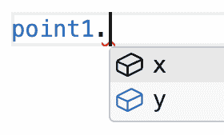
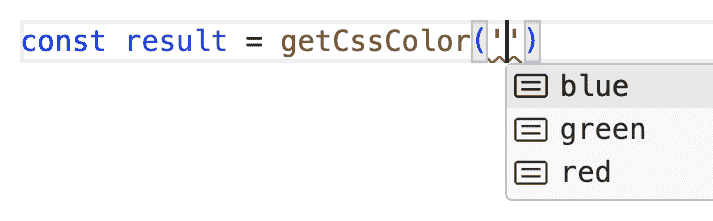

# 2 TypeScript 的销售点

> 原文：[`exploringjs.com/ts/book/ch_why-typescript.html`](https://exploringjs.com/ts/book/ch_why-typescript.html)

(广告，请勿屏蔽。)

1.  2.1 本章使用的符号

1.  2.2 TypeScript 优点：自动完成和编辑时检测更多错误

    1.  2.2.1 示例：打字错误、类型错误、缺少参数

    1.  2.2.2 示例：函数结果错误

    1.  2.2.3 示例：处理可选属性

    1.  2.2.4 示例：忘记 switch 情况

    1.  2.2.5 示例：代码处理某些情况不正确

1.  2.3 函数参数和结果的类型注解是良好的文档

1.  2.4 TypeScript 优点：更好的重构

1.  2.5 使用 TypeScript 已经变得更容易

1.  2.6 使用 TypeScript 的缺点

1.  2.7 TypeScript 常见问题解答

    1.  2.7.1 TypeScript 代码是否重量级？

    1.  2.7.2 TypeScript 是否试图将 JavaScript 转变为 C# 或 Java？

    1.  2.7.3 TypeScript 类型的高级使用看起来非常复杂。我真的需要学习这些吗？

    1.  2.7.4 TypeScript 学习需要多长时间？

大概来说，TypeScript 是 JavaScript 加上类型信息。后者在 TypeScript 代码由 JavaScript 引擎执行之前被移除。因此，编写和部署 TypeScript 需要做更多工作。这种额外的工作值得吗？在本章中，我将论证是的，它是值得的。如果你对 TypeScript 持怀疑态度但想给它一个机会，请阅读。

 **如果你已经确定想要学习和使用 TypeScript，可以跳过这一章**

### 2.1 本章使用的符号

在 TypeScript 代码中，我将通过以 `@ts-expect-error` 开头的注释展示 TypeScript 报告的错误，例如：

```ts
// @ts-expect-error: The right-hand side of an arithmetic operation
// must be of type 'any', 'number', 'bigint' or an enum type.
const value = 5 * '8';

```

这使得自动测试本章中的所有源代码变得更容易。这也是 TypeScript 内置的一个有用功能（尽管很少使用）。

### 2.2 TypeScript 优点：自动完成和编辑时检测更多错误

让我们看看 TypeScript 如何通过自动完成和错误检测帮助我们编写代码的示例。第一个示例很简单；后面的示例更复杂。

#### 2.2.1 示例：拼写错误、类型不正确、缺少参数

```ts
class Point {
 x: number;
 y: number;
 constructor(x: number, y = x) {
 this.x = x;
 this.y = y;
 }
}
const point1 = new Point(3, 8);

// @ts-expect-error: Property 'z' does not exist on type 'Point'.
console.log(point1.z); // (A)

// @ts-expect-error: Property 'toUpperCase' does not exist on
// type 'number'.
point1.x.toUpperCase(); // (B)

const point2 = new Point(3); // (C)

// @ts-expect-error: Expected 1-2 arguments, but got 0.
const point3 = new Point(); // (D)

// @ts-expect-error: Argument of type 'string' is not assignable to
// parameter of type 'number'.
const point4 = new Point(3, '8'); // (E)

```

这里发生了什么？

+   行 A：TypeScript 知道 `point1` 的类型，并且它没有属性 `.z`。

+   行 B：`point1.x` 是一个数字，因此没有字符串方法 `.toUpperCase()`。

+   行 C：这个调用之所以有效，是因为 `new Point()` 的第二个参数是可选的。

+   行 D：至少必须提供一个参数。

+   行 E：`new Point()` 的第二个参数必须是一个数字。

在行 A，我们在 `point1.`（该对象的属性 `x` 和 `y`）之后获得自动完成：



#### 2.2.2 示例：获取函数结果错误

你能在以下 JavaScript 代码中看到多少问题？

```ts
function reverseString(str) {
 if (str.length === 0) {
 return str;
 }
 Array.from(str).reverse();
}

```

让我们看看如果我们添加类型注解（行 A），TypeScript 会告诉我们什么：

```ts
// @ts-expect-error: Function lacks ending return statement and
// return type does not include 'undefined'.
function reverseString(str: string): string { // (A)
 if (str.length === 0) {
 return str;
 }
 Array.from(str).reverse(); // (B)
}

```

TypeScript 告诉我们：

+   最后，没有 `return` 语句——这是真的：我们忘记在行 B 中以 `return` 开头，因此在行 B 之后隐式返回 `undefined`。

+   隐式返回的 `undefined` 与返回类型 `string`（行 A）不兼容。

如果我们修复这个问题，TypeScript 会指出另一个错误：

```ts
function reverseString(str: string): string { // (A)
 if (str.length === 0) {
 return str;
 }
 // @ts-expect-error: Type 'string[]' is not assignable to
 // type 'string'.
 return Array.from(str).reverse(); // (B)
}

```

在行 B 中，我们返回一个数组，而行 A 中的返回类型表明我们想要返回一个字符串。如果我们修复这个问题，TypeScript 最终会对我们的代码感到满意：

```ts
function reverseString(str: string): string {
 if (str.length === 0) {
 return str;
 }
 return Array.from(str).reverse().join('');
}

```

#### 2.2.3 示例：处理可选属性

在我们的下一个示例中，我们处理通过对象定义的名称。我们通过以下 TypeScript 类型定义这些对象的架构：

```ts
type NameDef = {
 name?: string, // (A)
 nick?: string, // (B)
};

```

换句话说：NameDef 对象有两个属性，其值是字符串。这两个属性都是可选的——这在行 A 和行 B 中的问号中表示。

以下代码包含一个错误，TypeScript 警告我们：

```ts
function getName(nameDef: NameDef): string {
 // @ts-expect-error: Type 'string | undefined' is not assignable
 // to type 'string'.
 return nameDef.nick ?? nameDef.name;
}

```

`??` 是空合并运算符，它返回其左侧值——除非它是 `undefined` 或 `null`。在这种情况下，它返回其右侧值。有关更多信息，请参阅[“探索 JavaScript”](https://exploringjs.com/js/book/ch_undefined-null.html#nullish-coalescing-operator)。

`nameDef.name` 可能不存在。在这种情况下，结果是 `undefined` 而不是字符串。如果我们修复这个问题，TypeScript 就不会再报告任何错误：

```ts
function getName(nameDef: NameDef): string {
 return nameDef.nick ?? nameDef.name ?? '(Anonymous)';
}

```

#### 2.2.4 示例：忘记 switch 情况

考虑以下颜色类型：

```ts
type Color = 'red' | 'green' | 'blue';

```

换句话说：颜色可以是字符串 `'red'`、`'green'` 或 `'blue'`。以下函数将此类颜色转换为 CSS 十六进制颜色值：

```ts
function getCssColor(color: Color): `#${string}` {
 switch (color) {
 case 'red':
 return '#FF0000';
 case 'green':
 // @ts-expect-error: Type '"00FF00"' is not assignable to
 // type '`#${string}`'.
 return '00FF00'; // (A)
 default:
 // (B)
 // @ts-expect-error: Argument of type '"blue"' is not
 // assignable to parameter of type 'never'.
 throw new UnexpectedValueError(color); // (C)
 }
}

```

在行 A，我们得到一个错误，因为我们返回了一个与返回类型 `` `#${string}` `` 不兼容的字符串：它不以井号符号开头。

行 C 中的错误意味着我们忘记了一个情况（值 `'blue'`）。为了理解错误信息，我们必须知道 TypeScript 会持续调整 `color` 的类型：

+   在 `switch` 语句之前，其类型是 `'red' | 'green' | 'blue'`。

+   在我们划掉了`'red'`和`'green'`这两种情况后，它在 B 行中的类型是`'blue'`。

而且这种类型与`new UnexpectedValueError()`参数的特殊类型`never`不兼容。这种类型用于我们永远不会到达的位置的变量。更多信息请参阅“底类型`never`”（§15）。

修复了这两个错误后，我们的代码看起来是这样的：

```ts
function getCssColor(color: Color): `#${string}` {
 switch (color) {
 case 'red':
 return '#FF0000';
 case 'green':
 return '#00FF00';
 case 'blue':
 return '#0000FF';
 default:
 throw new UnexpectedValueError(color);
 }
}

```

这就是错误类`UnexpectedValueError`的样子：

```ts
class UnexpectedValueError extends Error {
 constructor(
 // Type enables type checking
 value: never,
 // Avoid exception if `value` is:
 // - object without prototype
 // - symbol
 message = `Unexpected value: ${{}.toString.call(value)}`
 ) {
 super(message)
 }
}

```

最后，TypeScript 为我们提供了`getCssColor()`（我们可以用于它的`'blue'`、`'green'`和`'red'`等值）参数的自动完成功能：



#### 2.2.5   示例：代码处理某些情况不正确

以下类型通过对象描述内容。内容可以是文本、图片或视频：

```ts
type Content =
 | {
 kind: 'text',
 charCount: number,
 }
 | {
 kind: 'image',
 width: number,
 height: number,
 }
 | {
 kind: 'video',
 width: number,
 height: number,
 runningTimeInSeconds: number,
 }
;

```

在以下代码中，我们错误地使用了内容：

```ts
function getWidth(content: Content): number {
 // @ts-expect-error: Property 'width' does not exist on
 // type 'Content'.
 return content.width;
}

```

TypeScript 会警告我们，因为并非所有内容都有`.content`属性。然而，它们都有`.kind`属性——我们可以用它来修复错误：

```ts
function getWidth(content: Content): number {
 if (content.kind === 'text') {
 return NaN;
 }
 return content.width; // (A)
}

```

注意，TypeScript 在 A 行不会报错，因为我们排除了文本内容，这是唯一没有`.width`属性的内容。

### 2.3   函数参数和结果的类型注解是良好的文档

考虑以下 JavaScript 代码：

```ts
function filter(items, callback) {
 // ···
}

```

这并没有告诉我们`filter()`期望的参数很多。我们也不知道它返回什么。相比之下，这是相应的 TypeScript 代码的样子：

```ts
function filter(
 items: Iterable<string>,
 callback: (item: string, index: number) => boolean
): Iterable<string> {
 // ···
}

```

这条信息告诉我们：

+   参数`items`是一个字符串的可迭代对象。

+   `callback`接收一个字符串和一个索引，并返回一个布尔值。

+   `filter()`的结果是另一个字符串的可迭代对象。

是的，类型符号需要一段时间来习惯。但是，一旦我们理解了它，我们就可以快速地大致了解`filter()`函数的作用。比阅读英文散文（诚然，这仍然是必要的，以填补类型符号和函数名称留下的空白）要快。

我发现理解 TypeScript 代码库比 JavaScript 代码库更容易，因为对我来说，TypeScript 提供了一层额外的文档。

这额外的文档也有助于团队协作，因为它更清楚地说明了代码应该如何使用，并且 TypeScript 经常警告我们如果我们在做错事。

每当我将 JavaScript 代码迁移到 TypeScript 时，我都会注意到一个有趣的现象：为了找到函数或方法的参数的适当类型，我必须检查它在何处被调用。这意味着静态类型给了我本地信息，否则我必须在其他地方查找。

### 2.4   TypeScript 的优势：更好的重构

重构是许多集成开发环境提供的自动化代码转换。

重命名方法是重构的一个例子。在纯 JavaScript 中这样做可能很棘手，因为同一个名称可能指向不同的方法。TypeScript 有更多关于方法和类型之间联系的信息，这使得在 TypeScript 中重命名方法更安全。

### 2.5 使用 TypeScript 变得更容易

与 JavaScript 相比，我们现在通常不需要额外的构建步骤：

+   在 Node.js、Deno 和 Bun 等服务器端 JavaScript 平台上，我们可以直接运行 TypeScript——无需编译。

+   大多数打包器，如 Vite，都内置了对 TypeScript 的支持。

更好的消息：

+   将 TypeScript 编译成 JavaScript 的效率已经提高——多亏了一种称为*类型剥离*的技术，它简单地移除了 TypeScript 语法中的类型部分，而没有进行其他转换（更多信息）。

创建包的功能也得到了改进：

+   npm：非库包可以用 TypeScript 发布。库包必须包含 JavaScript 以及*声明文件*（包含类型信息）。生成后者也得到了改进——多亏了一种称为*隔离声明*的技术。

+   [JSR (JavaScript Registry)](https://jsr.io) 是 npm 的一个替代品，其中可以上传 TypeScript 包。它支持多种平台。对于 Node.js，它自动生成 JavaScript 文件和声明文件。

然而，类型检查仍然相对较慢，必须通过 TypeScript 编译器`tsc`来执行。

### 2.6 使用 TypeScript 的缺点

+   它是在 JavaScript 之上的一个附加层：更多的复杂性，更多需要学习的东西，等等。

+   npm 包只能在使用时具有静态类型定义。如今，大多数包都附带类型定义，或者可以在[DefinitelyTyped](http://definitelytyped.org)上找到它们的类型定义。然而，后者偶尔可能会有些许错误，这会导致在没有静态类型的情况下不会出现的问题。

+   通过`tsconfig.json`配置 TypeScript 也增加了一点点复杂性，意味着 TypeScript 代码库的类型检查方式有很大的差异。有两个缓解因素：

    +   对于我自己的项目，我现在使用一个尽可能严格的`tsconfig.json`——这消除了我对`tsconfig.json`应该是什么样子的疑虑。

    +   类型剥离（见上一节）让我对`tsconfig.json`的作用有了更清晰的认识：有了它们，它只配置了类型检查的工作方式。生成 JavaScript 可以不使用`tsconfig.json`。

### 2.7 TypeScript FAQ

#### 2.7.1 TypeScript 代码重量级吗？

TypeScript 代码*可以是重量级的。但它不必是。例如，由于类型推断，我们通常可以少用一些类型注解：

```ts
function setDifference<T>(set1: Set<T>, set2: Set<T>): Set<T> {
 const result = new Set<T>();
 for (const elem of set1) {
 if (!set2.has(elem)) {
 result.add(elem);
 }
 }
 return result;
}

```

这段代码中唯一的非 JavaScript 语法是 `<T>`：其首次出现 `setDifference<T>` 表示 `setDifference()` 函数有一个 *类型参数*——一个在类型级别的参数。所有后续的 `<T>` 出现都指的是该参数。它们的意思是：

+   参数 `set1` 和 `set2` 是具有相同类型 `T` 的集合。

+   结果也是一个集合。其元素与 `set1` 和 `set2` 的元素具有相同的类型。

注意，我们通常不需要提供类型参数 `<T>`——TypeScript 可以自动从参数的类型中提取它：

```ts
assert.deepEqual(
 setDifference(new Set(['a', 'b']), new Set(['b'])),
 new Set(['a']),
);
assert.deepEqual(
 setDifference(new Set(['a', 'b']), new Set(['a', 'b'])),
 new Set(),
);

```

当涉及到 *使用* `setDifference()` 时，TypeScript 代码在这种情况下与 JavaScript 代码没有区别。

#### 2.7.2 TypeScript 是否试图将 JavaScript 转变为 C# 或 Java？

随着时间的推移，TypeScript 的本质已经发生了演变。

TypeScript 0.8 在 2012 年 10 月发布，当时 JavaScript 已经停滞不前很长时间。因此，TypeScript 添加了其团队认为 JavaScript 缺失的功能——例如，类、模块和枚举。

从那时起，JavaScript 获得了许多新特性。现在 TypeScript 跟踪 JavaScript 提供的内容，并且不再引入新的语言级特性——例如：

+   2012 年，TypeScript 有自己的模块实现方式。现在它支持 ECMAScript 模块和 CommonJS。

+   2012 年，TypeScript 有将类转换为函数的类。自从 2015 年 ECMAScript 6 发布以来，TypeScript 支持内置类。

+   2015 年，TypeScript 引入了其自己的装饰器风格，以支持 Angular。到 2022 年，ECMAScript 装饰器达到了第 3 阶段，TypeScript 一直支持它们。有关更多信息，请参阅 2ality 关于 ECMAScript 装饰器的帖子中的 [“装饰器的历史”](https://2ality.com/2022/10/javascript-decorators.html#the-history-of-decorators) 部分。

+   如果类型检查选项 `erasableSyntaxOnly`（见 ch_tsconfig-json.html#erasableSyntaxOnly）处于激活状态，TypeScript 仅支持 JavaScript 的语言特性——例如，我们不允许使用枚举。此选项启用 类型剥离，并且在 TypeScript 程序员中很受欢迎。因此，看起来在将来，大多数 TypeScript 将真正是纯 JavaScript 加上类型信息。

+   只有当 JavaScript 获得枚举或模式匹配时，TypeScript 才会得到更好的枚举或模式匹配。

##### 2.7.2.1 TypeScript 不仅仅是 OOP

一个常见的误解是 TypeScript 只支持以类为主的 OOP 风格；它同样支持许多函数式编程模式——例如，*区分联合*，它是代数数据类型的一个（稍微不那么优雅）版本：

```ts
type Content =
 | {
 kind: 'text',
 charCount: number,
 }
 | {
 kind: 'image',
 width: number,
 height: number,
 }
 | {
 kind: 'video',
 width: number,
 height: number,
 runningTimeInSeconds: number,
 }
;

```

在 Haskell 中，这种数据类型看起来是这样的（为了简单起见，没有标签）：

```ts
data Content =
 Text Int
 | Image Int Int
 | Video Int Int Int

```

更多信息：TypeScript 手册中的 [“TypeScript for functional programmers”](https://www.typescriptlang.org/docs/handbook/typescript-in-5-minutes-func.html)。

#### 2.7.3 TypeScript 类型的高级使用似乎非常复杂。我真的需要学习这些吗？

TypeScript 的常规使用几乎总是涉及相对简单的类型。对于库来说，复杂的类型可能很有用，但编写起来复杂，使用起来并不复杂。我的总体建议是尽可能简化类型，这样更容易理解和维护。如果代码中的类型过于复杂，那么通常可以简化它们——例如，通过更改代码并使用两个函数而不是一个，或者不使用它们捕捉每一个细节。

理解高级类型的一个关键见解是，它们在类型级别上大多像是一种新的编程语言，通常描述输入类型如何转换为输出类型。在许多方面，它们与 JavaScript 类似。包括：

+   变量（类型变量）

+   带有参数的函数（具有类型参数的泛型类型）

+   条件表达式 `C ? T : F`（条件类型）

+   对象循环（映射类型）

+   等等。

关于这个主题的更多信息，请参阅“概述：使用类型进行计算”（§33）。

##### 2.7.3.1 复杂类型值得学习吗？

有时候是这样的——例如，作为一个实验，我编写了一个简单的 SQL API（[a simple SQL API](https://github.com/rauschma/simple-sql)），在编辑过程中会提供大量的类型补全和警告（如果你输入了错误等）。请注意，编写这个 API 涉及了一些工作；使用它很简单。

#### 2.7.4 TypeScript 学习需要多长时间？

我认为你可以在一天内学会 TypeScript 的基础知识，并在第二天开始高效使用。在那之后，还有很多东西可以学习，但你可以在使用它的同时进行学习。

“TypeScript 的基础知识”（§4） 教授你这些基础知识。如果你是 TypeScript 的新手，我很乐意听到你的意见：我的假设正确吗？你在阅读之后能否写出（简单的）TypeScript 代码？
