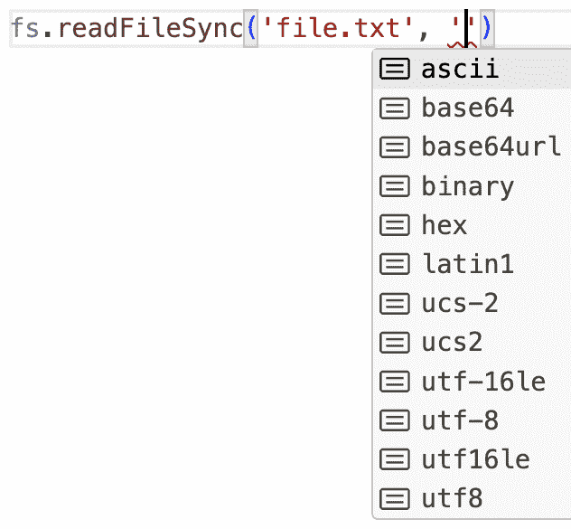

# 4   TypeScript 的基础知识

> 原文：[`exploringjs.com/ts/book/ch_typescript-essentials.html`](https://exploringjs.com/ts/book/ch_typescript-essentials.html)

(广告，请勿拦截。)

1.  4.1 你将学到什么

1.  4.2 如何在阅读本章时玩转代码

1.  4.3 什么是类型？

1.  4.4 TypeScript 的两种语言级别

    1.  4.4.1 动态类型与静态类型

    1.  4.4.2 JavaScript 的动态类型

    1.  4.4.3 TypeScript 的静态类型

    1.  4.4.4 重访两种语言级别

1.  4.5 原始字面量类型

1.  4.6 类型 `any`、`unknown` 和 `never`

    1.  4.6.1 通配符类型 `any`

1.  4.7 类型推断

    1.  4.7.1 类型推断的规则

1.  4.8 类型别名

1.  4.9 复合类型

1.  4.10 数组的类型化

    1.  [4.10.1 数组类型：`T[]` 和 `Array<T>`](#array-types-t-and-array-t)

    1.  [4.10.2 元组类型：`[T0, T1, ···]`](#tuple-types-t0-t1)

1.  4.11 函数类型

    1.  4.11.1 推断函数类型

    1.  4.11.2 示例：参数是函数的函数

    1.  4.11.3 推断函数的返回类型

    1.  4.11.4 特殊返回类型 `void`

    1.  4.11.5 可选参数

    1.  4.11.6 参数默认值

    1.  4.11.7 可变参数

1.  4.12 对象的类型化

    1.  4.12.1 通过对象字面量类型对固定布局对象进行类型化

    1.  4.12.2 接口作为对象字面量类型的替代方案

    1.  4.12.3 TypeScript 的结构化类型与名义类型

    1.  4.12.4 可选属性

    1.  4.12.5 方法

1.  4.13 联合类型

    1.  4.13.1 将 `undefined` 和 `null` 添加到类型中

    1.  4.13.2 字符串字面量类型的联合

1.  4.14 交集类型

1.  4.15 类型守卫和缩窄

1.  4.16 类型变量和泛型类型

    1.  4.16.1 示例：值的容器

    1.  4.16.2 示例：泛型类

    1.  4.16.3 示例：映射

    1.  4.16.4 带有类型参数的函数和方法

1.  4.17 结论：理解初始示例

1.  4.18 下一步

    1.  4.18.1 小贴士：尽可能使用`strict`类型检查

本章解释了 TypeScript 的基础知识。阅读后，您应该能够编写您的第一个 TypeScript 代码。我的希望是，这不应该花您超过一天的时间。[我很乐意听听](https://dr-axel.de/#contact)您实际上花了多长时间——我的猜测可能不准确。

 **从这里开始阅读**

您可以从本章开始阅读这本书：除了 JavaScript 之外，不需要任何先前的知识。或者，如果您首先想更好地理解 TypeScript 作为工具如何融入开发工作流程，您可以查看“TypeScript 的使用：工作流程、工具等”（§6）。

### 4.1 您将学习的内容

阅读本章后，您应该能够理解以下 TypeScript 代码（我们将在最后回到它）：

```ts
interface Array<T> {
 concat(...items: Array<T[] | T>): T[];
 reduce<U>(
 callback: (state: U, element: T, index: number) => U,
 firstState?: U
 ): U;
 // ···
}

```

您可能会认为这是晦涩的。我同意您的看法！但是（我希望证明），这种语法相对容易学习。一旦您理解了它，它就能立即、精确和全面地总结代码的行为——而不必阅读冗长的英文描述。

### 4.2 阅读本章时如何玩代码

本章旨在被动阅读：您需要看到的一切都在这里，包括对代码功能的探索。

然而，您可能仍然想尝试 TypeScript 代码。下一章将解释如何做到这一点：“尝试 TypeScript 而不安装它”（§7）。

### 4.3 什么是类型？

在本章中：

+   类型是一组值。例如，类型`boolean`是一个包含`false`和`true`元素的集合。

+   `S`是`T`的子类型意味着`S`是`T`的子集。

### 4.4 TypeScript 的两个语言级别

TypeScript 是 JavaScript 加上添加静态类型信息的语法。因此，TypeScript 有两个*语言级别*——两种使用源代码的方式：

+   *程序级别*（JavaScript）：在这个级别上，使用 TypeScript 源代码意味着运行它：我们必须移除类型信息并将其提供给 JavaScript 引擎。

+   *类型级别*（TypeScript）：在这个级别上，使用 TypeScript 源代码意味着检查其类型：我们分析源代码以确保类型使用的一致性。

|  | 程序级别 | 类型级别 |
| --- | --- | --- |
| 编程语言 | JavaScript | TypeScript |
| 源代码是 | 执行 | 类型检查 |
| 类型是 | 动态的 | 静态的 |
| 类型存在于 | 运行时 | 编译时 |

#### 4.4.1 动态类型与静态类型

到目前为止，我们只讨论了 TypeScript 的（静态）类型。但 JavaScript 也有类型：

```ts
> typeof true
'boolean'

```

它们的类型被称为 *动态*。为什么是这样？我们必须运行代码来查看它们是否被正确使用——例如：

```ts
const value = null;
assert.throws(
 () => value.length,
 /^TypeError: Cannot read properties of null/
);

```

相比之下，TypeScript 的类型是 *静态* 的：我们通过分析语法来检查它们——而不需要运行代码。这发生在编辑（对于单个文件）或运行 TypeScript 编译器 `tsc`（对于整个代码库）时。在下面的代码中，TypeScript 通过类型检查检测到错误（注意，在这种情况下甚至不需要显式的类型信息）：

```ts
const value = null;
// @ts-expect-error: 'value' is possibly 'null'.
value.length;

```

 **`@ts-expect-error` 显示类型检查错误**

在这本书中，类型检查错误是通过 `@ts-expect-error` 指令显示的（更多信息）。

#### 4.4.2 JavaScript 的动态类型

JavaScript 语言（不是 TypeScript！）只有八个类型。在 ECMAScript 规范中，它们的名称以大写字母开头。在这里，我使用 `typeof` 返回的值——例如：

```ts
> typeof undefined
'undefined'
> typeof 123
'number'
> typeof 'abc'
'string'

```

JavaScript 的八个类型是：

1.  `undefined`: 只有一个元素 `undefined` 的集合

1.  `null`: 只有一个元素 `null` 的集合。由于一个历史性的错误决定，`typeof` 对于 `null` 值返回 `'object'` 而不是 `'null'`。

1.  `boolean`: 包含两个元素 `false` 和 `true` 的集合

1.  `number`: 所有数字的集合

1.  `bigint`: 所有任意精度整数的集合

1.  `string`: 所有字符串的集合

1.  `symbol`: 所有符号的集合

1.  `object`: 所有对象的集合（包括函数和数组）

`typeof` 还有一个针对函数的单独的“类型”，但 ECMAScript 并不是这样看待内部事物的。

所有这些类型都是动态的。它们也可以在 TypeScript 的类型级别上使用（见下一节）。

#### 4.4.3 TypeScript 的静态类型

TypeScript 为 JavaScript 增加了一个额外的层：*静态类型*。在源代码中，有：

+   数据的源——例如，通过字面量如 `128`、`true` 或 `['a', 'b']` 创建的值

+   数据的汇——例如，变量、属性和参数等存储位置。

    +   存储位置在读取时也可以成为数据源。

在 TypeScript 中，它们都有静态类型：

+   数据源的类型描述了它可以接受哪些动态值。

+   数据汇的类型描述了可以写入它的动态值。

变量等存储位置可以通过 *类型注解* 接收静态类型，例如：

```ts
let count: number;

```

冒号 (`:`) 加上类型 `number` 是类型注解。它声明变量 `count` 的静态类型是 `number`。类型注解有助于类型检查：

```ts
let count: number;
// @ts-expect-error: Type 'string' is not assignable to type 'number'.
count = 'yes';

```

错误信息是什么意思？数据源 `'yes'` 的（隐式）静态类型 `string` 与数据汇 `count` 的（明确指定的）静态类型 `number` 不兼容。

##### 4.4.3.1 带有类型注解的函数

下一个示例展示了一个带有类型注解的函数：

```ts
function toString(num: number): string {
 return String(num);
}

```

有两种类型注解：

+   参数 `num` 的类型是 `number`。

+   函数的返回类型是 `string`。

#### 4.4.4 回顾两种语言级别

让我们简要回顾一下两种语言级别。看看它们如何在 TypeScript 的语法中体现出来是很有趣的：

```ts
const noValue: undefined = undefined;

```

+   在动态级别上，我们使用 JavaScript 声明一个变量 `noValue` 并用值 `undefined` 初始化它。

+   在静态级别上，我们使用 TypeScript 指定变量 `noValue` 的静态类型为 `undefined`。

同样的语法 `undefined` 在 JavaScript 级别和类型级别上使用，但含义不同——取决于它被使用的地方。

### 4.5 原始字面类型

几个原始类型都有所谓的 *字面类型*：

```ts
let thousand: 1000 = 1000;

```

冒号后面的 `1000` 是一个类型，一个 *数字字面类型*：它是一个只包含值 `1000` 的集合，并且它是 `number` 的子类型。

一方面，我们分配给 `thousand` 的任何值都必须是 `1000`：

```ts
thousand = 1000; // OK
// @ts-expect-error: Type '999' is not assignable to type '1000'.
thousand = 999;

```

另一方面，我们可以将 `thousand` 赋值给任何类型为 `number` 的变量，因为它的类型是 `number` 的子类型：

```ts
const num: number = thousand;

```

除了 `symbol` 之外，所有原始类型都有字面类型：

```ts
// boolean literal type
const TRUTHY: true = true;

// bigint literal type
const HUNDRED: 100n = 100n;

// string literal type
const YES: 'yes' = 'yes';

// These could also be considered literal types
const UNDEF: undefined = undefined;
const NULL: null = null;

```

尤其是字符串字面类型将在之后变得很有用（当我们到达联合类型时）。

### 4.6 `any`、`unknown` 和 `never` 类型

TypeScript 有几种特定于类型级别的类型：

+   `any` 是一个通配符类型，接受任何值（见下文）。

+   `unknown` 与 `any` 类似但更不灵活：如果一个变量或参数具有该类型，我们也可以向它写入任何值。然而，除非我们执行进一步的类型检查，否则我们无法对其内容进行任何操作。不够灵活是好事：我建议尽可能避免使用 `any`，而是使用 `unknown`。更多信息请参阅“顶级类型 `any` 和 `unknown`”（§14）。

+   `never` 是空集作为类型。在许多情况下，它用于程序执行时永远不会到达的位置。

#### 4.6.1 通配符类型 `any`

如果存储位置的类型既没有明确指定也没有可推断，TypeScript 会使用类型 `any`。`any` 是所有值的类型，也是一个通配符类型：如果一个值具有该类型，TypeScript 不会以任何方式限制我们。

如果启用了 `strict` 类型检查，我们只能显式地使用 `any`：每个位置都必须有一个明确的或推断的静态类型。这更安全，因为没有类型检查的漏洞，没有意外的盲点。

让我们看看例子——参数的类型通常无法推断：

```ts
// @ts-expect-error: Parameter 'arg' implicitly has an 'any' type.
function func1(arg): void {} // error

function func2(arg: boolean): void {} // OK

function func3(arg = false): void {} // OK

```

对于 `func3`，TypeScript 可以推断出 `arg` 的类型为 `boolean`，因为它有默认值 `false`。

### 4.7 类型推断

在许多情况下，TypeScript 可以自动推导数据源或数据汇的类型，而无需我们进行任何注释。这被称为 *类型推断*。

这是一个类型推断的例子：

```ts
const count = 14;
assertType<14>(count);

```

 **`assertType<T>(v)` 显示值 `v` 的类型 `T`**

在这本书中，`assertType<T>(v)` 用于显示一个值 `v` 的类型 `T` —— 这可能是推断出来的或明确指定的。有关更多信息，请参阅“类型级别：`assertType<T>(v)`”（§5.2）（ch_book-notation.html#notation-assertType）。

TypeScript 推断 `count` 的类型为 `14`。它可以这样做，因为它知道值 `14` 的类型是 `14`。有趣的是，当我们使用 `let` 时，TypeScript 推断一个更通用的类型：

```ts
let count = 14;
assertType<number>(count);

```

为什么呢？假设是 `count` 的值是初步的，我们希望稍后分配其他（类似！）的值。如果 `count` 的类型是 `14`，那么我们就无法这样做。

类型推断的另一个例子：在这种情况下，TypeScript 推断函数 `toString()` 的返回类型为 `string`。

```ts
function toString(num: number) {
 return String(num);
}
assertType<string>(toString(32));

```

#### 4.7.1 类型推断规则

类型推断不是猜测：它遵循明确的规则（类似于算术）来推导类型，其中没有明确指定。例如：

```ts
const strValue = String(32);
assertType<string>(strValue);

```

推断出的 `strValue` 类型为 `string`：

**步骤 1**：推断出的 `32` 的类型是 `32`。

**步骤 2**：`String` 作为函数使用时具有以下类型（简化版）：

```ts
(value: any) => string

```

这种类型表示法用于函数，其含义为：

+   函数有一个参数，`value`。该参数的类型为 `any`。如果一个参数具有该类型，它接受任何类型的值。（关于 `any` 的更多信息将在后面介绍。）

+   函数返回`string`类型的值。

**步骤 3**：通过结合步骤 1 和步骤 2 的结果，TypeScript 可以推断出 `strValue` 的类型为 `string`。

### 4.8 类型别名

使用`type`我们可以为现有类型创建一个新名称（别名）：

```ts
type Age = number;
const age: Age = 82;

```

### 4.9 复合类型

复合类型内部包含其他类型，这使得它们非常具有表现力。以下是一些例子：

```ts
// Array types
type StringArray = Array<string>;

// Function types
type NumToStr = (num: number) => string;

// Object literal types
type BlogPost = {
 title: string,
 tags: Array<string>,
};

// Union types
type YesOrNo = 'yes' | 'no';

```

接下来，我们将探索所有这些复合类型以及更多。

### 4.10 数组类型

TypeScript 有两种不同的方式来为数组进行类型注解：

+   当数组是一个具有相同类型 `T` 的值集合时，使用 *数组类型* `T[]` 或 `Array<T>`。

+   当数组元素的索引确定其类型时，使用 *元组类型* `[T0, T1, ···]`。

#### [4.10.1 数组类型：`T[]` 和 `Array<T>`](#array-types-t-and-array-t)

由于历史原因，表达`arr`是一个数组的事实有两种等效的方式，用于管理一系列数字（例如列表、栈、队列等）：

```ts
let arr1: number[] = [];
let arr2: Array<number> = [];

```

通常情况下，TypeScript 可以在存在赋值的情况下推断变量的类型。在这种情况下，我们必须帮助它，因为对于一个空数组，它无法确定元素的类型。

我们将在稍后更详细地探讨 `Array<number>` 的尖括号表示法（剧透：`Array` 是一个 *泛型类型*，而 `number` 是一个 *类型参数*）。

在 JavaScript 的标准库中，`Object.keys()` 返回一个数组：

```ts
const keys = Object.keys({prop: 123});
assertType<string[]>(keys);

```

#### [4.10.2 元组类型：`[T0, T1, ···]`](#tuple-types-t0-t1)

以下变量`entry`具有元组类型：

```ts
const entry: [string, number] = ['count', 33];

```

我们可以使用它通过`Object.fromEntries()`创建一个对象：

```ts
assert.deepEqual(
 Object.fromEntries([entry]),
 {
 count: 33,
 }
);

```

`entry`的本质是什么？在 JavaScript 级别上，它也是一个数组，但它被不同地使用：

+   长度是固定的：`2`。

+   元素的索引决定了它的意义和类型：

    +   在索引 0 处，存在类型为`string`的键。

    +   在索引 1 处，存在类型为`number`的值。

### 4.11 函数类型

这是一个函数类型的例子：

```ts
type NumToStr = (num: number) => string;

```

这种类型包括接受单个类型为数字的参数并返回字符串的每个函数。让我们在类型注解中使用这个类型：

```ts
const toString: NumToStr = (num) => String(num);

```

因为 TypeScript 知道`toString`的类型是`NumToStr`，所以我们不需要在箭头函数内添加类型注解。

#### 4.11.1 推断函数类型

我们也可以这样定义`toString`：

```ts
const toString = (num: number): string => String(num);

```

注意，我们为参数`num`指定了类型，并且指定了返回类型。`toString`推断出的类型是：

```ts
assertType<
 (num: number) => string
>(toString);

```

#### 4.11.2 示例：参数为函数的函数

以下函数有一个类型为函数的参数`callback`：

```ts
function stringify123(callback: (num: number) => string): string {
 return callback(123);
}

```

由于`callback`参数的类型，TypeScript 拒绝以下函数调用：

```ts
// @ts-expect-error: Argument of type 'NumberConstructor' is not
// assignable to parameter of type '(num: number) => string'.
stringify123(Number);

```

但它接受这个函数调用：

```ts
assert.equal(
 stringify123(String), '123'
);

```

我们也可以使用箭头函数来实现`stringify123()`：

```ts
const stringify123 =
 (callback: (num: number) => string): string => callback(123);

```

#### 4.11.3 推断函数的返回类型

TypeScript 擅长推断函数的返回类型，但显式指定它们是推荐的：它使意图更清晰，启用额外的一致性检查，并帮助外部工具生成声明文件（这些工具通常无法推断返回类型）。

#### 4.11.4 特殊的返回类型`void`

`void`是函数的一个特殊返回类型：它告诉 TypeScript 该函数总是返回`undefined`。

它可能明确地这样做：

```ts
function f1(): void {
 return undefined;
}

```

或者它可能隐式地这样做：

```ts
function f2(): void {}

```

然而，这样的函数不能明确地返回除了`undefined`之外的其他值：

```ts
function f3(): void {
 // @ts-expect-error: Type 'string' is not assignable to type 'void'.
 return 'abc';
}

```

#### 4.11.5 可选参数

标识符后面的问号表示该参数是可选的。例如：

```ts
function stringify123(callback?: (num: number) => string) {
 if (callback === undefined) {
 callback = String;
 }
 return callback(123); // (A)
}

```

TypeScript 只允许我们在行 A 处调用函数，前提是我们确保`callback`不是`undefined`（如果省略了参数，它就是`undefined`）。

#### 4.11.6 参数默认值

TypeScript 支持[参数默认值](https://exploringjs.com/js/book/ch_callables.html#parameter-default-values)：

```ts
function createPoint(x=0, y=0): [number, number] {
 return [x, y];
}

assert.deepEqual(
 createPoint(),
 [0, 0]);
assert.deepEqual(
 createPoint(1, 2),
 [1, 2]);

```

默认值使参数可选。我们通常可以省略类型注解，因为 TypeScript 可以推断类型。例如，它可以推断出`x`和`y`都具有`number`类型。

如果我们想要添加类型注解，它看起来会是这样。

```ts
function createPoint(x:number = 0, y:number = 0): [number, number] {
 return [x, y];
}

```

#### 4.11.7 剩余参数

我们也可以在 TypeScript 参数定义中使用[剩余参数](https://exploringjs.com/js/book/ch_callables.html#rest-parameters)。它们的静态类型必须是数组或元组：

```ts
function joinNumbers(...nums: number[]): string {
 return nums.join('-');
}
assert.equal(
 joinNumbers(1, 2, 3),
 '1-2-3'
);

```

### 4.12 对象类型化

类似于数组，在 JavaScript 中（偶尔混合使用）对象可以用两种方式使用：

+   固定布局对象：在开发时已知的固定数量的属性。每个属性可以有不同的类型。

+   字典对象：在开发时不知道名称的任意数量的属性。所有属性具有相同的类型。

在本章中，我们忽略了字典对象——它们在“索引签名：对象作为字典”（§18.7）中有所涉及。顺便提一下，Map 通常比字典是一个更好的选择。

#### 4.12.1 通过对象字面量类型对固定布局对象进行类型化

对象字面量类型描述了固定布局的对象——例如：

```ts
type Point = {
 x: number,
 y: number,
};

```

我们也可以使用分号而不是逗号来分隔成员，但后者更常见。

成员也可以用分号而不是逗号来分隔，但由于对象字面量类型的语法与对象字面量（成员必须用逗号分隔）的语法相关，逗号的使用更为频繁。

#### 4.12.2 接口作为对象字面量类型的替代方案

接口基本上等同于对象字面量类型，但随时间推移变得不那么受欢迎。接口看起来是这样的：

```ts
interface Point {
 x: number;
 y: number;
} // no semicolon!

```

成员也可以用逗号而不是分号来分隔，但由于接口的语法与类的语法（成员必须用分号分隔）相关，分号的使用更为频繁。

#### 4.12.3 TypeScript 的结构化类型与名义化类型

TypeScript 的类型系统的一个重大优势是它是**结构化**的，而不是**名义化**的。也就是说，类型`Point`与所有具有适当结构的对象匹配：

```ts
type Point = {
 x: number,
 y: number,
};
function pointToString(pt: Point) {
 return `(${pt.x}, ${pt.y})`;
}

assert.equal(
 pointToString({x: 5, y: 7}), // compatible structure
 '(5, 7)');

```

相反，在 Java 的名义类型系统中，我们必须在每个类中显式声明它实现了哪些接口。因此，一个类只能实现其创建时存在的接口。

#### 4.12.4 可选属性

如果一个属性可以省略，我们在其名称后加上一个问号：

```ts
type Person = {
 name: string,
 company?: string,
};

```

在以下示例中，`john`和`jane`都匹配类型`Person`：

```ts
const john: Person = {
 name: 'John',
};
const jane: Person = {
 name: 'Jane',
 company: 'Massive Dynamic',
};

```

#### 4.12.5 方法

对象字面量类型也可以包含方法：

```ts
type Point = {
 x: number,
 y: number,
 distance(other: Point): number,
};

```

就 TypeScript 的类型系统而言，方法定义和值是函数的属性是等效的：

```ts
type HasMethodDef = {
 simpleMethod(flag: boolean): void,
};
type HasFuncProp = {
 simpleMethod: (flag: boolean) => void,
};
type _ = Assert<Equal<
 HasMethodDef,
 HasFuncProp
>>;

const objWithMethod = {
 simpleMethod(flag: boolean): void {},
};
assertType<HasMethodDef>(objWithMethod);
assertType<HasFuncProp>(objWithMethod);

const objWithOrdinaryFunction: HasMethodDef = {
 simpleMethod: function (flag: boolean): void {},
};
assertType<HasMethodDef>(objWithOrdinaryFunction);
assertType<HasFuncProp>(objWithOrdinaryFunction);

const objWithArrowFunction: HasMethodDef = {
 simpleMethod: (flag: boolean): void => {},
};
assertType<HasMethodDef>(objWithArrowFunction);
assertType<HasFuncProp>(objWithArrowFunction);

```

我的建议是使用最能表达属性设置方式的语法。

### 4.13 联合类型

变量所持有的值（每次一个值）可能是不同类型的成员。在这种情况下，我们需要一个**联合类型**。例如，在以下代码中，`stringOrNumber`可以是`string`类型或`number`类型：

```ts
function getScore(stringOrNumber: string|number): number {
 if (typeof stringOrNumber === 'string'
 && /^\*{1,5}$/.test(stringOrNumber)) {
 return stringOrNumber.length;
 } else if (typeof stringOrNumber === 'number'
 && stringOrNumber >= 1 && stringOrNumber <= 5) {
 return stringOrNumber
 } else {
 throw new Error('Illegal value: ' + JSON.stringify(stringOrNumber));
 }
}

assert.equal(getScore('*****'), 5);
assert.equal(getScore(3), 3);

```

`stringOrNumber` 的类型是 `string|number`。类型表达式 `s|t` 的结果是类型 `s` 和 `t` 的集合论并集（解释为集合）。

#### 4.13.1 将 `undefined` 和 `null` 添加到类型中

在 TypeScript 中，`undefined` 和 `null` 不包含在任何类型中（除了 `undefined`、`null`、`any` 和 `unknown` 类型）。这在静态类型语言中很常见（一个值得注意的例外是 Java）。如果我们想允许这些值，我们需要使用联合类型，例如 `undefined|string` 和 `null|string`：

```ts
let numberOrNull: undefined|number = undefined;
numberOrNull = 123;

```

否则，我们会得到一个错误：

```ts
// @ts-expect-error: Type 'undefined' is not assignable to type 'number'.
let mustBeNumber: number = undefined;
mustBeNumber = 123;

```

注意，TypeScript 不会强迫我们立即初始化（只要我们在初始化之前不读取变量）：

```ts
let myNumber: number; // OK
myNumber = 123;

```

#### 4.13.2 字符串字面量类型的联合

字符串字面量类型的联合提供了一种快速定义具有有限值集合的类型的方法。例如，这就是 Node.js 类型定义可以用于（例如）`fs.readFileSync()` 的缓冲区编码的方式：

```ts
type BufferEncoding =
 | 'ascii'
 | 'utf8'
 | 'utf-8'
 | 'utf16le'
 | 'utf-16le'
 | 'ucs2'
 | 'ucs-2'
 | 'base64'
 | 'base64url'
 | 'latin1'
 | 'binary'
 | 'hex'
;

```

获得这样的联合类型的自动完成功能很方便（图 4.1）。我们还可以在联合类型被使用的地方重命名其元素——通过相同的重构，这也会改变函数名。



图 4.1：`BufferEncoding` 的自动完成显示了联合类型的所有元素。

### 4.14 交集类型

当联合类型计算两个类型的并集时，视为集合，交集类型计算的是交集：

```ts
type Type1 = 'a' | 'b' | 'c';
type Type2 = 'b' | 'c' | 'd' | 'e';
type _ = Assert<Equal<
 Type1 & Type2,
 'b' | 'c'
>>;

```

 **泛型类型 `Assert<B>` 用于比较类型**

在这本书中，类型是通过泛型类型 `Assert<B>` 来比较的（更多信息请参阅 [ch_book-notation.html#notation-generic-type-Assert]）。

交集类型的一个关键用途是组合对象类型（更多信息请参阅 [ch_intersections-object-types.html#ch_intersections-object-types]）。

### 4.15 类型守卫和缩小

有时候我们会遇到过于通用的类型。然后我们需要使用所谓的 *类型守卫* 的条件来使它们足够小，以便我们可以使用它们。这个过程被称为 *缩小*。

在以下代码中，我们通过类型守卫 `typeof` 来缩小 `value` 的类型：

```ts
function getLength(value: string | number): number {
 assertType<string | number>(value); // (A)
 // @ts-expect-error: Property 'length' does not exist on
 // type 'string | number'.
 value.length; // (B)
 if (typeof value === 'string') {
 assertType<string>(value); // (C)
 return value.length; // (D)
 }
 assertType<number>(value); // (E)
 return String(value).length;
}

```

看到由于我们在 `if` 语句的条件中使用 `typeof`，`value` 的类型是如何变化的，这很有趣：

+   初始时，`value` 的类型是 `string | number`（行 A）。

    +   这就是为什么我们无法在行 B 中访问属性 `.length` 的原因。

+   在 `if` 语句的真分支中，`value` 的类型是 `string`（行 C）。

    +   现在我们可以访问属性 `.length`（行 D）。

+   由于我们在真分支中返回，TypeScript 知道在行 E 中 `value` 的类型是 `number`。

### 4.16 类型变量和泛型类型

回想一下 TypeScript 的两种语言级别：

+   值存在于 *动态级别*。

+   类型存在于*静态级别*。

类似地：

+   正常函数存在于动态级别，是值的工厂，并且有代表值的参数。参数在括号之间声明：

    ```ts
    const valueFactory = (x: number) => x; // definition
    const myValue = valueFactory(123); // use

    ```

+   *泛型类型*存在于静态级别，是类型的工厂，并且有代表类型的参数。参数在尖括号之间声明：

    ```ts
    type TypeFactory<X> = X; // definition
    type MyType = TypeFactory<string>; // use

    ```

 **命名类型参数**

在 TypeScript 中，通常使用单个大写字母（如`T`、`I`和`O`）作为类型参数。然而，任何合法的 JavaScript 标识符都是允许的，较长的名称往往使代码更容易理解。

#### 4.16.1 示例：值的容器

```ts
// Factory for types
type ValueContainer<Value> = {
 value: Value;
};

// Creating one type
type StringContainer = ValueContainer<string>;

```

`Value`是一个*类型变量*。一个或多个类型变量可以在尖括号之间引入。

#### 4.16.2 示例：一个泛型类

类也可以有类型参数：

```ts
class SimpleStack<Elem> {
 #data: Array<Elem> = [];
 push(x: Elem): void {
 this.#data.push(x);
 }
 pop(): Elem {
 const result = this.#data.pop();
 if (result === undefined) {
 throw new Error();
 }
 return result;
 }
 get length() {
 return this.#data.length;
 }
}

```

类`SimpleStack`有一个类型参数`Elem`。当我们实例化类时，我们也为类型参数提供一个值：

```ts
const stringStack = new SimpleStack<string>();
stringStack.push('first');
stringStack.push('second');
assert.equal(stringStack.length, 2);
assert.equal(stringStack.pop(), 'second');

```

#### 4.16.3 示例：映射

TypeScript 中的映射是泛型类型的。例如：

```ts
const myMap: Map<boolean,string> = new Map([
 [false, 'no'],
 [true, 'yes'],
]);

```

多亏了类型推断（基于`new Map()`的参数），我们可以省略类型参数：

```ts
const myMap = new Map([
 [false, 'no'],
 [true, 'yes'],
]);
assertType<Map<boolean, string>>(myMap);

```

#### 4.16.4 带类型参数的函数和方法

函数定义可以引入类型变量，如下所示：

```ts
function identity<Arg>(arg: Arg): Arg {
 return arg;
}

```

我们可以这样使用该函数：

```ts
const num1 = identity<number>(123);
assertType<number>(num1);

```

由于类型推断，我们再次可以省略类型参数：

```ts
const num2 = identity(123);
assertType<123>(num2);

```

`num2`的类型是数字字面量类型`123`。

##### 4.16.4.1 带类型参数的箭头函数

箭头函数也可以有类型参数：

```ts
const identity = <Arg>(arg: Arg): Arg => arg;

```

##### 4.16.4.2 带类型参数的方法

这是方法类型参数的语法：

```ts
const obj = {
 identity<Arg>(arg: Arg): Arg {
 return arg;
 },
};

```

##### 4.16.4.3 更复杂的函数示例

```ts
function fillArray<T>(len: number, elem: T): T[] {
 return new Array<T>(len).fill(elem);
}

```

类型变量`T`在这段代码中出现了四次：

+   它通过`fillArray<T>`引入。因此，它的作用域是函数。

+   它在参数`elem`的类型注解中首次使用。

+   它在`fillArray()`的返回类型中第二次使用。

+   它也被用作构造函数`Array()`的类型参数。

当调用`fillArray()`时（行 A），我们可以省略类型参数，因为 TypeScript 可以从参数`elem`推断出`T`：

```ts
const arr1 = fillArray<string>(3, '*');
assertType<string[]>(arr1);
assert.deepEqual(
 arr1, ['*', '*', '*']);

const arr2 = fillArray(3, '*'); // (A)
assertType<string[]>(arr2);

```

### 4.17 结论：理解初始示例

让我们利用我们所学的知识来理解我们之前看到的代码片段：

```ts
interface Array<T> {
 concat(...items: Array<T[] | T>): T[];
 reduce<U>(
 callback: (state: U, element: T, index: number) => U,
 firstState?: U
 ): U;
 // ···
}

```

这是一个元素类型为`T`的数组接口：

+   方法`.concat()`：

    +   有零个或多个参数（通过剩余参数定义）。每个参数的类型为`T[]|T`。也就是说，它要么是一个`T`值的数组，要么是一个单个的`T`值。这意味着`items`中的值与`this`（方法调用的接收者）中的值的类型`T`相同。

    +   返回一个元素类型也为 `T` 的数组。

+   方法 `.reduce()` 引入了它自己的类型变量 `U`。`U` 用于表达以下实体都具有相同类型的事实：

    +   `callback()` 的参数 `state`

    +   `callback()` 的结果

    +   `.reduce()` 的可选参数 `firstState`

    +   `.reduce()` 的结果

    除了 `state`，`callback()` 还有以下参数：

    +   `element`：它具有与数组元素相同的类型 `T`

    +   `index`：一个数字

### 4.18 下一步

+   接下来，你可能想阅读“TypeScript 的使用方式：工作流程、工具等”（§6）——这能让你更好地理解 TypeScript 在实际中的应用。

+   然后，你可以继续阅读本书的其余部分。

在使用 TypeScript 时，请记住以下提示。

#### 4.18.1 提示：尽可能使用 `strict` 类型检查

TypeScript 编译器可以配置的有很多种方式。其中一组重要的选项控制编译器如何严格检查 TypeScript 代码。我的建议是：

+   选项 `strict` 应始终启用。

+   有一些额外的设置可以进一步提高严格性：我会从所有这些设置开始，然后禁用那些你不喜欢的或不想处理的错误。

你可能会想使用产生更少编译器错误的设置。然而，没有 `strict` 检查，TypeScript 的表现将大打折扣，并且它将检测你代码中的问题要少得多。

更多关于配置 TypeScript 的信息，请参阅“`tsconfig.json` 指南”（§8）。
