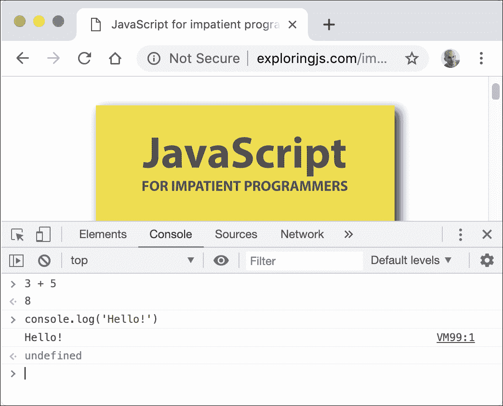
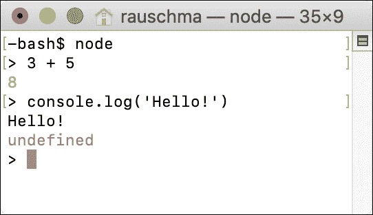

# 八、控制台：交互式 JavaScript 命令行

> 原文：[`exploringjs.com/impatient-js/ch_console.html`](https://exploringjs.com/impatient-js/ch_console.html)

* * *

+   8.1 尝试 JavaScript 代码

    +   8.1.1 浏览器控制台

    +   8.1.2 Node.js REPL

    +   8.1.3 其他选项

+   8.2 `console.*` API：打印数据和更多

    +   8.2.1 打印值：`console.log()`（stdout）

    +   8.2.2 打印错误信息：`console.error()`（stderr）

    +   8.2.3 通过`JSON.stringify()`打印嵌套对象

* * *

### 8.1 尝试 JavaScript 代码

您有许多选项可以快速运行 JavaScript 代码片段。以下各小节描述了其中的一些。

#### 8.1.1 浏览器控制台

Web 浏览器有所谓的*控制台*：交互式命令行，您可以通过`console.log()`打印文本，并在其中运行代码片段。如何打开控制台因浏览器而异。图 3 显示了 Google Chrome 的控制台。

要找出如何在您的 Web 浏览器中打开控制台，您可以通过 Web 搜索“控制台«您的浏览器名称»”来了解。以下是一些常用 Web 浏览器的页面：

+   [Apple Safari](https://developer.apple.com/safari/tools/)

+   [Google Chrome](https://developers.google.com/web/tools/chrome-devtools/console/)

+   [Microsoft Edge](https://docs.microsoft.com/en-us/microsoft-edge/devtools-guide/console)

+   [Mozilla Firefox](https://developer.mozilla.org/en-US/docs/Tools/Web_Console/Opening_the_Web_Console)



图 3：打开 Web 浏览器“Google Chrome”的控制台（在窗口的下半部分），同时访问网页。

#### 8.1.2 Node.js REPL

*REPL*代表*read-eval-print loop*，基本上意味着*命令行*。要使用它，您必须首先从操作系统命令行启动 Node.js，通过命令`node`。然后，与之交互看起来如图所示 4：`>`后面的文本是用户输入；其他所有内容都是 Node.js 的输出。



图 4：启动和使用 Node.js REPL（交互式命令行）。

  **阅读：REPL 交互**

我偶尔会通过 REPL 交互演示 JavaScript。然后我也使用大于号符号（`>`）来标记输入，例如：

```js
> 3 + 5
8
```

#### 8.1.3 其他选项

其他选项包括：

+   有许多 Web 应用程序可以让您在 Web 浏览器中尝试 JavaScript，例如[Babel 的 REPL](https://babeljs.io/repl)。

+   还有原生应用程序和 IDE 插件可用于运行 JavaScript。

  **控制台通常在非严格模式下运行**

在现代 JavaScript 中，大多数代码（例如模块）都是在严格模式下执行的。然而，控制台通常在非严格模式下运行。因此，当使用控制台执行本书中的代码时，您偶尔可能会得到略有不同的结果。

### 8.2 `console.*` API：打印数据和更多

在浏览器中，控制台是一个通常隐藏的东西，您可以打开它。对于 Node.js，控制台是 Node.js 当前运行的终端。

完整的`console.*` API 在[MDN web 文档](https://developer.mozilla.org/en-US/docs/Web/API/console)和[Node.js 网站](https://nodejs.org/api/console.html)上有文档。它不是 JavaScript 语言标准的一部分，但大部分功能都得到了浏览器和 Node.js 的支持。

在本章中，我们只关注以下两种打印数据的方法（“打印”意味着在控制台中显示）：

+   `console.log()`

+   `console.error()`

#### 8.2.1 打印值：`console.log()`（stdout）

这个操作有两种变体：

```js
console.log(...values: any[]): void
console.log(pattern: string, ...values: any[]): void
```

##### 8.2.1.1 打印多个值

第一个变体在控制台上打印（文本表示的）值：

```js
console.log('abc', 123, true);
// Output:
// abc 123 true
```

最后，`console.log()`总是打印一个换行符。因此，如果你用零个参数调用它，它就只打印一个换行符。

##### 8.2.1.2 用替换打印字符串

第二个变体执行字符串替换：

```js
console.log('Test: %s %j', 123, 'abc');
// Output:
// Test: 123 "abc"
```

这些是你可以用于替换的一些指令：

+   `%s`将相应的值转换为字符串并插入它。

    ```js
    console.log('%s %s', 'abc', 123);
    // Output:
    // abc 123
    ```

+   `%o`插入一个对象的字符串表示。

    ```js
    console.log('%o', {foo: 123, bar: 'abc'});
    // Output:
    // { foo: 123, bar: 'abc' }
    ```

+   `%j`将一个值转换为 JSON 字符串并插入它。

    ```js
    console.log('%j', {foo: 123, bar: 'abc'});
    // Output:
    // {"foo":123,"bar":"abc"}
    ```

+   `%%`插入一个单独的`%`。

    ```js
    console.log('%s%%', 99);
    // Output:
    // 99%
    ```

#### 8.2.2 打印错误信息：`console.error()`（stderr）

`console.error()`的工作方式与`console.log()`相同，但它记录的是错误信息。对于 Node.js，这意味着输出会被发送到 stderr 而不是 Unix 上的 stdout。

#### 8.2.3 通过`JSON.stringify()`打印嵌套对象

`JSON.stringify()` 有时用于打印嵌套对象：

```js
console.log(JSON.stringify({first: 'Jane', last: 'Doe'}, null, 2));
```

输出：

```js
{
  "first": "Jane",
  "last": "Doe"
}
```

[评论](https://github.com/rauschma/impatient-js/issues/48)
