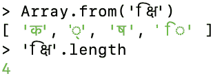
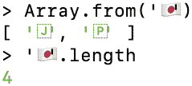

# 十九、Unicode-简介（高级）

> 原文：[`exploringjs.com/impatient-js/ch_unicode.html`](https://exploringjs.com/impatient-js/ch_unicode.html)
> 
> 译者：[飞龙](https://github.com/wizardforcel)
> 
> 协议：[CC BY-NC-SA 4.0](https://creativecommons.org/licenses/by-nc-sa/4.0/)


* * *

+   19.1 码点与码元

    +   19.1.1 码点

    +   19.1.2 编码 Unicode 码点：UTF-32，UTF-16，UTF-8

+   19.2 Web 开发中使用的编码：UTF-16 和 UTF-8

    +   19.2.1 内部源代码：UTF-16

    +   19.2.2 字符串：UTF-16

    +   19.2.3 文件中的源代码：UTF-8

+   19.3 字形簇-真正的字符

    +   19.3.1 字形簇与字形

* * *

Unicode 是表示和管理世界上大多数书写系统的文本的标准。几乎所有处理文本的现代软件都支持 Unicode。该标准由 Unicode 联盟维护。每年都会发布标准的新版本（带有新的表情符号等）。Unicode 版本 1.0.0 于 1991 年 10 月发布。

### 19.1 码点与码元

了解 Unicode 的两个概念至关重要：

+   *码点*是表示 Unicode 文本的原子部分的数字。它们大多表示可见符号，但也可以具有其他含义，例如指定符号的某个方面（字母的重音，表情符号的肤色等）。

+   *码元*是编码码点的数字，用于存储或传输 Unicode 文本。一个或多个码元编码一个单个码点。每个码元的大小相同，取决于所使用的*编码格式*。最流行的格式 UTF-8 具有 8 位码元。

#### 19.1.1 码点

Unicode 的第一个版本具有 16 位码点。从那时起，字符数量大大增加，码点的大小扩展到 21 位。这 21 位被分成 17 个平面，每个平面有 16 位：

+   平面 0：**基本多语言平面（BMP）**，0x0000–0xFFFF

    +   包含几乎所有现代语言的字符（拉丁字符，亚洲字符等）和许多符号。

+   平面 1：补充多语言平面（SMP），0x10000–0x1FFFF

    +   支持历史书写系统（例如埃及象形文字和楔形文字）和其他现代书写系统。

    +   支持表情符号和许多其他符号。

+   平面 2：补充表意文字平面（SIP），0x20000–0x2FFFF

    +   包含额外的 CJK（中文，日文，韩文）表意文字。

+   平面 3-13：未分配

+   平面 14：补充特殊用途平面（SSP），0xE0000–0xEFFFF

    +   包含标记字符和字形变体选择器等非图形字符。

+   平面 15-16：补充专用区域（S PUA A/B），0x0F0000–0x10FFFF

    +   可供 ISO 和 Unicode 联盟之外的各方分配字符。未标准化。

飞机 1-16 被称为补充平面或**星界平面**。

让我们检查一些字符的码点：

```js
> 'A'.codePointAt(0).toString(16)
'41'
> 'ü'.codePointAt(0).toString(16)
'fc'
> 'π'.codePointAt(0).toString(16)
'3c0'
> '🙂'.codePointAt(0).toString(16)
'1f642'
```

码点的十六进制数字告诉我们，前三个字符位于平面 0（在 16 位内），而表情符号位于平面 1。

#### 19.1.2 编码 Unicode 码点：UTF-32，UTF-16，UTF-8

编码码点的主要方式有三种*Unicode 转换格式*（UTFs）：UTF-32，UTF-16，UTF-8。每种格式的末尾数字表示其码元的大小（以位为单位）。

##### 19.1.2.1 UTF-32（Unicode 转换格式 32）

UTF-32 使用 32 位来存储码元，从而每个码点对应一个码元。这种格式是唯一具有*固定长度编码*的格式；其他所有格式都使用不同数量的码元来编码单个码点。

##### 19.1.2.2 UTF-16（Unicode 转换格式 16）

UTF-16 使用 16 位码元进行编码。它将码点编码如下：

+   BMP（Unicode 的前 16 位）存储在单个代码单元中。

+   星际平面：BMP 包括 0x10_000 个代码点。鉴于 Unicode 总共有 0x110_000 个代码点，我们仍然需要编码剩余的 0x100_000 个代码点（20 位）。BMP 有两个未分配代码点的范围，提供了必要的存储空间：

    +   最重要的 10 位（*领导代理*）：0xD800-0xDBFF

    +   最不重要的 10 位（*尾随代理*）：0xDC00-0xDFFF

换句话说，末尾的两个十六进制数字贡献了 8 位。但是，只有当 BMP 以以下两位数字对之一开头时，我们才能使用这 8 位：

+   D8, D9, DA, DB

+   DC, DD, DE, DF

每个代理都有 4 对可选，这就是剩下的 2 位来自的地方。

因此，每个 UTF-16 代码单元始终是一个领导代理、一个尾随代理或者编码 BMP 代码点。

这是 UTF-16 编码的两个示例代码点：

+   代码点 0x03C0（π）在 BMP 中，因此可以由单个 UTF-16 代码单元 0x03C0 表示。

+   代码点 0x1F642（`🙂`）在星际平面中，由两个代码单元表示：0xD83D 和 0xDE42。

##### 19.1.2.3 UTF-8（Unicode 转换格式 8）

UTF-8 具有 8 位代码单元。它使用 1-4 个代码单元来编码一个代码点：

| 代码点 | 代码单元 |
| --- | --- |
| 0000–007F | 0bbbbbbb (7 位) |
| 0080–07FF | 110bbbbb, 10bbbbbb (5+6 位) |
| 0800–FFFF | 1110bbbb, 10bbbbbb, 10bbbbbb (4+6+6 位) |
| 10000–1FFFFF | 11110bbb, 10bbbbbb, 10bbbbbb, 10bbbbbb (3+6+6+6 位) |

注：

+   每个代码单元的位前缀告诉我们：

    +   它是一系列代码单元中的第一个吗？如果是，后面会跟随多少个代码单元？

    +   它是一系列代码单元中的第二个或更后面的吗？

+   0000–007F 范围内的字符映射与 ASCII 相同，这导致与旧软件的一定程度的向后兼容。

三个例子：

| 字符 | 代码点 | 代码单元 |
| --- | --- | --- |
| A | 0x0041 | 01000001 |
| π | 0x03C0 | 11001111, 10000000 |
| `🙂` | 0x1F642 | 11110000, 10011111, 10011001, 10000010 |

### 19.2 Web 开发中使用的编码：UTF-16 和 UTF-8

在 Web 开发中使用的 Unicode 编码格式有：UTF-16 和 UTF-8。

#### 19.2.1 源代码内部：UTF-16

ECMAScript 规范在内部将源代码表示为 UTF-16。

#### 19.2.2 字符串：UTF-16

JavaScript 字符串中的字符基于 UTF-16 代码单元：

```js
> const smiley = '🙂';
> smiley.length
2
> smiley === '\uD83D\uDE42' // code units
true
```

有关 Unicode 和字符串的更多信息，请参阅§20.7“文本的原子：代码点、JavaScript 字符、图形簇”。

#### 19.2.3 文件中的源代码：UTF-8

HTML 和 JavaScript 这些天几乎总是以 UTF-8 编码。

例如，这就是 HTML 文件通常现在的开头方式：

```js
<!doctype html>
<html>
<head>
 <meta charset="UTF-8">
···
```

对于在 Web 浏览器中加载的 HTML 模块，[标准编码](https://html.spec.whatwg.org/multipage/webappapis.html#fetch-a-single-module-script)也是 UTF-8。

### 19.3 图形簇 - 真正的字符

字符的概念一旦考虑到世界上各种不同的书写系统，就变得非常复杂。这就是为什么有几个不同的 Unicode 术语在某种程度上都意味着“字符”：*代码点*、*图形簇*、*字形*等。

在 Unicode 中，*代码点*是文本的一个原子部分。

然而，*图形簇*最接近于屏幕或纸张上显示的符号。它被定义为“文本的水平可分割单元”。因此，[官方 Unicode 文件](https://unicode.org/reports/tr29/#Grapheme_Cluster_Boundaries)也称其为*用户感知字符*。需要一个或多个代码点来编码一个图形簇。

例如，德瓦纳加里语*kshi*由 4 个代码点编码。我们使用`Array.from()`将字符串拆分为具有代码点的数组（有关详细信息，请参阅§20.7.1“使用代码点”）：

> 

旗帜表情符号也是字形簇，由两个代码点组成 - 例如，日本的国旗：

> 

#### 19.3.1 字形簇 vs. 字形

符号是一个抽象概念，是书面语言的一部分：

+   它在计算机内存中由*字形簇*表示 - 一个或多个数字（代码点）的序列。

+   它通过*字形*在屏幕上绘制。字形是一种图像，通常存储在字体中。可以使用多个字形来绘制单个符号 - 例如，符号“é”可以通过组合字形“e”和字形“´”来绘制。

概念与其表示之间的区别是微妙的，在谈论 Unicode 时可能会变得模糊。

**有关字形簇的更多信息**

有关更多信息，请参阅 Manish Goregaokar 的[“让我们停止将含义归因于代码点”](https://manishearth.github.io/blog/2017/01/14/stop-ascribing-meaning-to-unicode-code-points/)。

**测验**

请参阅测验应用程序。

[评论](https://github.com/rauschma/impatient-js/issues/41)
