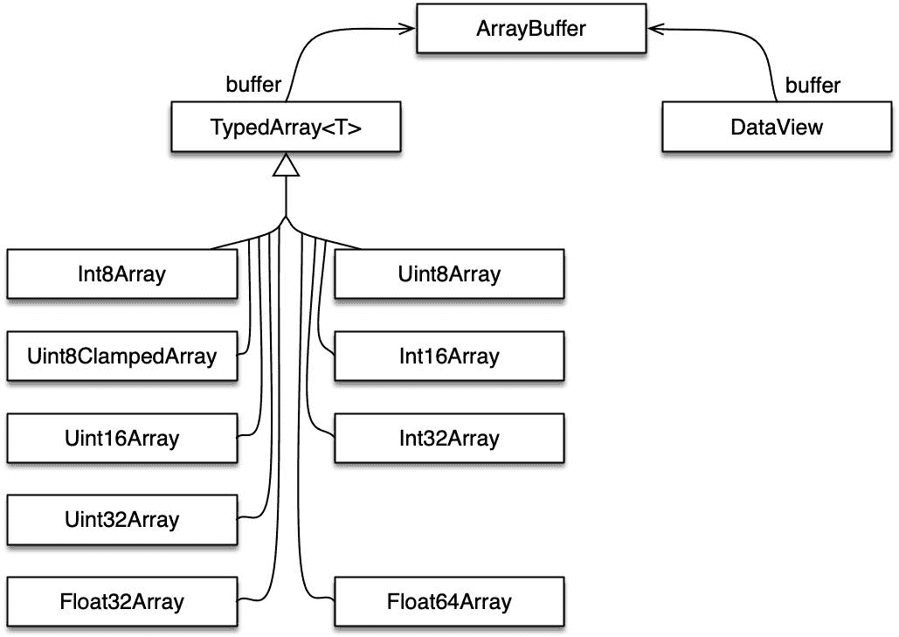

# 三十二、Typed Arrays：处理二进制数据（高级）

> 原文：[`exploringjs.com/impatient-js/ch_typed-arrays.html`](https://exploringjs.com/impatient-js/ch_typed-arrays.html)

* * *

+   32.1 API 的基础](ch_typed-arrays.html#the-basics-of-the-api)

    +   32.1.1 Typed Arrays 的用例](ch_typed-arrays.html#use-cases-for-typed-arrays)

    +   32.1.2 核心类：`ArrayBuffer`、Typed Arrays、`DataView`](ch_typed-arrays.html#the-core-classes-arraybuffer-typed-arrays-dataview)

    +   32.1.3 使用 Typed Arrays](ch_typed-arrays.html#using-typed-arrays)

    +   32.1.4 使用 DataViews](ch_typed-arrays.html#using-dataviews)

+   32.2 元素类型](ch_typed-arrays.html#element-types)

    +   32.2.1 处理溢出和下溢](ch_typed-arrays.html#handling-overflow-underflow)

    +   32.2.2 字节顺序](ch_typed-arrays.html#endianness)

+   32.3 Typed Arrays 的更多信息](ch_typed-arrays.html#more-information-on-typed-arrays)

    +   32.3.1 `«ElementType»Array.from()`的静态方法

    +   32.3.2 Typed Arrays 是可迭代的](ch_typed-arrays.html#typed-arrays-are-iterable)

    +   32.3.3 Typed Arrays vs. normal Arrays](ch_typed-arrays.html#typed-arrays-vs.-normal-arrays)

    +   32.3.4 转换 Typed Arrays 为普通数组](ch_typed-arrays.html#converting-typed-arrays-to-and-from-normal-arrays)

    +   32.3.5 连接 Typed Arrays](ch_typed-arrays.html#concatenating-typed-arrays)

+   32.4 索引与偏移的快速参考](ch_typed-arrays.html#typed-arrays-indices-offsets)

+   32.5 ArrayBuffer 的快速参考](ch_typed-arrays.html#quick-reference-arraybuffers)

    +   32.5.1 `new ArrayBuffer()`](ch_typed-arrays.html#new-arraybuffer)

    +   32.5.2 `ArrayBuffer`的静态方法](ch_typed-arrays.html#static-methods-of-arraybuffer)

    +   32.5.3 `ArrayBuffer.prototype`的属性](ch_typed-arrays.html#properties-of-arraybuffer.prototype)

+   32.6 Typed Arrays 的快速参考](ch_typed-arrays.html#quick-reference-typed-arrays)

    +   32.6.1 `TypedArray<T>`的静态方法](ch_typed-arrays.html#static-methods-of-typedarrayt)

    +   32.6.2 `TypedArray<T>.prototype`的属性

    +   32.6.3 `new «ElementType»Array()`](ch_typed-arrays.html#new-elementtypearray)

    +   32.6.4 «ElementType»Array 的静态属性

    +   32.6.5 `«ElementType»Array.prototype`的属性

+   32.7 DataView 的快速参考](ch_typed-arrays.html#quick-reference-dataviews)

    +   32.7.1 `new DataView()`](ch_typed-arrays.html#new-dataview)

    +   32.7.2 `DataView.prototype`的属性

* * *

### 32.1 API 的基础

网络上的许多数据都是文本：JSON 文件、HTML 文件、CSS 文件、JavaScript 代码等。JavaScript 通过其内置的字符串很好地处理这些数据。

然而，在 2011 年之前，它并不擅长处理二进制数据。[Typed Array Specification 1.0](https://www.khronos.org/registry/typedarray/specs/1.0/)于 2011 年 2 月 8 日推出，提供了处理二进制数据的工具。随着 ECMAScript 6，Typed Arrays 被添加到核心语言，并获得了以前仅适用于普通数组的方法（`.map()`、`.filter()`等）。

#### 32.1.1 Typed Arrays 的用例

Typed Arrays 的主要用例包括：

+   处理二进制数据：管理图像数据、操作二进制文件、处理二进制网络协议等。

+   与本机 API 交互：本机 API 通常以二进制格式接收和返回数据，在 ES6 之前的 JavaScript 中无法很好地存储或操作这些数据。这意味着每当您与此类 API 通信时，数据都必须在 JavaScript 和二进制之间进行转换。类型化数组消除了这一瓶颈。与本机 API 通信的一个例子是 WebGL，最初为其创建了类型化数组。文章[“类型化数组的历史”](http://www.html5rocks.com/en/tutorials/webgl/typed_arrays/#toc-history)（由 Ilmari Heikkinen 为 HTML5 Rocks 撰写）的部分[“类型化数组：浏览器中的二进制数据”](http://www.html5rocks.com/en/tutorials/webgl/typed_arrays/#toc-history)有更多信息。

#### 32.1.2 核心类：`ArrayBuffer`，类型化数组，`DataView`

类型化数组 API 将二进制数据存储在`ArrayBuffer`的实例中：

```js
const buf = new ArrayBuffer(4); // length in bytes
 // buf is initialized with zeros
```

ArrayBuffer 本身是一个黑匣子：如果您想访问其数据，必须将其包装在另一个对象中 - *视图对象*。有两种类型的视图对象可用：

+   类型化数组：让您将数据作为具有相同类型的索引序列的元素访问。示例包括：

    +   `Uint8Array`：元素为无符号 8 位整数。*无符号*表示它们的范围从零开始。

    +   `Int16Array`：元素为有符号 16 位整数。*有符号*表示它们具有符号，可以是负数，零或正数。

    +   `Float32Array`：元素为 32 位浮点数。

+   DataViews：让您将数据解释为各种类型（`Uint8`，`Int16`，`Float32`等），您可以在任何字节偏移处读取和写入。

图 20 显示了 API 的类图。



图 20：类型化数组 API 的类。

#### 32.1.3 使用类型化数组

类型化数组与普通数组的使用方式基本相同，但有一些显著的区别：

+   类型化数组将它们的数据存储在 ArrayBuffers 中。

+   所有元素都初始化为零。

+   所有元素具有相同的类型。将值写入类型化数组会将它们强制转换为该类型。读取值会产生普通数字或大整数。

+   类型化数组的长度是不可变的；它不能被更改。

+   类型化数组不能有空洞。

##### 32.1.3.1 创建类型化数组

以下代码显示了创建相同类型化数组的三种不同方式：

```js
// Argument: Typed Array or Array-like object
const ta1 = new Uint8Array([0, 1, 2]);

const ta2 = Uint8Array.of(0, 1, 2);

const ta3 = new Uint8Array(3); // length of Typed Array
ta3[0] = 0;
ta3[1] = 1;
ta3[2] = 2;

assert.deepEqual(ta1, ta2);
assert.deepEqual(ta1, ta3);
```

##### 32.1.3.2 包装的 ArrayBuffer

```js
const typedArray = new Int16Array(2); // 2 elements
assert.equal(typedArray.length, 2);

assert.deepEqual(
 typedArray.buffer, new ArrayBuffer(4)); // 4 bytes
```

##### 32.1.3.3 获取和设置元素

```js
const typedArray = new Int16Array(2);

assert.equal(typedArray[1], 0); // initialized with 0
typedArray[1] = 72;
assert.equal(typedArray[1], 72);
```

#### 32.1.4 使用 DataViews

这就是 DataViews 的使用方式：

```js
const dataView = new DataView(new ArrayBuffer(4));
assert.equal(dataView.getInt16(0), 0);
assert.equal(dataView.getUint8(0), 0);
dataView.setUint8(0, 5);
```

### 32.2 元素类型

表 20：类型化数组 API 支持的元素类型。

| 元素 | 类型化数组 | 字节 | 描述 |  |
| --- | --- | --- | --- | --- |
| `Int8` | `Int8Array` | 1 | 8 位有符号整数 | ES6 |
| `Uint8` | `Uint8Array` | 1 | 8 位无符号整数 | ES6 |
| `Uint8C` | `Uint8ClampedArray` | 1 | 8 位无符号整数 | ES6 |
|  |  |  | （夹紧转换） | ES6 |
| `Int16` | `Int16Array` | 2 | 16 位有符号整数 | ES6 |
| `Uint16` | `Uint16Array` | 2 | 16 位无符号整数 | ES6 |
| `Int32` | `Int32Array` | 4 | 32 位有符号整数 | ES6 |
| `Uint32` | `Uint32Array` | 4 | 32 位无符号整数 | ES6 |
| `BigInt64` | `BigInt64Array` | 8 | 64 位有符号整数 | ES2020 |
| `BigUint64` | `BigUint64Array` | 8 | 64 位无符号整数 | ES2020 |
| `Float32` | `Float32Array` | 4 | 32 位浮点 | ES6 |
| `Float64` | `Float64Array` | 8 | 64 位浮点 | ES6 |

Tbl. 20 列出了可用的元素类型。这些类型（例如`Int32`）出现在两个位置：

+   在类型化数组中，它们指定元素的类型。例如，`Int32Array`的所有元素都具有类型`Int32`。元素类型是类型化数组唯一不同的方面。

+   在 DataViews 中，它们是访问其 ArrayBuffers 的透镜，当您使用`.getInt32()`和`.setInt32()`等方法时。

元素类型 `Uint8C` 是特殊的：它不受 `DataView` 支持，只存在于启用 `Uint8ClampedArray`。这种类型化数组被 `canvas` 元素使用（它替换了 `CanvasPixelArray`）并且应该尽量避免使用。`Uint8C` 和 `Uint8` 之间唯一的区别是如何处理溢出和下溢（如下一小节中所解释的）。

类型化数组和数组缓冲区使用数字和大整数来导入和导出值：

+   `BigInt64` 和 `BigUint64` 类型通过大整数处理。例如，setter 接受大整数，getter 返回大整数。

+   所有其他元素类型都通过数字处理。

#### 32.2.1 处理溢出和下溢

通常，当一个值超出了元素类型的范围时，会使用模算术将其转换为范围内的值。对于有符号和无符号整数来说，这意味着：

+   最高值加一会转换为最低值（对于无符号整数为 0）。

+   最低值减一会转换为最高值。

以下函数有助于说明转换的工作原理：

```js
function setAndGet(typedArray, value) {
 typedArray[0] = value;
 return typedArray[0];
}
```

无符号 8 位整数的模转换：

```js
const uint8 = new Uint8Array(1);

// Highest value of range
assert.equal(setAndGet(uint8, 255), 255);
// Overflow
assert.equal(setAndGet(uint8, 256), 0);

// Lowest value of range
assert.equal(setAndGet(uint8, 0), 0);
// Underflow
assert.equal(setAndGet(uint8, -1), 255);
```

有符号 8 位整数的模转换：

```js
const int8 = new Int8Array(1);

// Highest value of range
assert.equal(setAndGet(int8, 127), 127);
// Overflow
assert.equal(setAndGet(int8, 128), -128);

// Lowest value of range
assert.equal(setAndGet(int8, -128), -128);
// Underflow
assert.equal(setAndGet(int8, -129), 127);
```

夹紧转换是不同的：

+   所有下溢的值都转换为最低值。

+   所有溢出的值都转换为最高值。

```js
const uint8c = new Uint8ClampedArray(1);

// Highest value of range
assert.equal(setAndGet(uint8c, 255), 255);
// Overflow
assert.equal(setAndGet(uint8c, 256), 255);

// Lowest value of range
assert.equal(setAndGet(uint8c, 0), 0);
// Underflow
assert.equal(setAndGet(uint8c, -1), 0);
```

#### 32.2.2 字节顺序

每当一个类型（如 `Uint16`）被存储为多个字节的序列时，*字节顺序* 都很重要：

+   大端：最重要的字节先出现。例如，`Uint16` 值 0x4321 存储为两个字节 - 首先是 0x43，然后是 0x21。

+   小端：最不重要的字节先出现。例如，`Uint16` 值 0x4321 存储为两个字节 - 首先是 0x21，然后是 0x43。

字节顺序往往固定在每个 CPU 架构上，并且在本机 API 中保持一致。类型化数组用于与这些 API 进行通信，这就是为什么它们的字节顺序遵循平台的字节顺序并且不能更改的原因。

另一方面，协议和二进制文件的字节顺序是变化的，但在格式上是固定的，跨平台一致。因此，我们必须能够访问任一字节顺序的数据。DataView 用于这种情况，并且让您在获取或设置值时指定字节顺序。

[引用维基百科关于字节顺序的内容](https://en.wikipedia.org/wiki/Endianness)：

+   大端表示法是数据网络中最常见的约定；互联网协议套件的协议字段，如 IPv4、IPv6、TCP 和 UDP，以大端顺序传输。因此，大端字节顺序也被称为网络字节顺序。

+   小端存储在微处理器中很受欢迎，部分原因是因特尔公司对微处理器设计的重大历史影响。

还有其他可能的排序方式。这些通常被称为 *中端* 或 *混合端*。

### 32.3 有关类型化数组的更多信息

在本节中，`«ElementType»Array` 代表 `Int8Array`、`Uint8Array` 等。`ElementType` 是 `Int8`、`Uint8` 等。

#### 32.3.1 静态方法 `«ElementType»Array.from()`

这种方法的类型签名是：

```js
.from<S>(
 source: Iterable<S>|ArrayLike<S>,
 mapfn?: S => ElementType, thisArg?: any)
 : «ElementType»Array
```

`.from()` 将 `source` 转换为 `this` 的实例（类型化数组）。

例如，普通数组是可迭代的，并且可以使用这种方法进行转换：

```js
assert.deepEqual(
 Uint16Array.from([0, 1, 2]),
 Uint16Array.of(0, 1, 2));
```

类型化数组也是可迭代的：

```js
assert.deepEqual(
 Uint16Array.from(Uint8Array.of(0, 1, 2)),
 Uint16Array.of(0, 1, 2));
```

`source` 也可以是一个 *类数组对象*：

```js
assert.deepEqual(
 Uint16Array.from({0:0, 1:1, 2:2, length: 3}),
 Uint16Array.of(0, 1, 2));
```

可选的 `mapfn` 允许您在它们成为结果的元素之前转换 `source` 的元素。为什么要一次完成两个步骤 *映射* 和 *转换*？与通过 `.map()` 分别进行映射相比，有两个优势：

1.  不需要中间数组或类型化数组。

1.  在不同精度的类型化数组之间进行转换时，出错的可能性较小。

继续阅读有关第二个优势的解释。

##### 32.3.1.1 陷阱：在类型化数组类型之间进行映射转换时

静态方法 `.from()` 可以选择同时在类型化数组类型之间进行映射和转换。如果使用该方法，出错的可能性较小。

为了理解这一点，让我们首先将一个具有更高精度的 Typed Array 转换为一个具有更高精度的 Typed Array。如果我们使用`.from()`进行映射，结果会自动正确。否则，您必须先转换，然后再映射。

```js
const typedArray = Int8Array.of(127, 126, 125);
assert.deepEqual(
 Int16Array.from(typedArray, x => x * 2),
 Int16Array.of(254, 252, 250));

assert.deepEqual(
 Int16Array.from(typedArray).map(x => x * 2),
 Int16Array.of(254, 252, 250)); // OK
assert.deepEqual(
 Int16Array.from(typedArray.map(x => x * 2)),
 Int16Array.of(-2, -4, -6)); // wrong
```

如果我们从具有较低精度的 Typed Array 转换为具有较低精度的 Typed Array，通过`.from()`进行映射会产生正确的结果。否则，我们必须先映射，然后再转换。

```js
assert.deepEqual(
 Int8Array.from(Int16Array.of(254, 252, 250), x => x / 2),
 Int8Array.of(127, 126, 125));

assert.deepEqual(
 Int8Array.from(Int16Array.of(254, 252, 250).map(x => x / 2)),
 Int8Array.of(127, 126, 125)); // OK
assert.deepEqual(
 Int8Array.from(Int16Array.of(254, 252, 250)).map(x => x / 2),
 Int8Array.of(-1, -2, -3)); // wrong
```

问题在于，如果我们通过`.map()`进行映射，那么输入类型和输出类型是相同的。相反，`.from()`从任意输入类型转换为您通过其接收器指定的输出类型。

#### 32.3.2 Typed Arrays 是可迭代的

Typed Arrays 是可迭代的。这意味着你可以使用`for-of`循环和其他基于迭代的机制：

```js
const ui8 = Uint8Array.of(0, 1, 2);
for (const byte of ui8) {
 console.log(byte);
}
// Output:
// 0
// 1
// 2
```

ArrayBuffers 和 DataViews 不可迭代。

#### 32.3.3 Typed Arrays vs. 普通数组

Typed Arrays 与普通数组非常相似：它们具有`.length`，可以通过方括号操作符`[]`访问元素，并且具有大多数标准数组方法。它们与普通数组的不同之处在于：

+   Typed Arrays 有缓冲区。Typed Array `ta`的元素不存储在`ta`中，而是存储在一个关联的 ArrayBuffer 中，可以通过`ta.buffer`访问：

    ```js
    const ta = new Uint16Array(2); // 2 elements
    assert.deepEqual(
     ta.buffer, new ArrayBuffer(4)); // 4 bytes
    ```

+   Typed Arrays 初始化为零：

    +   `new Array(4)`创建一个没有任何元素的普通数组。它只有四个*空洞*（索引小于`.length`且没有关联元素）。

    +   `new Uint8Array(4)`创建一个所有元素都为 0 的 Typed Array。

    ```js
    assert.deepEqual(new Uint8Array(4), Uint8Array.of(0, 0, 0, 0));
    ```

+   所有 Typed Array 的元素都具有相同的类型：

    +   设置元素会将值转换为该类型。

        ```js
        const ta = new Uint8Array(1);

        ta[0] = 257;
        assert.equal(ta[0], 1); // 257 % 256 (overflow)

        ta[0] = '2';
        assert.equal(ta[0], 2);
        ```

    +   获取元素返回数字或大整数。

        ```js
        const ta = new Uint8Array(1);
        assert.equal(ta[0], 0);
        assert.equal(typeof ta[0], 'number');
        ```

+   Typed Array 的`.length`是从其 ArrayBuffer 派生的，永远不会改变（除非切换到不同的 ArrayBuffer）。

+   普通数组可以有空洞；Typed Arrays 不能。

#### 32.3.4 将 Typed Arrays 转换为普通数组

要将普通数组转换为 Typed Array，可以将其传递给 Typed Array 构造函数（接受类似数组的对象和 Typed Arrays）或`«ElementType»Array.from()`（接受可迭代对象和类似数组的对象）。例如：

```js
const ta1 = new Uint8Array([0, 1, 2]);
const ta2 = Uint8Array.from([0, 1, 2]);
assert.deepEqual(ta1, ta2);
```

要将 Typed Array 转换为普通数组，可以使用`Array.from()`或扩展（因为 Typed Arrays 是可迭代的）：

```js
assert.deepEqual(
 [...Uint8Array.of(0, 1, 2)], [0, 1, 2]
);
assert.deepEqual(
 Array.from(Uint8Array.of(0, 1, 2)), [0, 1, 2]
);
```

#### 32.3.5 连接 Typed Arrays

Typed Arrays 没有`.concat()`方法，像普通数组一样。解决方法是使用它们的重载方法`.set()`：

```js
.set(typedArray: TypedArray, offset=0): void
.set(arrayLike: ArrayLike<number>, offset=0): void
```

它将现有的`typedArray`或`arrayLike`复制到接收器中，索引为`offset`。`TypedArray`是所有具体 Typed Array 类的虚构抽象超类。

以下函数使用该方法将零个或多个 Typed Arrays（或类似数组的对象）复制到`resultConstructor`的实例中：

```js
function concatenate(resultConstructor, ...arrays) {
 let totalLength = 0;
 for (const arr of arrays) {
 totalLength += arr.length;
 }
 const result = new resultConstructor(totalLength);
 let offset = 0;
 for (const arr of arrays) {
 result.set(arr, offset);
 offset += arr.length;
 }
 return result;
}
assert.deepEqual(
 concatenate(Uint8Array, Uint8Array.of(1, 2), [3, 4]),
 Uint8Array.of(1, 2, 3, 4));
```

### 32.4 快速参考：索引 vs. 偏移

为了准备 ArrayBuffers、Typed Arrays 和 DataViews 的快速参考，我们需要了解索引和偏移之间的区别：

+   方括号操作符`[]`的索引：只能使用非负索引（从 0 开始）。

    在普通数组中，写入负索引会创建属性：

    ```js
    const arr = [6, 7];
    arr[-1] = 5;
    assert.deepEqual(
     Object.keys(arr), ['0', '1', '-1']);
    ```

    在 Typed Arrays 中，写入负索引会被忽略：

    ```js
    const tarr = Uint8Array.of(6, 7);
    tarr[-1] = 5;
    assert.deepEqual(
     Object.keys(tarr), ['0', '1']);
    ```

+   ArrayBuffers、Typed Arrays 和 DataViews 的方法的索引：每个索引都可以是负数。如果是负数，则将其添加到实体的长度以产生实际索引。因此，`-1`指的是最后一个元素，`-2`指的是倒数第二个元素，依此类推。普通数组的方法工作方式相同。

    ```js
    const ui8 = Uint8Array.of(0, 1, 2);
    assert.deepEqual(ui8.slice(-1), Uint8Array.of(2));
    ```

+   传递给 Typed Arrays 和 DataViews 方法的偏移量必须是非负的-例如：

    ```js
    const dataView = new DataView(new ArrayBuffer(4));
    assert.throws(
     () => dataView.getUint8(-1),
     {
     name: 'RangeError',
     message: 'Offset is outside the bounds of the DataView',
     });
    ```

参数是索引还是偏移量只能通过查看文档来确定；没有简单的规则。

### 32.5 快速参考：ArrayBuffers

ArrayBuffers 存储二进制数据，可以通过 Typed Arrays 和 DataViews 访问。

#### 32.5.1 `new ArrayBuffer()`

构造函数的类型签名是：

```js
new ArrayBuffer(length: number)
```

通过`new`调用此构造函数会创建一个容量为`length`字节的实例。这些字节最初都是 0。

您无法更改 ArrayBuffer 的长度；您只能创建一个具有不同长度的新 ArrayBuffer。

#### 32.5.2 `ArrayBuffer`的静态方法

+   `ArrayBuffer.isView(arg: any)`

    如果`arg`是一个对象并且是 ArrayBuffer 的*视图*（即，如果它是 Typed Array 或 DataView），则返回`true`。

#### 32.5.3 `ArrayBuffer.prototype`的属性

+   `get .byteLength(): number`

    返回此 ArrayBuffer 的容量（以字节为单位）。

+   `.slice(startIndex: number, endIndex=this.byteLength)`

    创建一个新的 ArrayBuffer，其中包含此 ArrayBuffer 的字节，其索引大于或等于`startIndex`且小于`endIndex`。`start`和`endIndex`可以是负数（参见§32.4“快速参考：索引 vs. 偏移量”）。

### 32.6 快速参考：Typed Arrays

各种 Typed Array 对象的属性分两步介绍：

1.  `TypedArray`：首先，我们看一下所有 Typed Array 类的抽象超类（在本章开头的类图中显示）。我称这个超类为`TypedArray`，但它无法直接从 JavaScript 访问。`TypedArray.prototype`包含所有 Typed Arrays 的方法。

1.  `«ElementType»Array`：具体的 Typed Array 类称为`Uint8Array`，`Int16Array`，`Float32Array`等。这些是您通过`new`，`.of`和`.from()`使用的类。

#### 32.6.1 `TypedArray<T>`的静态方法

两个静态`TypedArray`方法都被其子类（`Uint8Array`等）继承。`TypedArray`是抽象的。因此，您总是通过子类使用这些方法，子类是具体的，可以直接实例化。

+   `.from<S>(source: Iterable<S>|ArrayLike<S>, mapfn?: S => T, thisArg?: any) : instanceof this`

    将可迭代对象（包括数组和 Typed Arrays）或类似数组的对象转换为`this`的实例（`instanceof this`是我发明的，用于表达这个事实）。

    ```js
    assert.deepEqual(
     Uint16Array.from([0, 1, 2]),
     Uint16Array.of(0, 1, 2));
    ```

    可选的`mapfn`允许您在它们成为结果的元素之前转换`source`的元素。

    ```js
    assert.deepEqual(
     Int16Array.from(Int8Array.of(127, 126, 125), x => x * 2),
     Int16Array.of(254, 252, 250));
    ```

+   `.of(...items: bigint[]): instanceof this`（`BigInt64Array`，`BigUint64Array`）

+   `.of(...items: number[]): instanceof this`（所有其他 Typed Arrays）

    创建一个新的`this`实例，其元素为`items`（强制转换为元素类型）。

    ```js
    assert.deepEqual(
     Int16Array.of(-1234, 5, 67),
     new Int16Array([-1234, 5, 67]) );
    ```

#### 32.6.2 `TypedArray<T>.prototype`的属性

Typed Array 方法接受的索引可以是负数（它们的工作方式类似于传统的数组方法）。偏移量必须是非负的。详情请参见§32.4“快速参考：索引 vs. 偏移量”。

##### 32.6.2.1 特定于 Typed Arrays 的属性

以下属性特定于 Typed Arrays；普通数组没有这些属性：

+   `get .buffer(): ArrayBuffer`

    返回支持此 Typed Array 的缓冲区。

+   `get .length(): number`

    返回此 Typed Array 缓冲区中的元素长度。

+   `get .byteLength(): number`

    返回此 Typed Array 缓冲区的字节大小。

+   `get .byteOffset(): number`

    返回此 Typed Array 在其 ArrayBuffer 内“开始”的偏移量。

+   `.set(typedArray: TypedArray, offset=0): void`

+   `.set(arrayLike: ArrayLike<bigint>, offset=0): void`（`BigInt64Array`，`BigUint64Array`）

+   `.set(arrayLike: ArrayLike<number>, offset=0): void`（所有其他 Typed Arrays）

    将第一个参数的所有元素复制到此 Typed Array。参数的索引 0 的元素写入此 Typed Array 的索引`offset`（依此类推）。有关类似数组的更多信息，请参阅§31.5“类似数组”。

+   `.subarray(startIndex=0, endIndex=this.length): TypedArray<T>`

    返回一个新的 Typed Array，其缓冲区与此 Typed Array 相同，但范围（通常）更小。如果`startIndex`是非负数，则结果 Typed Array 的第一个元素是`this[startIndex]`，第二个是`this[startIndex+1]`（依此类推）。如果`startIndex`为负数，则会进行适当转换。

##### 32.6.2.2 数组方法

以下方法基本上与普通数组的方法相同：

+   `.at(index: number): T | undefined` ^([R, ES2022])

+   `.copyWithin(target: number, start: number, end=this.length): this` ^([W, ES6])

+   `.entries(): Iterable<[number, T]>` ^([R, ES6])

+   `.every(callback: (value: T, index: number, array: TypedArray<T>) => boolean, thisArg?: any): boolean` ^([R, ES6])

+   `.fill(value: T, start=0, end=this.length): this` ^([W, ES6])

+   `.filter(callback: (value: T, index: number, array: TypedArray<T>) => any, thisArg?: any): T[]` ^([R, ES6])

+   `.find(predicate: (value: T, index: number, obj: T[]) => boolean, thisArg?: any): T | undefined` ^([R, ES6])

+   `.findIndex(predicate: (value: T, index: number, obj: T[]) => boolean, thisArg?: any): number` ^([R, ES6])

+   `.forEach(callback: (value: T, index: number, array: TypedArray<T>) => void, thisArg?: any): void` ^([R, ES6])

+   `.includes(searchElement: T, fromIndex=0): boolean` ^([R, ES2016])

+   `.indexOf(searchElement: T, fromIndex=0): number` ^([R, ES6])

+   `.join(separator = ','): string` ^([R, ES6])

+   `.keys(): Iterable<number>` ^([R, ES6])

+   `.lastIndexOf(searchElement: T, fromIndex=this.length-1): number` ^([R, ES6])

+   `.map<U>(mapFunc: (value: T, index: number, array: TypedArray<T>) => U, thisArg?: any): U[]` ^([R, ES6])

+   `.reduce<U>(callback: (accumulator: U, element: T, index: number, array: T[]) => U, init?: U): U` ^([R, ES6])

+   `.reduceRight<U>(callback: (accumulator: U, element: T, index: number, array: T[]) => U, init?: U): U` ^([R, ES6])

+   `.reverse(): this` ^([W, ES6])

+   `.slice(start=0, end=this.length): T[]` ^([R, ES6])

+   `.some(callback: (value: T, index: number, array: TypedArray<T>) => boolean, thisArg?: any): boolean` ^([R, ES6])

+   `.sort(compareFunc?: (a: T, b: T) => number): this` ^([W, ES6])

+   `.toString(): string` ^([R, ES6])

+   `.values(): Iterable<T>` ^([R, ES6])

有关这些方法的工作原理的详细信息，请参阅§31.13.3“Array.prototype 的方法”。

#### 32.6.3 `new «ElementType»Array()`

每个类型化数组构造函数都有一个遵循`«ElementType»Array`模式的名称，其中`«ElementType»`是表格中的元素类型之一。这意味着类型化数组有 11 个构造函数：

+   `Float32Array`, `Float64Array`

+   `Int8Array`, `Int16Array`, `Int32Array`, `BigInt64Array`

+   `Uint8Array`, `Uint8ClampedArray`, `Uint16Array`, `Uint32Array`, `BigUint64Array`

每个构造函数都有四个*重载*版本-它的行为取决于它接收的参数数量以及它们的类型：

+   `new «ElementType»Array(buffer: ArrayBuffer, byteOffset=0, length=0)`

    创建一个新的`«ElementType»Array`，其缓冲区为`buffer`。它从给定的`byteOffset`开始访问缓冲区，并具有给定的`length`。请注意，`length`计算类型化数组的元素（每个元素 1-8 个字节），而不是字节。

+   `new «ElementType»Array(length=0)`

    创建一个具有给定`length`和适当缓冲区的新`«ElementType»Array`。缓冲区的大小以字节为单位：

    ```js
    length * «ElementType»Array.BYTES_PER_ELEMENT
    ```

+   `new «ElementType»Array(source: TypedArray)`

    创建一个`«ElementType»Array`的新实例，其元素具有与`source`的元素相同的值，但被强制转换为`ElementType`。

+   `new «ElementType»Array(source: ArrayLike<bigint>)` (`BigInt64Array`, `BigUint64Array`)

+   `new «ElementType»Array(source: ArrayLike<number>)`（所有其他类型化数组）

    创建一个新的`«ElementType»Array`的实例，其元素具有与`source`的元素相同的值，但被强制转换为`ElementType`。有关类似数组的对象的更多信息，请参阅§31.5“类似数组的对象”。

#### 32.6.4 `«ElementType»Array`的静态属性

+   `«ElementType»Array.BYTES_PER_ELEMENT: number`

    计算存储单个元素所需的字节数：

    ```js
    > Uint8Array.BYTES_PER_ELEMENT
    1
    > Int16Array.BYTES_PER_ELEMENT
    2
    > Float64Array.BYTES_PER_ELEMENT
    8
    ```

#### 32.6.5 `«ElementType»Array.prototype`的属性

+   `.BYTES_PER_ELEMENT: number`

    与`«ElementType»Array.BYTES_PER_ELEMENT`相同。

### 32.7 快速参考：DataViews

#### 32.7.1 `new DataView()`

+   `new DataView(buffer: ArrayBuffer, byteOffset=0, byteLength=buffer.byteLength-byteOffset)`

    创建一个新的 DataView，其数据存储在 ArrayBuffer`buffer`中。默认情况下，新的 DataView 可以访问整个`buffer`。最后两个参数允许您更改这一点。

#### 32.7.2 `DataView.prototype`的属性

在本节的其余部分，`«ElementType»`指的是：

+   `Int8`, `Int16`, `Int32`, `BigInt64`

+   `Uint8`, `Uint16`, `Uint32`, `BigUint64`

+   `Float32`, `Float64`

这些是`DataView.prototype`的属性：

+   `get .buffer(): ArrayBuffer`

    返回此 DataView 的 ArrayBuffer。

+   `get .byteLength(): number`

    返回此 DataView 可以访问多少字节。

+   `get .byteOffset(): number`

    返回此 DataView 开始访问其缓冲区中的字节的偏移量。

+   `.get«ElementType»(byteOffset: number, littleEndian=false): bigint` (`BigInt64`, `BigUint64`)

    `.get«ElementType»(byteOffset: number, littleEndian=false): number`（所有其他元素类型）

    从此 DataView 的缓冲区中读取值。

+   `.set«ElementType»(byteOffset: number, value: bigint, littleEndian=false): void`（`BigInt64`，`BigUint64`）

    `.set«ElementType»(byteOffset: number, value: number, littleEndian=false): void`（所有其他元素类型）

    将`value`写入此 DataView 的缓冲区。

[评论](https://github.com/rauschma/impatient-js/issues/45)
