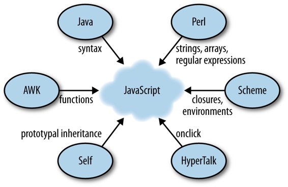

# 第三章：JavaScript 的本质

> 原文：[3. The Nature of JavaScript](https://exploringjs.com/es5/ch03.html)
> 
> 译者：[飞龙](https://github.com/wizardforcel)
> 
> 协议：[CC BY-NC-SA 4.0](https://creativecommons.org/licenses/by-nc-sa/4.0/)

JavaScript 的本质可以总结如下：

它是动态的

许多东西都可以改变。例如，你可以自由地添加和删除对象的*属性*（字段）。而且你可以直接创建对象，而不需要先创建对象工厂（例如类）。

它是动态类型的

变量和对象属性始终可以保存任何类型的值。

它是功能性的和面向对象的

JavaScript 支持两种编程语言范式：函数式编程（一流函数、闭包、通过`bind()`进行部分应用、数组的内置`map()`和`reduce()`等）和面向对象编程（可变状态、对象、继承等）。

它默默失败

直到 ECMAScript 3，JavaScript 才没有异常处理。这就解释了为什么语言经常默默失败并自动转换参数和操作数的值：它最初无法抛出异常。

它部署为源代码

JavaScript 始终以源代码部署，并由 JavaScript 引擎编译。源代码具有灵活的交付格式和抽象引擎之间的差异的好处。为了保持文件大小小，使用了两种技术：*压缩*（主要是 gzip）和*最小化*（通过重命名变量、删除注释等使源代码更小；有关详细信息，请参见第三十二章）。

它是 Web 平台的一部分

JavaScript 是 Web 平台（HTML5 API、DOM 等）的一个重要组成部分，以至于很容易忘记前者也可以在没有后者的情况下使用。然而，JavaScript 在非浏览器环境中的使用越多（如 Node.js），它就越明显。

## 怪癖和非正统特性

一方面，JavaScript 有一些怪癖和缺失的功能（例如，它没有块作用域变量，没有内置模块，也不支持子类化）。因此，在其他语言中学习语言特性的地方，你需要在 JavaScript 中学习模式和解决方法。另一方面，JavaScript 包括非正统的特性（如原型继承和对象属性）。这些也需要学习，但更像是一种特性而不是错误。

请注意，JavaScript 引擎已经变得非常智能，并在幕后修复了一些怪癖。例如：

+   就规范而言，JavaScript 没有整数，只有浮点数。在内部，大多数引擎尽可能使用整数。

+   可以说，JavaScript 中的数组太灵活了：它们不是元素的索引序列，而是从数字到元素的映射。这样的映射可以有空洞：数组“内部”没有关联值的索引。再次，引擎通过使用优化表示来帮助数组不具有空洞。

## 优雅的部分

但 JavaScript 也有许多优雅的部分。Brendan Eich 最喜欢的是：¹

+   一流函数

+   闭包

+   原型

+   对象字面量

+   数组字面量

最后两个项目，对象字面量和数组字面量，让你可以从对象开始，并在后来引入抽象（比如构造函数，JavaScript 中类的类比）。它们还支持 JSON（见第二十二章）。

请注意，优雅的部分可以帮助你解决怪癖。例如，它们允许你在语言内部实现块作用域、模块和继承 API。

## 影响

JavaScript 受到了几种编程语言的影响（如[图 3-1](ch03.html#fig3-1 "图 3-1： 影响 JavaScript 的编程语言。"）所示）：

+   Java 是 JavaScript 语法的榜样。它还导致 JavaScript 将值分为原始值和对象，并引入了`Date`构造函数（这是`java.util.Date`的一个移植）。

+   AWK 启发了 JavaScript 的函数。实际上，关键字`function`来自 AWK。

+   Scheme 是 JavaScript 拥有一流函数（它们被视为值并且可以作为参数传递给函数）和闭包（见第十六章）的原因。

+   Self 对 JavaScript 不寻常的对象导向风格负有责任；它支持对象之间的原型继承。

+   Perl 和 Python 影响了 JavaScript 对字符串、数组和正则表达式的处理。

+   除了实际的语言之外，HyperTalk 影响了 JavaScript 如何集成到 Web 浏览器中。这导致 HTML 标签具有事件处理属性，如`onclick`。

图 3-1。影响 JavaScript 的编程语言。

* * *

¹ Brendan Eich，“JavaScript 简史”，2010 年 7 月 21 日，[`bit.ly/1lKkI0M`](http://bit.ly/1lKkI0M)。

