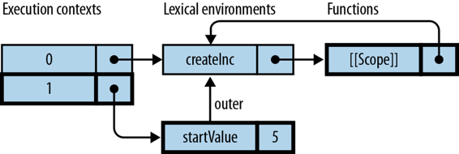

# 第十六章：变量：作用域、环境和闭包

> 原文：[16. Variables: Scopes, Environments, and Closures](https://exploringjs.com/es5/ch16.html)
> 
> 译者：[飞龙](https://github.com/wizardforcel)
> 
> 协议：[CC BY-NC-SA 4.0](https://creativecommons.org/licenses/by-nc-sa/4.0/)


本章首先解释了如何使用变量，然后详细介绍了它们的工作方式（环境、闭包等）。

## 声明变量

在 JavaScript 中，您在使用变量之前通过`var`语句声明变量：

```js
var foo;
foo = 3; // OK, has been declared
bar = 5; // not OK, an undeclared variable
```

您还可以将声明与赋值结合在一起，立即初始化变量：

```js
var foo = 3;
```

未初始化变量的值为`undefined`：

```js
> var x;
> x
undefined
```

## 背景：静态与动态

您可以从两个角度来检查程序的工作方式：

静态（或词法）

您在不运行程序的情况下检查程序的存在。给定以下代码，我们可以得出静态断言，即函数`g`嵌套在函数`f`内部：

```js
function f() {
    function g() {
    }
}
```

形容词*词法*与*静态*是同义词，因为两者都与程序的*词汇*（单词，源代码）有关。

动态

您在执行程序时检查发生的情况（“在运行时”）。给定以下代码：

```js
function g() {
}
function f() {
    g();
}
```

当我们调用`f()`时，它调用`g()`。在运行时，`g`被`f`调用表示动态关系。

## 背景：变量的范围

在本章的其余部分，您应该了解以下概念：

变量的范围

变量的范围是它可访问的位置。例如：

```js
function foo() {
    var x;
}
```

在这里，`x`的*直接作用域*是函数`foo()`。

词法作用域

JavaScript 中的变量是*词法作用域*的，因此程序的静态结构决定了变量的作用域（不受例如函数从何处调用的影响）。

嵌套范围

如果作用域嵌套在变量的直接作用域内，则该变量在所有这些作用域中都是可访问的：

```js
function foo(arg) {
    function bar() {
        console.log('arg: '+arg);
    }
    bar();
}
console.log(foo('hello')); // arg: hello
```

`arg`的直接范围是`foo()`，但它也可以在嵌套范围`bar()`中访问。就嵌套而言，`foo()`是*外部范围*，`bar()`是*内部范围*。

遮蔽

如果作用域声明了与外部作用域中的变量同名的变量，则内部作用域中将阻止对外部变量的访问，并且所有嵌套在其中的作用域。对内部变量的更改不会影响外部变量，在离开内部作用域后，外部变量再次可访问：

```js
var x = "global";
function f() {
    var x = "local";
    console.log(x); // local
}
f();
console.log(x); // global
```

在函数`f()`内部，全局`x`被本地`x`遮蔽。

## 变量是函数作用域的

大多数主流语言都是*块作用域*的：变量“存在于”最内部的周围代码块中。以下是 Java 的一个例子：

```js
public static void main(String[] args) {
    { // block starts
        int foo = 4;
    } // block ends
    System.out.println(foo); // Error: cannot find symbol
}
```

在前面的代码中，变量`foo`只能在直接包围它的块内部访问。如果我们在块结束后尝试访问它，将会得到编译错误。

相比之下，JavaScript 的变量是*函数作用域*的：只有函数引入新的作用域；在作用域方面忽略了块。例如：

```js
function main() {
    { // block starts
        var foo = 4;
    } // block ends
    console.log(foo); // 4
}
```

换句话说，`foo`在`main()`中是可访问的，而不仅仅是在块内部。

## 变量声明被提升

JavaScript *提升*所有变量声明，将它们移动到其直接作用域的开头。这样可以清楚地说明如果在声明之前访问变量会发生什么：

```js
function f() {
    console.log(bar);  // undefined
    var bar = 'abc';
    console.log(bar);  // abc
}
```

我们可以看到变量`bar`已经存在于`f()`的第一行，但它还没有值；也就是说，声明已经被提升，但赋值没有。JavaScript 执行`f()`时，就好像它的代码是：

```js
function f() {
    var bar;
    console.log(bar);  // undefined
    bar = 'abc';
    console.log(bar);  // abc
}
```

如果声明已经声明了一个变量，那么什么也不会发生（变量的值不变）：

```js
> var x = 123;
> var x;
> x
123
```

每个函数声明也会被提升，但方式略有不同。完整的函数会被提升，而不仅仅是存储它的变量的创建（参见[提升](ch15.html#function_hoisting "提升")）。

### 最佳实践：了解提升，但不要害怕它

一些 JavaScript 风格指南建议您只在函数开头放置变量声明，以避免被提升所欺骗。如果您的函数相对较小（无论如何都应该是这样），那么您可以放松这个规则，将变量声明在使用它们的地方附近（例如，在`for`循环内部）。这样更好地封装了代码片段。显然，您应该意识到这种封装只是概念上的，因为函数范围的提升仍然会发生。

陷阱：给未声明的变量赋值会使其成为全局变量

在松散模式下，对未经`var`声明的变量进行赋值会创建一个全局变量：

```js
> function sloppyFunc() { x = 123 }
> sloppyFunc()
> x
123
```

值得庆幸的是，严格模式在发生这种情况时会抛出异常：

```js
> function strictFunc() { 'use strict'; x = 123 }
> strictFunc()
ReferenceError: x is not defined
```

## 通过 IIFE 引入新的作用域

通常，您会引入新的作用域来限制变量的生命周期。一个例子是您可能希望在`if`语句的`then`部分中这样做：只有在条件成立时才执行；如果它专门使用辅助变量，我们不希望它们“泄漏”到周围的作用域中：

```js
function f() {
    if (condition) {
        var tmp = ...;
        ...
    }
    // tmp still exists here
    // => not what we want
}
```

如果要为`then`块引入新的作用域，可以定义一个函数并立即调用它。这是一种解决方法，模拟块作用域：

```js
function f() {
    if (condition) {
        (function () {  // open block
            var tmp = ...;
            ...
        }());  // close block
    }
}
```

这是 JavaScript 中的一种常见模式。Ben Alman 建议将其称为[*立即调用函数表达式*](http://bit.ly/i-ife)（IIFE，发音为“iffy”）。一般来说，IIFE 看起来像这样：

```js
(function () { // open IIFE
    // inside IIFE
}()); // close IIFE
```

以下是关于 IIFE 的一些注意事项：

它立即被调用

在函数的闭括号后面的括号立即调用它。这意味着它的主体立即执行。

它必须是一个表达式

如果语句以关键字`function`开头，解析器会期望它是一个函数声明（参见[Expressions Versus Statements](ch07.html#expr_vs_stmt "Expressions Versus Statements")）。但是函数声明不能立即调用。因此，我们通过以开括号开始语句来告诉解析器关键字`function`是函数表达式的开始。在括号内，只能有表达式。

需要分号

如果您在两个 IIFE 之间忘记了它，那么您的代码将不再起作用：

```js
(function () {
    ...
}()) // no semicolon
(function () {
    ...
}());
```

前面的代码被解释为函数调用——第一个 IIFE（包括括号）是要调用的函数，第二个 IIFE 是参数。

### 注意

IIFE 会产生成本（在认知和性能方面），因此在`if`语句内部使用它很少有意义。上面的例子是为了教学目的而选择的。

### IIFE 变体：前缀运算符

您还可以通过前缀运算符强制执行表达式上下文。例如，您可以通过逻辑非运算符这样做：

```js
!function () { // open IIFE
    // inside IIFE
}(); // close IIFE
```

或通过`void`运算符（参见[The void Operator](ch09.html#void_operator "The void Operator")）：

```js
void function () { // open IIFE
    // inside IIFE
}(); // close IIFE
```

使用前缀运算符的优点是忘记结束分号不会引起麻烦。

### IIFE 变体：已经在表达式上下文中

请注意，如果您已经处于表达式上下文中，则不需要强制执行 IIFE 的表达式上下文。然后您不需要括号或前缀运算符。例如：

```js
var File = function () { // open IIFE
    var UNTITLED = 'Untitled';
    function File(name) {
        this.name = name || UNTITLED;
    }
    return File;
}(); // close IIFE
```

在上面的例子中，有两个不同的变量名为`File`。一方面，有一个函数，只能直接在 IIFE 内部访问。另一方面，在第一行声明的变量。它被赋予在 IIFE 中返回的值。

### IIFE 变体：带参数的 IIFE

您可以使用参数来定义 IIFE 内部的变量：

```js
var x = 23;
(function (twice) {
    console.log(twice);
}(x * 2));
```

这类似于：

```js
var x = 23;
(function () {
    var twice = x * 2;
    console.log(twice);
}());
```

### IIFE 应用

IIFE 使您能够将私有数据附加到函数上。然后，您就不必声明全局变量，并且可以将函数与其状态紧密打包。您避免了污染全局命名空间：

```js
var setValue = function () {
    var prevValue;
    return function (value) { // define setValue
        if (value !== prevValue) {
            console.log('Changed: ' + value);
            prevValue = value;
        }
    };
}();
```

IIFE 的其他应用在本书的其他地方提到：

+   避免全局变量；隐藏全局范围内的变量（参见[Best Practice: Avoid Creating Global Variables](ch16.html#avoid_global_variables "Best Practice: Avoid Creating Global Variables")）

+   创建新的环境；避免共享（参见[Pitfall: Inadvertently Sharing an Environment](ch16.html#inadvertently_sharing_environments "Pitfall: Inadvertently Sharing an Environment")）

+   将全局数据私有化到所有构造函数中（参见[Keeping global data private to all of a constructor](ch17_split_001.html#private_data_complete_constructor "Keeping global data private to all of a constructor")）

+   将全局数据附加到单例对象上（参见[将私有全局数据附加到单例对象](ch17_split_001.html#private_data_singleton "将私有全局数据附加到单例对象"）

+   将全局数据附加到方法（参见[将全局数据附加到方法](ch17_split_001.html#private_data_method "将全局数据附加到方法"）

## 全局变量

包含程序的所有范围称为*全局范围*或*程序范围*。这是当进入脚本时所在的范围（无论是网页中的`<script>`标签还是*.js*文件）。在全局范围内，你可以通过定义一个函数来创建一个嵌套作用域。在这样的函数内部，你可以再次嵌套作用域。每个作用域都可以访问自己的变量以及包围它的作用域中的变量。由于全局范围包围所有其他作用域，它的变量可以在任何地方访问：

```js
// here we are in global scope
var globalVariable = 'xyz';
function f() {
    var localVariable = true;
    function g() {
        var anotherLocalVariable = 123;

        // All variables of surround scopes are accessible
        localVariable = false;
        globalVariable = 'abc';
    }
}
// here we are again in global scope
```

### 最佳实践：避免创建全局变量

全局变量有两个缺点。首先，依赖全局变量的软件部分会受到副作用的影响；它们不够健壮，行为不够可预测，也不够可重用。

其次，网页上的所有 JavaScript 共享相同的全局变量：你的代码，内置函数，分析代码，社交媒体按钮等等。这意味着名称冲突可能会成为一个问题。这就是为什么最好尽可能隐藏全局范围内的变量。例如，不要这样做：

```js
<!-- Don’t do this -->
<script>
    // Global scope
    var tmp = generateData();
    processData(tmp);
    persistData(tmp);
</script>
```

变量`tmp`变成了全局变量，因为它的声明是在全局范围内执行的。但它只在本地使用。因此，我们可以使用 IIFE（参见[通过 IIFE 引入新作用域](ch16.html#iife "通过 IIFE 引入新作用域"））将其隐藏在嵌套作用域中：

```js
<script>
    (function () {  // open IIFE
        // Local scope
        var tmp = generateData();
        processData(tmp);
        persistData(tmp);
    }());  // close IIFE
</script>
```

### 模块系统导致全局变量减少

值得庆幸的是，模块系统（参见[模块系统](ch31.html#module_systems "模块系统"））大多消除了全局变量的问题，因为模块不通过全局范围进行接口，并且每个模块都有自己的模块全局变量的作用域。

## 全局对象

ECMAScript 规范使用内部数据结构*环境*来存储变量（参见[环境：管理变量](ch16.html#environments "环境：管理变量"））。该语言具有一个有点不寻常的特性，即通过对象（所谓的*全局对象*）使全局变量的环境可访问。全局对象可用于创建、读取和更改全局变量。在全局范围内，`this`指向它：

```js
> var foo = 'hello';
> this.foo  // read global variable
'hello'

> this.bar = 'world';  // create global variable
> bar
'world'
```

请注意，全局对象具有原型。如果你想列出它的（自己的和继承的）所有属性，你需要一个诸如`getAllPropertyNames()`的函数，来自[列出所有属性键](ch17_split_000.html#getAllPropertyNames "列出所有属性键"）：

```js
> getAllPropertyNames(window).sort().slice(0, 5)
[ 'AnalyserNode', 'Array', 'ArrayBuffer', 'Attr', 'Audio' ]
```

JavaScript 的创造者 Brendan Eich 认为全局对象是他的[“最大遗憾”](http://mzl.la/1oOeCif)之一。它对性能产生负面影响，使变量作用域的实现更加复杂，并导致代码模块化程度降低。

### 跨平台考虑

浏览器和 Node.js 都有用于引用全局对象的全局变量。不幸的是，它们是不同的：

+   浏览器包含`window`，它作为文档对象模型（DOM）的一部分进行了标准化，而不是作为 ECMAScript 5 的一部分。每个框架或窗口都有一个全局对象。

+   Node.js 包含`global`，这是一个特定于 Node.js 的变量。每个模块都有自己的作用域，其中`this`指向具有该作用域变量的对象。因此，在模块内部，`this`和`global`是不同的。

在两个平台上，`this`都指向全局对象，但只有在全局范围内才是如此。这在 Node.js 上几乎从不会发生。如果你想以跨平台的方式访问全局对象，可以使用以下模式：

```js
(function (glob) {
    // glob points to global object
}(typeof window !== 'undefined' ? window : global));
```

从现在开始，我使用`window`来指代全局对象，但在跨平台代码中，你应该使用前面的模式和`glob`。

### 使用`window`的用例

本节描述了通过`window`访问全局变量的用例。但一般规则是：尽量避免这样做。

#### 使用情况：标记全局变量

前缀`window`是代码引用全局变量而不是局部变量的视觉线索：

```js
var foo = 123;
(function () {
    console.log(window.foo);  // 123
}());
```

但是，这会使您的代码变得脆弱。一旦您将`foo`从全局范围移动到另一个周围范围，它就会停止工作：

```js
(function () {
    var foo = 123;
    console.log(window.foo);  // undefined
}());
```

因此，最好将`foo`作为变量而不是`window`的属性引用。如果您想明显地表明`foo`是全局或类似全局的变量，可以添加一个名称前缀，例如`g_`：

```js
var g_foo = 123;
(function () {
    console.log(g_foo);
}());
```

#### 使用情况：内置

我不喜欢通过`window`引用内置全局变量。它们是众所周知的名称，因此从指示它们是全局的角度获得的帮助很少。而且前缀的`window`会增加混乱：

```js
window.isNaN(...)  // no
isNaN(...)  // yes
```

#### 使用情况：样式检查器

当您使用诸如 JSLint 和 JSHint 之类的样式检查工具时，使用`window`意味着在引用当前文件中未声明的全局变量时不会出错。但是，这两个工具都提供了方法来告诉它们这样的变量，并防止出现此类错误（在其文档中搜索“全局变量”）。

#### 使用情况：检查全局变量是否存在

这不是一个常见的用例，但是 shim 和 polyfill 特别需要检查全局变量`someVariable`是否存在（请参阅[Shims Versus Polyfills](ch30.html#shim_vs_polyfill "Shims Versus Polyfills")）。在这种情况下，`window`有所帮助：

```js
if (window.someVariable) { ... }
```

这是执行此检查的安全方式。如果`someVariable`未声明，则以下语句会引发异常：

```js
// Don’t do this
if (someVariable) { ... }
```

您可以通过`window`进行两种额外的检查方式；它们大致等效，但更加明确：

```js
if (window.someVariable !== undefined) { ... }
if ('someVariable' in window) { ... }
```

检查变量是否存在（并具有值）的一般方法是通过`typeof`（请参阅[typeof: Categorizing Primitives](ch09.html#typeof "typeof: Categorizing Primitives")）：

```js
if (typeof someVariable !== 'undefined') { ... }
```

#### 使用情况：在全局范围创建事物

`window`允许您将事物添加到全局范围（即使您处于嵌套范围），并且它允许您有条件地这样做：

```js
if (!window.someApiFunction) {
    window.someApiFunction = ...;
}
```

通常最好通过`var`将事物添加到全局范围，而您处于全局范围。但是，`window`提供了一种有条件地进行添加的清晰方式。

## 环境：管理变量

### 提示

环境是一个高级主题。它们是 JavaScript 内部的细节。如果您想更深入地了解变量的工作原理，请阅读本节。

当程序执行进入其作用域时，变量就会出现。然后它们需要存储空间。提供该存储空间的数据结构在 JavaScript 中称为*环境*。它将变量名映射到值。其结构与 JavaScript 对象的结构非常相似。环境有时会在您离开其作用域后继续存在。因此，它们存储在堆上，而不是栈上。

变量以两种方式传递。如果您愿意的话，它们有两个维度：

动态维度：调用函数

每次调用函数时，它都需要为其参数和变量提供新的存储空间。完成后，该存储通常可以被回收。例如，考虑阶乘函数的以下实现。它递归调用自身多次，每次都需要`n`的新存储空间：

```js
function fac(n) {
    if (n <= 1) {
        return 1;
    }
    return n * fac(n - 1);
}
```

词法（静态）维度：保持与周围作用域的连接

无论函数被调用多少次，它总是需要访问自己（新鲜的）局部变量和周围作用域的变量。例如，以下函数`doNTimes`内部有一个辅助函数`doNTimesRec`。当`doNTimesRec`多次调用自身时，每次都会创建一个新的环境。但是，在这些调用期间，`doNTimesRec`也保持与`doNTimes`的单个环境的连接（类似于所有函数共享单个全局环境）。`doNTimesRec`需要该连接来访问（1）行中的`action`：

```js
function doNTimes(n, action) {
    function doNTimesRec(x) {
        if (x >= 1) {
            action();  // (1)
            doNTimesRec(x-1);
        }
    }
    doNTimesRec(n);
}
```

这两个维度的处理方式如下：

动态维度：执行上下文的堆栈

每次调用函数时，都会创建一个新的*环境*，用于将标识符（参数和变量）映射到值。为了处理递归，*执行上下文*——对环境的引用——在堆栈中进行管理。该堆栈反映了调用堆栈。

词法维度：环境链

为了支持这个维度，函数通过内部属性`[[Scope]]`记录了它被创建时的作用域。当调用函数时，会为进入的新作用域创建一个环境。该环境有一个称为`outer`的字段，指向外部作用域的环境，并通过`[[Scope]]`设置。因此，始终存在一条环境链，从当前活动环境开始，继续到它的外部环境，依此类推。每条链以全局环境结束（最初调用函数的作用域）。全局环境的`outer`字段为`null`。

为了解析标识符，会遍历完整的环境链，从活动环境开始。

让我们看一个例子：

```js
function myFunction(myParam) {
    var myVar = 123;
    return myFloat;
}
var myFloat = 1.3;
// Step 1
myFunction('abc');  // Step 2
```

图 16-1：变量的动态维度通过执行上下文的堆栈处理，静态维度通过环境链处理。活动的执行上下文、环境和函数被突出显示。步骤 1 显示了在调用 myFunction(*abc*)函数之前这些数据结构。步骤 2 显示了在函数调用期间。

图 16-1 函数之前这些数据结构。步骤 2 显示了在函数调用期间。")说明了在执行前述代码时会发生什么：

1.  `myFunction`和`myFloat`已经存储在全局环境（#0）中。请注意，由`myFunction`引用的`function`对象通过内部属性`[[Scope]]`指向它的作用域（全局作用域）。

1.  对于执行`myFunction('abc')`，会创建一个新的环境（#1），其中包含参数和局部变量。它通过`outer`（从`myFunction.[[Scope]]`初始化）引用其外部环境。由于外部环境，`myFunction`可以访问`myFloat`。

## 闭包：函数保持与它们诞生作用域的连接

如果一个函数离开了它被创建的作用域，它仍然与该作用域（以及周围作用域）的变量保持连接。例如：

```js
function createInc(startValue) {
    return function (step) {
        startValue += step;
        return startValue;
    };
}
```

`createInc()`返回的函数不会失去与`startValue`的连接——该变量为函数提供了跨函数调用持续存在的状态：

```js
> var inc = createInc(5);
> inc(1)
6
> inc(2)
8
```

*闭包*是一个函数加上它被创建时的作用域的连接。这个名字源于闭包“封闭”了函数的自由变量。如果一个变量不是在函数内声明的，即来自“外部”，那么它就是自由的。

### 通过环境处理闭包

### 提示

这是一个深入探讨闭包工作原理的高级部分。您应该熟悉环境（请查看[环境：管理变量](ch16.html#environments "环境：管理变量")）。

闭包是执行离开其范围后仍然存在的环境的一个例子。为了说明闭包的工作原理，让我们将之前与`createInc()`的交互分解为四个步骤（在每个步骤中，突出显示活动执行上下文及其环境；如果函数是活动的，它也会被突出显示）：

1.  这一步发生在交互之前，并且在评估`createInc`的函数声明之后。`createInc`的条目已添加到全局环境（＃0）中，并指向一个函数对象。


1.  这一步发生在函数调用`createInc(5)`期间。为`createInc`创建了一个新的环境（＃1）并推送到堆栈上。它的外部环境是全局环境（与`createInc.[[Scope]]`相同）。该环境保存了参数`startValue`。



1.  这一步发生在对`inc`进行赋值之后。当我们从`createInc`返回时，指向其环境的执行上下文已从堆栈中移除，但是环境仍然存在于堆中，因为`inc.[[Scope]]`引用它。`inc`是一个闭包（函数加出生环境）。


1.  这一步发生在执行`inc(1)`期间。已创建了一个新的环境（＃1），并且指向它的执行上下文已被推送到堆栈上。它的外部环境是`inc`的`[[Scope]]`。外部环境使`inc`可以访问`startValue`。


1.  这一步发生在执行`inc(1)`之后。不再有引用（执行上下文，`outer`字段或`[[Scope]]`）指向`inc`的环境。因此它不再需要，并且可以从堆中删除。


### 陷阱：无意中共享环境

有时，您创建的函数的行为受当前范围内的变量的影响。在 JavaScript 中，这可能会有问题，因为每个函数应该使用函数创建时变量的值。但是，由于函数是闭包，函数将始终使用变量的*当前*值。在`for`循环中，这可能会导致事情无法正常工作。通过示例可以更清楚地说明：

```js
function f() {
    var result = [];
    for (var i=0; i<3; i++) {
        var func = function () {
            return i;
        };
        result.push(func);
    }
    return result;
}
console.log(f()1;  // 3
```

`f`返回一个包含三个函数的数组。所有这些函数仍然可以访问`f`的环境，因此也可以访问`i`。实际上，它们共享相同的环境。然而，在循环结束后，`i`在该环境中的值为 3。因此，所有函数都返回`3`。

这不是我们想要的。为了解决问题，我们需要在创建使用它的函数之前对索引`i`进行快照。换句话说，我们希望将每个函数与函数创建时`i`的值打包在一起。因此，我们采取以下步骤：

1.  为返回的数组中的每个函数创建一个新的环境。

1.  在该环境中存储（复制）*i*的当前值。

只有函数创建环境，因此我们使用 IIFE（参见[通过 IIFE 引入新作用域](ch16.html#iife "通过 IIFE 引入新作用域")）来完成第 1 步：

```js
function f() {
    var result = [];
    for (var i=0; i<3; i++) {
        (function () { // step 1: IIFE
            var pos = i; // step 2: copy
            var func = function () {
                return pos;
            };
            result.push(func);
        }());
    }
    return result;
}
console.log(f()1;  // 1
```

请注意，该示例具有现实世界的相关性，因为在通过循环向 DOM 元素添加事件处理程序时会出现类似的情况。

