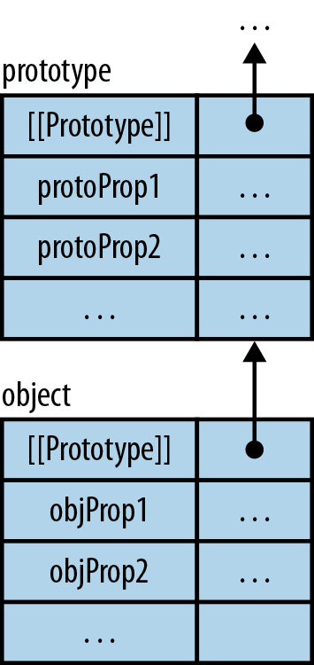
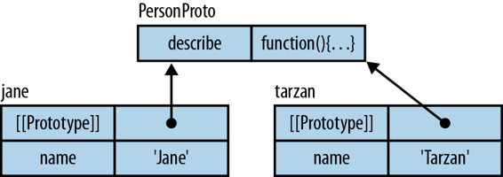
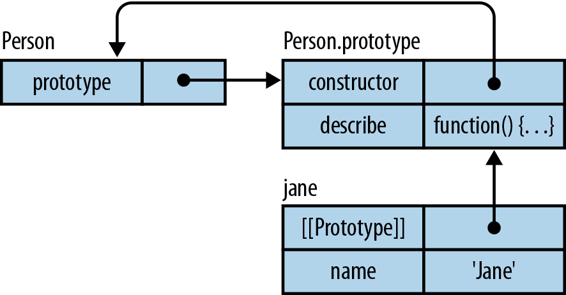
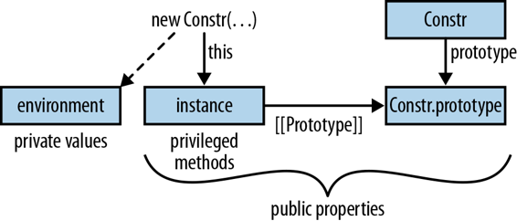
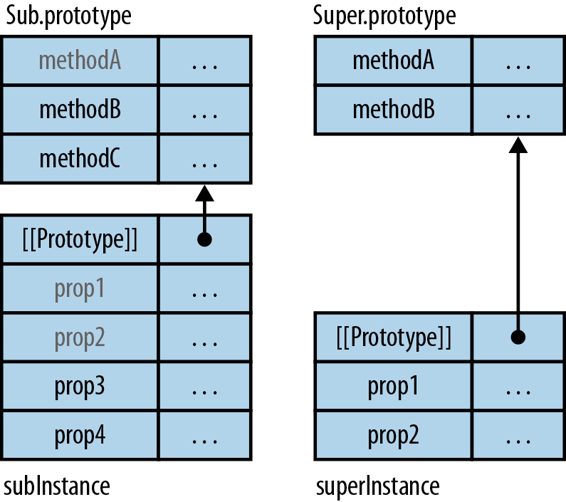
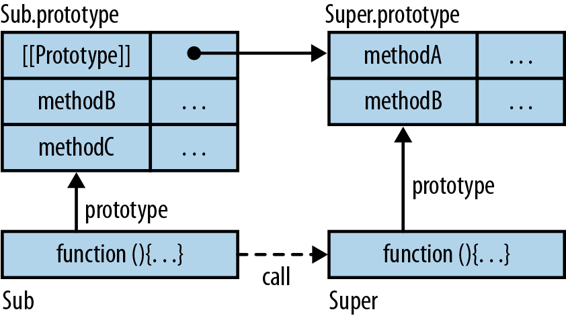
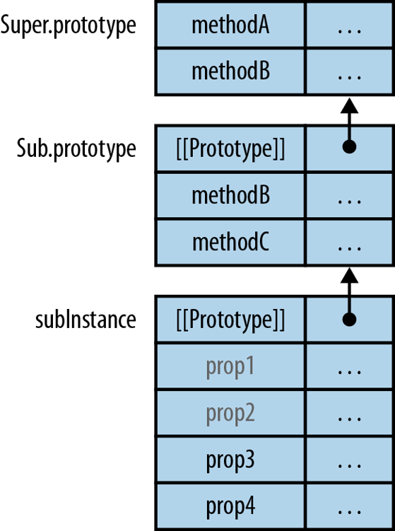

# 第十七章：对象和继承

> 原文：[17. Objects and Inheritance](https://exploringjs.com/es5/ch17.html)
> 
> 译者：[飞龙](https://github.com/wizardforcel)
> 
> 协议：[CC BY-NC-SA 4.0](https://creativecommons.org/licenses/by-nc-sa/4.0/)


JavaScript 中的面向对象编程（OOP）有几个层次：

+   第 1 层：使用单个对象的面向对象（在[第 1 层：单个对象](ch17_split_000.html#single_objects "第 1 层：单个对象")中介绍）

+   第二层：对象的原型链（在[第二层：对象之间的原型关系](ch17_split_000.html#prototype_relationship "第二层：对象之间的原型关系")中描述）

+   第 3 层：构造函数作为实例的工厂，类似于其他语言中的类（在[第 3 层：构造函数—实例的工厂](ch17_split_001.html#constructors "第 3 层：构造函数—实例的工厂")中讨论）

+   第 4 层：子类化，通过从现有构造函数继承创建新的构造函数（在[第 4 层：构造函数之间的继承](ch17_split_001.html#constructor_inheritance "第 4 层：构造函数之间的继承")中讨论）

每个新层只依赖于之前的层，使您能够逐步学习 JavaScript OOP。第 1 层和第 2 层形成一个简单的核心，您可以在更复杂的第 3 层和第 4 层让您感到困惑时进行参考。

## 第 1 层：单个对象

大致上，JavaScript 中的所有对象都是从字符串到值的映射（字典）。对象中的（键，值）条目称为*属性*。属性的键始终是文本字符串。属性的值可以是任何 JavaScript 值，包括函数。*方法*是其值为函数的属性。

### 属性的种类

有三种属性：

属性（或命名数据属性）

对象中的普通属性—即从字符串键到值的映射。命名数据属性包括方法。这是最常见的属性类型。

访问器（或命名访问器属性）

特殊方法的调用看起来像是读取或写入属性。普通属性是属性值的存储位置；访问器允许您计算属性的值。如果你愿意，它们是虚拟属性。有关详细信息，请参见[访问器（getter 和 setter）](ch17_split_000.html#getters_setters "访问器（getter 和 setter）")。

内部属性

仅存在于 ECMAScript 语言规范中。它们无法直接从 JavaScript 中访问，但可能有间接访问它们的方法。规范使用方括号写入内部属性的键。例如，`[[Prototype]]`保存对象的原型，并且可以通过`Object.getPrototypeOf()`读取。

### 对象字面量

JavaScript 的*对象字面量*允许您直接创建*普通对象*（`Object`的直接实例）。以下代码使用对象字面量将对象分配给变量`jane`。对象具有两个属性：`name`和`describe`。`describe`是一个方法：

```js
var jane = {
    name: 'Jane',

    describe: function () {
        return 'Person named '+this.name;  // (1)
    },  // (2)
};
```

1.  在方法中使用`this`来引用当前对象（也称为方法调用的*接收者*）。

1.  ECMAScript 5 允许在对象字面量中使用尾随逗号（在最后一个属性之后）。遗憾的是，并非所有旧版浏览器都支持它。尾随逗号很有用，因为您可以重新排列属性，而不必担心哪个属性是最后一个。

您可能会有这样的印象，即对象*只是*从字符串到值的映射。但它们不仅如此：它们是真正的通用对象。例如，您可以在对象之间使用继承（请参见[第 2 层：对象之间的原型关系](ch17_split_000.html#prototype_relationship "第 2 层：对象之间的原型关系")），并且可以保护对象免受更改。直接创建对象的能力是 JavaScript 的一大特点：您可以从具体对象开始（无需类！），然后稍后引入抽象。例如，*构造函数*是对象的工厂（如[第 3 层：构造函数—实例的工厂](ch17_split_001.html#constructors "第 3 层：构造函数—实例的工厂")中讨论的），大致类似于其他语言中的类。

### 点运算符（.）：通过固定键访问属性

点运算符提供了一种紧凑的语法来访问属性。属性键必须是标识符（参见[Legal Identifiers](ch07.html#identifiers "Legal Identifiers")）。如果您想要读取或写入具有任意名称的属性，您需要使用括号运算符（参见[Bracket Operator ([]): Accessing Properties via Computed Keys](ch17_split_000.html#bracket_operator "Bracket Operator ([]): Accessing Properties via Computed Keys")）。

本节中的示例与以下对象一起使用：

```js
var jane = {
    name: 'Jane',

    describe: function () {
        return 'Person named '+this.name;
    }
};
```

#### 获取属性

点运算符允许您“获取”属性（读取其值）。以下是一些示例：

```js
> jane.name  // get property `name`
'Jane'
> jane.describe  // get property `describe`
[Function]
```

获取不存在的属性返回`undefined`：

```js
> jane.unknownProperty
undefined
```

#### 调用方法

点运算符也用于调用方法：

```js
> jane.describe()  // call method `describe`
'Person named Jane'
```

#### 设置属性

您可以使用赋值运算符（`=`）通过点表示法设置属性的值。例如：

```js
> jane.name = 'John';  // set property `name`
> jane.describe()
'Person named John'
```

如果属性尚不存在，则设置它会自动创建它。如果属性已经存在，则设置它会更改其值。

#### 删除属性

`delete`运算符允许您完全从对象中删除属性（整个键值对）。例如：

```js
> var obj = { hello: 'world' };
> delete obj.hello
true
> obj.hello
undefined
```

如果您仅将属性设置为`undefined`，则该属性仍然存在，对象仍然包含其键：

```js
> var obj = { foo: 'a', bar: 'b' };

> obj.foo = undefined;
> Object.keys(obj)
[ 'foo', 'bar' ]
```

如果删除属性，则其键也将消失：

```js
> delete obj.foo
true
> Object.keys(obj)
[ 'bar' ]
```

`delete`仅影响对象的直接（“自有”，非继承的）属性。其原型不会受到影响（参见[Deleting an inherited property](ch17_split_000.html#delete_inherited_property "Deleting an inherited property")）。

### 提示

谨慎使用`delete`运算符。大多数现代 JavaScript 引擎会优化通过构造函数创建的实例的性能，如果它们的“形状”不发生变化（大致上：不会删除或添加属性）。删除属性会阻止该优化。

#### `delete`的返回值

如果属性是自有属性，但无法删除，则`delete`返回`false`。在所有其他情况下，它返回`true`。以下是一些示例。

作为准备工作，我们创建一个可以删除的属性和另一个无法删除的属性（[Getting and Defining Properties via Descriptors](ch17_split_000.html#functions_for_property_descriptors "Getting and Defining Properties via Descriptors")解释了`Object.defineProperty()`）：

```js
var obj = {};
Object.defineProperty(obj, 'canBeDeleted', {
    value: 123,
    configurable: true
});
Object.defineProperty(obj, 'cannotBeDeleted', {
    value: 456,
    configurable: false
});
```

对于无法删除的自有属性，`delete`返回`false`：

```js
> delete obj.cannotBeDeleted
false
```

在所有其他情况下，`delete`都会返回`true`：

```js
> delete obj.doesNotExist
true
> delete obj.canBeDeleted
true
```

即使不改变任何内容，`delete`也会返回`true`（继承属性永远不会被删除）：

```js
> delete obj.toString
true
> obj.toString // still there
[Function: toString]
```

### 不寻常的属性键

虽然您不能将保留字（例如`var`和`function`）用作变量名，但您可以将它们用作属性键：

```js
> var obj = { var: 'a', function: 'b' };
> obj.var
'a'
> obj.function
'b'
```

数字可以在对象文字中用作属性键，但它们被解释为字符串。点运算符只能访问其键为标识符的属性。因此，您需要使用括号运算符（如下例所示）来访问其键为数字的属性：

```js
> var obj = { 0.7: 'abc' };
> Object.keys(obj)
[ '0.7' ]
> obj['0.7']
'abc'
```

对象文字还允许您使用任意字符串（既不是标识符也不是数字）作为属性键，但您必须对其进行引用。同样，您需要使用括号运算符来访问属性值：

```js
> var obj = { 'not an identifier': 123 };
> Object.keys(obj)
[ 'not an identifier' ]
> obj['not an identifier']
123
```

### 括号运算符（[]）：通过计算键访问属性

虽然点运算符适用于固定属性键，但括号运算符允许您通过表达式引用属性。

#### 通过括号运算符获取属性

括号运算符允许您通过表达式计算属性的键：

```js
> var obj = { someProperty: 'abc' };

> obj['some' + 'Property']
'abc'

> var propKey = 'someProperty';
> obj[propKey]
'abc'
```

这也允许您访问其键不是标识符的属性：

```js
> var obj = { 'not an identifier': 123 };
> obj['not an identifier']
123
```

请注意，括号运算符会将其内部强制转换为字符串。例如：

```js
> var obj = { '6': 'bar' };
> obj[3+3]  // key: the string '6'
'bar'
```

#### 通过括号运算符调用方法

调用方法的工作方式与您期望的一样：

```js
> var obj = { myMethod: function () { return true } };
> obj['myMethod']()
true
```

#### 通过括号运算符设置属性

设置属性的工作方式与点运算符类似：

```js
> var obj = {};
> obj['anotherProperty'] = 'def';
> obj.anotherProperty
'def'
```

#### 通过括号运算符删除属性

删除属性的工作方式也与点运算符类似：

```js
> var obj = { 'not an identifier': 1, prop: 2 };
> Object.keys(obj)
[ 'not an identifier', 'prop' ]
> delete obj['not an identifier']
true
> Object.keys(obj)
[ 'prop' ]
```

## 将任何值转换为对象

这并不是一个常见的用例，但有时你需要将任意值转换为对象。`Object()` 作为函数（而不是构造函数）提供了这种服务。它产生以下结果：

| 值 | 结果 |
| --- | --- |
| (不带参数调用) | `{}` |
| `undefined` | `{}` |
| `null` | `{}` |
| 布尔值 `bool` | `new Boolean(bool)` |
| 数字 `num` | `new Number(num)` |
| 字符串 `str` | `new String(str)` |
| 对象 `obj` | `obj`（不变，无需转换）|

以下是一些例子：

```js
> Object(null) instanceof Object
true

> Object(false) instanceof Boolean
true

> var obj = {};
> Object(obj) === obj
true
```

以下函数检查 `value` 是否为对象：

```js
function isObject(value) {
    return value === Object(value);
}
```

请注意，如果 `value` 不是对象，则前面的函数将创建一个对象。你可以通过 `typeof` 实现相同的功能，而不需要这样做（参见[Pitfall: typeof null](ch09.html#isobject_typeof "Pitfall: typeof null")）。

你也可以将 `Object` 作为构造函数调用，这将产生与作为函数调用相同的结果：

```js
> var obj = {};
> new Object(obj) === obj
true

> new Object(123) instanceof Number
true
```

### 提示

避免使用构造函数；几乎总是更好的选择是一个空对象字面量：

```js
var obj = new Object(); // avoid
var obj = {}; // prefer
```

## 函数和方法的隐式参数 `this`

当你调用一个函数时，`this` 总是一个（隐式）参数：

松散模式下的普通函数

即使普通函数对 `this` 没有用处，它仍然存在作为一个特殊变量，其值始终是全局对象（在浏览器中是 `window`；参见[全局对象](ch16.html#global_object "全局对象")）：

```js
> function returnThisSloppy() { return this }
> returnThisSloppy() === window
true
```

严格模式下的普通函数

`this` 总是 `undefined`：

```js
> function returnThisStrict() { 'use strict'; return this }
> returnThisStrict() === undefined
true
```

方法

`this` 指的是调用方法的对象：

```js
> var obj = { method: returnThisStrict };
> obj.method() === obj
true
```

在方法的情况下，`this` 的值被称为方法调用的*接收者*。

### 在设置 `this` 的情况下调用函数：call()、apply() 和 bind()

记住函数也是对象。因此，每个函数都有自己的方法。本节介绍了其中三个方法，并帮助调用函数。这三种方法在以下部分中用于解决调用函数的一些陷阱。即将出现的示例都涉及以下对象 `jane`：

```js
var jane = {
    name: 'Jane',
    sayHelloTo: function (otherName) {
        'use strict';
        console.log(this.name+' says hello to '+otherName);
    }
};
```

#### Function.prototype.call(thisValue, arg1?, arg2?, ...)

第一个参数是被调用函数内部的 `this` 的值；其余参数作为参数传递给被调用的函数。以下三次调用是等价的：

```js
jane.sayHelloTo('Tarzan');

jane.sayHelloTo.call(jane, 'Tarzan');

var func = jane.sayHelloTo;
func.call(jane, 'Tarzan');
```

对于第二次调用，你需要重复 `jane`，因为 `call()` 不知道你是如何得到它被调用的函数的。

#### Function.prototype.apply(thisValue, argArray)

第一个参数是被调用函数内部的 `this` 的值；第二个参数是一个提供调用参数的数组。以下三次调用是等价的：

```js
jane.sayHelloTo('Tarzan');

jane.sayHelloTo.apply(jane, ['Tarzan']);

var func = jane.sayHelloTo;
func.apply(jane, ['Tarzan']);
```

对于第二次调用，你需要重复 `jane`，因为 `apply()` 不知道你是如何得到它被调用的函数的。

[用于构造函数的 apply()](ch17_split_000.html#apply_constructors "用于构造函数的 apply()") 解释了如何在构造函数中使用 `apply()`。

#### Function.prototype.bind(thisValue, arg1?, ..., argN?)

这个方法执行*部分函数应用*——意味着它创建一个新的函数，以以下方式调用 `bind()` 的接收者：`this` 的值是 `thisValue`，参数从 `arg1` 开始直到 `argN`，然后是新函数的参数。换句话说，当新函数调用原始函数时，它将其参数附加到 `arg1, ..., argN`。让我们看一个例子：

```js
function func() {
    console.log('this: '+this);
    console.log('arguments: '+Array.prototype.slice.call(arguments));
}
var bound = func.bind('abc', 1, 2);
```

数组方法 `slice` 用于将 `arguments` 转换为数组，这对于记录它是必要的（这个操作在[类数组对象和通用方法](ch17_split_001.html#array-like_objects "类数组对象和通用方法")中有解释）。`bound` 是一个新函数。以下是交互：

```js
> bound(3)
this: abc
arguments: 1,2,3
```

以下三次对 `sayHelloTo` 的调用都是等价的：

```js
jane.sayHelloTo('Tarzan');

var func1 = jane.sayHelloTo.bind(jane);
func1('Tarzan');

var func2 = jane.sayHelloTo.bind(jane, 'Tarzan');
func2();
```

### 用于构造函数的 apply()

假设 JavaScript 有一个三个点运算符（`...`），可以将数组转换为实际参数。这样的运算符将允许您使用`Math.max()`（参见[其他函数](ch21.html#Math_max "其他函数")）与数组。在这种情况下，以下两个表达式将是等价的：

```js
Math.max(...[13, 7, 30])
Math.max(13, 7, 30)
```

对于函数，您可以通过`apply()`实现三个点运算符的效果：

```js
> Math.max.apply(null, [13, 7, 30])
30
```

三个点运算符对构造函数也有意义：

```js
new Date(...[2011, 11, 24]) // Christmas Eve 2011
```

遗憾的是，这里`apply()`不起作用，因为它只能帮助函数或方法调用，而不能帮助构造函数调用。

#### 手动模拟构造函数的 apply()

我们可以分两步模拟`apply()`。

步骤 1

通过方法调用将参数传递给`Date`（它们还不在数组中）：

```js
new (Date.bind(null, 2011, 11, 24))
```

前面的代码使用`bind()`创建一个没有参数的构造函数，并通过`new`调用它。

步骤 2

使用`apply()`将数组传递给`bind()`。因为`bind()`是一个方法调用，所以我们可以使用`apply()`：

```js
new (Function.prototype.bind.apply(
         Date, [null, 2011, 11, 24]))
```

前面的数组仍然有一个多余的元素`null`。我们可以使用`concat()`来添加：

```js
var arr = [2011, 11, 24];
new (Function.prototype.bind.apply(
         Date, [null].concat(arr)))
```

#### 一个库方法

前面的手动解决方法是受到 Mozilla 发布的[库方法](http://mzl.la/1oOf7sK)的启发。以下是它的一个稍微编辑过的版本：

```js
if (!Function.prototype.construct) {
    Function.prototype.construct = function(argArray) {
        if (! Array.isArray(argArray)) {
            throw new TypeError("Argument must be an array");
        }
        var constr = this;
        var nullaryFunc = Function.prototype.bind.apply(
            constr, [null].concat(argArray));
        return new nullaryFunc();
    };
}
```

这是使用的方法：

```js
> Date.construct([2011, 11, 24])
Sat Dec 24 2011 00:00:00 GMT+0100 (CET)
```

#### 另一种方法

与之前的方法相比的另一种方法是通过`Object.create()`创建一个未初始化的实例，然后通过`apply()`调用构造函数（作为函数）。这意味着您实际上正在重新实现`new`运算符（一些检查被省略）：

```js
Function.prototype.construct = function(argArray) {
    var constr = this;
    var inst = Object.create(constr.prototype);
    var result = constr.apply(inst, argArray); // (1)

    // Check: did the constructor return an object
    // and prevent `this` from being the result?
    return result ? result : inst;
};
```

### 警告

前面的代码对于大多数内置构造函数都不起作用，当作为函数调用时总是产生新的实例。换句话说，(1)处的步骤没有设置`inst`为期望的值。

### 陷阱：提取方法时丢失 this

如果您从对象中提取一个方法，它将再次成为一个真正的函数。它与对象的连接被切断，通常不再正常工作。例如，考虑以下对象`counter`：

```js
var counter = {
    count: 0,
    inc: function () {
        this.count++;
    }
}
```

提取`inc`并调用它（作为函数！）失败：

```js
> var func = counter.inc;
> func()
> counter.count  // didn’t work
0
```

这是解释：我们已经将`counter.inc`的值作为函数调用。因此，`this`是全局对象，我们执行了`window.count++`。`window.count`不存在，是`undefined`。对它应用`++`运算符会将其设置为`NaN`：

```js
> count  // global variable
NaN
```

#### 如何获得警告

如果方法`inc()`处于严格模式，您会收到一个警告：

```js
> counter.inc = function () { 'use strict'; this.count++ };
> var func2 = counter.inc;
> func2()
TypeError: Cannot read property 'count' of undefined
```

原因是当我们调用严格模式函数`func2`时，`this`是`undefined`，导致错误。

#### 如何正确提取方法

由于`bind()`，我们可以确保`inc`不会失去与`counter`的连接：

```js
> var func3 = counter.inc.bind(counter);
> func3()
> counter.count  // it worked!
1
```

#### 回调和提取的方法

在 JavaScript 中，有许多接受回调的函数和方法。浏览器中的示例包括`setTimeout()`和事件处理。如果我们将`counter.inc`作为回调传入，它也会作为函数调用，导致刚才描述的相同问题。为了说明这一现象，让我们使用一个简单的回调调用函数：

```js
function callIt(callback) {
    callback();
}
```

通过`callIt`执行`counter.count`会触发警告（由于严格模式）：

```js
> callIt(counter.inc)
TypeError: Cannot read property 'count' of undefined
```

与以前一样，我们通过`bind()`来修复问题：

```js
> callIt(counter.inc.bind(counter))
> counter.count  // one more than before
2
```

### 警告

每次调用`bind()`都会创建一个新的函数。这在注册和注销回调时（例如事件处理）会产生后果。您需要将注册的值存储在某个地方，并且也需要用它来进行注销。

### 陷阱：方法内部的函数会遮蔽 this

您经常在 JavaScript 中嵌套函数定义，因为函数可以是参数（例如回调），并且因为它们可以通过函数表达式在原地创建。当一个方法包含一个普通函数并且您想在后者内部访问前者的`this`时，这会导致问题，因为方法的`this`被普通函数的`this`遮蔽了（后者甚至对自己的`this`没有任何用处）。在以下示例中，(1)处的函数尝试访问(2)处的方法的`this`：

```js
var obj = {
    name: 'Jane',
    friends: [ 'Tarzan', 'Cheeta' ],
    loop: function () {
        'use strict';
        this.friends.forEach(
            function (friend) {  // (1)
                console.log(this.name+' knows '+friend);  // (2)
            }
        );
    }
};
```

显然，这会失败，因为函数（1）有自己的`this`，在这里是`undefined`：

```js
> obj.loop();
TypeError: Cannot read property 'name' of undefined
```

有三种方法可以解决这个问题。

#### 解决方法 1：that = this

我们将`this`分配给一个不会在嵌套函数中被遮蔽的变量：

```js
loop: function () {
    'use strict';
    var that = this;
    this.friends.forEach(function (friend) {
        console.log(that.name+' knows '+friend);
    });
}
```

以下是交互：

```js
> obj.loop();
Jane knows Tarzan
Jane knows Cheeta
```

#### 解决方法 2：bind()

我们可以使用`bind()`为`this`提供一个固定值，即方法的`this`（行（1））：

```js
loop: function () {
    'use strict';
    this.friends.forEach(function (friend) {
        console.log(this.name+' knows '+friend);
    }.bind(this));  // (1)
}
```

#### 解决方法 3：forEach()的 thisValue

针对`forEach()`（参见[检查方法](ch18.html#Array_prototype_forEach "检查方法")）的一个特定解决方法是在回调之后提供第二个参数，该参数成为回调的`this`：

```js
loop: function () {
    'use strict';
    this.friends.forEach(function (friend) {
        console.log(this.name+' knows '+friend);
    }, this);
}
```

## 第 2 层：对象之间的原型关系

两个对象之间的原型关系涉及继承：每个对象都可以有另一个对象作为其原型。然后前一个对象继承其原型的所有属性。对象通过内部属性`[[Prototype]]`指定其原型。每个对象都有这个属性，但它可以是`null`。通过`[[Prototype]]`属性连接的对象链称为*原型链*（图 17-1）。

图 17-1。原型链。

为了了解基于原型（或*原型式*）继承的工作原理，让我们看一个例子（使用虚构的语法来指定`[[Prototype]]`属性）：

```js
var proto = {
    describe: function () {
        return 'name: '+this.name;
    }
};
var obj = {
    [[Prototype]]: proto,
    name: 'obj'
};
```

对象`obj`从`proto`继承了属性`describe`。它还有一个所谓的*自有*（非继承的，直接的）属性，`name`。

### 继承

`obj`继承了属性`describe`；您可以像对象本身拥有该属性一样访问它：

```js
> obj.describe
[Function]
```

每当通过`obj`访问属性时，JavaScript 会从该对象开始搜索，并继续搜索其原型、原型的原型等。这就是为什么我们可以通过`obj.describe`访问`proto.describe`。原型链的行为就像它是一个单一对象一样。当调用方法时，这种幻觉总是保持：`this`的值始终是方法开始搜索的对象，而不是找到方法的对象。这允许方法访问原型链的所有属性。例如：

```js
> obj.describe()
'name: obj'
```

在`describe()`内部，`this`是`obj`，这允许该方法访问`obj.name`。

### 覆盖

在原型链中，对象中的属性*覆盖*了“后来”对象中具有相同键的属性：首先找到前者属性。它隐藏了后者属性，后者属性无法再被访问。例如，让我们在`obj`中覆盖方法`proto.describe()`：

```js
> obj.describe = function () { return 'overridden' };
> obj.describe()
'overridden'
```

这类似于类语言中方法覆盖的工作原理。

### 通过原型在对象之间共享数据

原型非常适合在对象之间共享数据：多个对象获得相同的原型，其中包含所有共享的属性。让我们看一个例子。对象`jane`和`tarzan`都包含相同的方法`describe()`。这是我们希望通过共享来避免的事情：

```js
var jane = {
    name: 'Jane',
    describe: function () {
        return 'Person named '+this.name;
    }
};
var tarzan = {
    name: 'Tarzan',
    describe: function () {
        return 'Person named '+this.name;
    }
};
```

两个对象都是人。它们的`name`属性不同，但我们可以让它们共享`describe`方法。我们通过创建一个名为`PersonProto`的共同原型，并将`describe`放入其中来实现这一点（图 17-2）。

图 17-2。对象 jane 和 tarzan 共享原型 PersonProto，因此共享属性 describe。

以下代码创建了对象`jane`和`tarzan`，它们共享原型`PersonProto`：

```js
var PersonProto = {
    describe: function () {
        return 'Person named '+this.name;
    }
};
var jane = {
    [[Prototype]]: PersonProto,
    name: 'Jane'
};
var tarzan = {
    [[Prototype]]: PersonProto,
    name: 'Tarzan'
};
```

以下是交互：

```js
> jane.describe()
Person named Jane
> tarzan.describe()
Person named Tarzan
```

这是一种常见的模式：数据驻留在原型链的第一个对象中，而方法驻留在后来的对象中。JavaScript 的原型继承设计支持这种模式：设置属性仅影响原型链中的第一个对象，而获取属性则考虑整个链条（参见[设置和删除仅影响自有属性](ch17_split_000.html#setting_properties_proto_chain "设置和删除仅影响自有属性")）。

### 获取和设置原型

到目前为止，我们假装你可以从 JavaScript 中访问内部属性`[[Prototype]]`。但是语言不允许你这样做。相反，有用于读取原型和创建具有给定原型的新对象的函数。

#### 创建具有给定原型的新对象

这个调用：

```js
Object.create(proto, propDescObj?)
```

创建一个原型为`proto`的对象。可以通过描述符添加属性（在[属性描述符](ch17_split_000.html#property_descriptors "属性描述符")中有解释）。在以下示例中，对象`jane`获得了原型`PersonProto`和一个可变属性`name`，其值为'Jane'（通过属性描述符指定）：

```js
var PersonProto = {
    describe: function () {
        return 'Person named '+this.name;
    }
};
var jane = Object.create(PersonProto, {
    name: { value: 'Jane', writable: true }
});
```

以下是交互：

```js
> jane.describe()
'Person named Jane'
```

但是你经常只是创建一个空对象，然后手动添加属性，因为描述符太啰嗦了：

```js
var jane = Object.create(PersonProto);
jane.value = 'Jane';
```

#### 读取对象的原型

这个方法调用：

```js
Object.getPrototypeOf(obj)
```

返回`obj`的原型。继续前面的例子：

```js
> Object.getPrototypeOf(jane) === PersonProto
true
```

#### 检查一个对象是否是另一个对象的原型

这种语法：

```js
Object.prototype.isPrototypeOf(obj)
```

检查方法的接收者是否是`obj`的（直接或间接）原型。换句话说：接收者和`obj`是否在同一个原型链中，`obj`是否在接收者之前？例如：

```js
> var A = {};
> var B = Object.create(A);
> var C = Object.create(B);
> A.isPrototypeOf(C)
true
> C.isPrototypeOf(A)
false
```

#### 查找定义属性的对象

以下函数遍历对象`obj`的属性链。它返回第一个具有键`propKey`的自有属性的对象，如果没有这样的对象，则返回`null`：

```js
function getDefiningObject(obj, propKey) {
    obj = Object(obj); // make sure it’s an object
    while (obj && !{}.hasOwnProperty.call(obj, propKey)) {
        obj = Object.getPrototypeOf(obj);
        // obj is null if we have reached the end
    }
    return obj;
}
```

在前面的代码中，我们通用地调用了方法`Object.prototype.hasOwnProperty`（参见[通用方法：从原型中借用方法](ch17_split_001.html#generic_method "通用方法：从原型中借用方法")）。

### 特殊属性 __proto__

一些 JavaScript 引擎有一个特殊的属性，用于获取和设置对象的原型：`__proto__`。它为语言带来了对`[[Prototype]]`的直接访问：

```js
> var obj = {};

> obj.__proto__ === Object.prototype
true

> obj.__proto__ = Array.prototype
> Object.getPrototypeOf(obj) === Array.prototype
true
```

有几件事情你需要知道关于`__proto__`：

+   `__proto__`的发音是“dunder proto”，是“double underscore proto”的缩写。这种发音是从 Python 编程语言中借来的（如 Ned Batchelder 在 2006 年所建议的）。在 Python 中，双下划线的特殊变量非常频繁。

+   `__proto__`不是 ECMAScript 5 标准的一部分。因此，如果您希望您的代码符合该标准并且可以在当前的 JavaScript 引擎中可靠运行，那么您不应该使用它。

+   然而，越来越多的引擎正在添加对`__proto__`的支持，它将成为 ECMAScript 6 的一部分。

+   以下表达式检查引擎是否支持`__proto__`作为特殊属性：

    ```js
    Object.getPrototypeOf({ __proto__: null }) === null
    ```

### 设置和删除仅影响自有属性

只有获取属性才会考虑对象的完整原型链。设置和删除会忽略继承，只影响自有属性。

#### 设置属性

设置属性会创建一个自有属性，即使存在具有该键的继承属性。例如，给定以下源代码：

```js
var proto = { foo: 'a' };
var obj = Object.create(proto);
```

`obj`从`proto`继承了`foo`： 

```js
> obj.foo
'a'
> obj.hasOwnProperty('foo')
false
```

设置`foo`会产生期望的结果：

```js
> obj.foo = 'b';
> obj.foo
'b'
```

然而，我们创建了一个自有属性，而没有改变`proto.foo`：

```js
> obj.hasOwnProperty('foo')
true
> proto.foo
'a'
```

其原因是原型属性应该被多个对象共享。这种方法允许我们非破坏性地“改变”它们——只有当前对象受到影响。

#### 删除继承属性

您只能删除自有属性。让我们再次设置一个对象`obj`，并具有原型`proto`：

```js
var proto = { foo: 'a' };
var obj = Object.create(proto);
```

删除继承的属性`foo`没有效果：

```js
> delete obj.foo
true
> obj.foo
'a'
```

有关`delete`运算符的更多信息，请参阅[删除属性](ch17_split_000.html#operator_delete "删除属性")。

#### 在原型链的任何位置更改属性

如果要更改继承的属性，首先必须找到拥有该属性的对象（参见[查找定义属性的对象](ch17_split_000.html#code_getDefiningObject "查找定义属性的对象")），然后在该对象上执行更改。例如，让我们从前面的示例中删除属性`foo`：

```js
> delete getDefiningObject(obj, 'foo').foo;
true
> obj.foo
undefined
```

## 属性的迭代和检测

迭代和检测属性的操作受以下因素的影响：

继承（自有属性与继承属性）

对象的自有属性直接存储在该对象中。继承的属性存储在其原型之一中。

可枚举性（可枚举属性与不可枚举属性）

属性的可枚举性是一个*属性*（参见[属性特性和属性描述符](ch17_split_000.html#property_attributes "属性特性和属性描述符")），一个可以是`true`或`false`的标志。可枚举性很少重要，通常可以忽略（参见[可枚举性：最佳实践](ch17_split_001.html#enumerability_best_practices "可枚举性：最佳实践")）。

您可以列出自有属性键，列出所有可枚举属性键，并检查属性是否存在。以下各小节显示了如何操作。

### 列出自有属性键

您可以列出所有自有属性键，或仅列出可枚举的属性键：

+   `Object.getOwnPropertyNames(obj)`返回`obj`的所有自有属性的键。

+   `Object.keys(obj)`返回`obj`的所有可枚举自有属性的键。

请注意，属性通常是可枚举的（参见[可枚举性：最佳实践](ch17_split_001.html#enumerability_best_practices "可枚举性：最佳实践")），因此您可以使用`Object.keys()`，特别是对于您创建的对象。

### 列出所有属性键

如果要列出对象的所有属性（自有和继承的属性），则有两种选择。

选项 1 是使用循环：

```js
for («variable» in «object»)
    «statement»
```

遍历`object`的所有可枚举属性的键。有关更详细的描述，请参见[for-in](ch13.html#for-in "for-in")。

选项 2 是自己实现一个函数，该函数迭代所有属性（而不仅仅是可枚举的属性）。例如：

```js
function getAllPropertyNames(obj) {
    var result = [];
    while (obj) {
        // Add the own property names of `obj` to `result`
        Array.prototype.push.apply(result, Object.getOwnPropertyNames(obj));
        obj = Object.getPrototypeOf(obj);
    }
    return result;
}
```

### 检查属性是否存在

您可以检查对象是否具有属性，或者属性是否直接存在于对象内部：

`propKey in obj`

如果`obj`具有键为`propKey`的属性，则返回`true`。继承的属性也包括在此测试中。

`Object.prototype.hasOwnProperty(propKey)`

如果接收者（`this`）具有键为`propKey`的自有（非继承）属性，则返回`true`。

### 警告

避免直接在对象上调用`hasOwnProperty()`，因为它可能被覆盖（例如，由一个键为`hasOwnProperty`的自有属性）：

```js
> var obj = { hasOwnProperty: 1, foo: 2 };
> obj.hasOwnProperty('foo')  // unsafe
TypeError: Property 'hasOwnProperty' is not a function
```

相反，最好通用调用它（参见[通用方法：从原型中借用方法](ch17_split_001.html#generic_method "通用方法：从原型中借用方法")）：

```js
> Object.prototype.hasOwnProperty.call(obj, 'foo')  // safe
true
> {}.hasOwnProperty.call(obj, 'foo')  // shorter
true
```

### 示例

以下示例基于这些定义：

```js
var proto = Object.defineProperties({}, {
    protoEnumTrue: { value: 1, enumerable: true },
    protoEnumFalse: { value: 2, enumerable: false }
});
var obj = Object.create(proto, {
    objEnumTrue: { value: 1, enumerable: true },
    objEnumFalse: { value: 2, enumerable: false }
});
```

`Object.defineProperties()`在[通过描述符获取和定义属性](ch17_split_000.html#functions_for_property_descriptors "通过描述符获取和定义属性")中有解释，但它的工作原理应该是相当明显的：`proto`具有自有属性`protoEnumTrue`和`protoEnumFalse`，`obj`具有自有属性`objEnumTrue`和`objEnumFalse`（并继承了`proto`的所有属性）。

### 注意

请注意，对象（例如前面示例中的`proto`）通常至少具有原型`Object.prototype`（其中定义了标准方法，如`toString()`和`hasOwnProperty()`）：

```js
> Object.getPrototypeOf({}) === Object.prototype
true
```

#### 可枚举性的影响

在属性相关的操作中，可枚举性只影响`for-in`循环和`Object.keys()`（它也影响`JSON.stringify()`，参见[JSON.stringify(value, replacer?, space?)](ch22.html#JSON.stringify "JSON.stringify(value, replacer?, space?)")）。

`for-in`循环遍历所有可枚举属性的键，包括继承的属性（注意`Object.prototype`的不可枚举属性都不会显示）：

```js
> for (var x in obj) console.log(x);
objEnumTrue
protoEnumTrue
```

`Object.keys()`返回所有自有（非继承的）可枚举属性的键：

```js
> Object.keys(obj)
[ 'objEnumTrue' ]
```

如果你想要所有自有属性的键，你需要使用`Object.getOwnPropertyNames()`：

```js
> Object.getOwnPropertyNames(obj)
[ 'objEnumTrue', 'objEnumFalse' ]
```

#### 继承的影响

只有`for-in`循环（参见上面的示例）和`in`运算符考虑继承：

```js
> 'toString' in obj
true
> obj.hasOwnProperty('toString')
false
> obj.hasOwnProperty('objEnumFalse')
true
```

#### 计算对象的自有属性数量

对象没有`length`或`size`这样的方法，所以你必须使用以下的解决方法：

```js
Object.keys(obj).length
```

## 最佳实践：遍历自有属性

遍历属性键：

+   结合`for-in`和`hasOwnProperty()`，以[for-in](ch13.html#for-in "for-in")中描述的方式。这甚至可以在旧的 JavaScript 引擎上工作。例如：

    ```js
    for (var key in obj) {
        if (Object.prototype.hasOwnProperty.call(obj, key)) {
            console.log(key);
        }
    }
    ```

+   结合`Object.keys()`或`Object.getOwnPropertyNames()`与`forEach()`数组迭代：

    ```js
    var obj = { first: 'John', last: 'Doe' };
    // Visit non-inherited enumerable keys
    Object.keys(obj).forEach(function (key) {
        console.log(key);
    });
    ```

遍历属性值或(key, value)对：

+   遍历键，并使用每个键检索相应的值。其他语言可能会更简单，但 JavaScript 不会。

## 访问器（Getters 和 Setters）

ECMAScript 5 允许你编写方法，其调用看起来像是在获取或设置属性。这意味着属性是虚拟的，而不是存储空间。例如，你可以禁止设置属性，并且总是在读取时计算返回的值。

### 通过对象字面量定义访问器

以下示例使用对象字面量为属性`foo`定义了一个 setter 和一个 getter：

```js
var obj = {
    get foo() {
        return 'getter';
    },
    set foo(value) {
        console.log('setter: '+value);
    }
};
```

以下是交互：

```js
> obj.foo = 'bla';
setter: bla
> obj.foo
'getter'
```

### 通过属性描述符定义访问器

指定 getter 和 setter 的另一种方式是通过属性描述符（参见[属性描述符](ch17_split_000.html#property_descriptors "属性描述符")）。以下代码定义了与前面的字面量相同的对象：

```js
var obj = Object.create(
    Object.prototype, {  // object with property descriptors
        foo: {  // property descriptor
            get: function () {
                return 'getter';
            },
            set: function (value) {
                console.log('setter: '+value);
            }
        }
    }
);
```

### 访问器和继承

Getter 和 setter 是从原型继承的：

```js
> var proto = { get foo() { return 'hello' } };
> var obj = Object.create(proto);

> obj.foo
'hello'
```

## 属性属性和属性描述符

### 提示

属性属性和属性描述符是一个高级主题。通常你不需要知道它们是如何工作的。

在本节中，我们将看一下属性的内部结构：

+   *属性属性*是属性的原子构建块。

+   *属性描述符*是一个用于以编程方式处理属性的数据结构。

### 属性属性

属性的所有状态，包括其数据和元数据，都存储在*属性*中。它们是属性具有的字段，就像对象具有属性一样。属性键通常用双括号写入。属性对于普通属性和访问器（getter 和 setter）都很重要。

以下属性是特定于普通属性的：

+   `[[Value]]`保存属性的值，它的数据。

+   `[[Writable]]`保存一个布尔值，指示属性的值是否可以被更改。

以下属性是特定于访问器的：

+   `[[Get]]`保存 getter，当属性被读取时调用的函数。该函数计算读取访问的结果。

+   `[[Set]]`保存 setter，当属性被设置为一个值时调用的函数。该函数将该值作为参数接收。

所有属性都具有以下属性：

+   `[[Enumerable]]`保存一个布尔值。使属性不可枚举会隐藏它，使其无法被某些操作检测到（参见[属性的迭代和检测](ch17_split_000.html#iterate_and_detect_properties "属性的迭代和检测")）。

+   `[[可配置]]`保存一个布尔值。如果它是`false`，您不能删除属性，更改其任何属性（除了`[[值]]`），或者将其从数据属性转换为访问器属性，反之亦然。换句话说，`[[可配置]]`控制属性元数据的可写性。有一个例外规则 - JavaScript 允许您将不可配置的属性从可写更改为只读，出于[历史原因](http://bit.ly/1fwlIQI)；数组的属性`length`一直是可写的且不可配置的。没有这个例外，您将无法冻结（参见[冻结](ch17_split_001.html#freezing_objects "冻结")）数组。

#### 默认值

如果您不指定属性，则使用以下默认值：

| 属性键 | 默认值 |
| --- | --- |
| `[[值]]` | `undefined` |
| `[[获取]]` | `undefined` |
| `[[设置]]` | `undefined` |
| `[[可写]]` | `false` |
| `[[可枚举]]` | `false` |
| `[[可配置]]` | `false` |

当您通过属性描述符创建属性时，这些默认值非常重要（请参阅下一节）。

### 属性描述符

属性描述符是用于以编程方式处理属性的数据结构。它是一个编码属性的属性的对象。描述符的每个属性对应一个属性。例如，以下是值为 123 的只读属性的描述符：

```js
{
    value: 123,
    writable: false,
    enumerable: true,
    configurable: false
}
```

您可以通过访问器实现相同的目标，即不可变性。然后描述符如下所示：

```js
{
    get: function () { return 123 },
    enumerable: true,
    configurable: false
}
```

### 通过描述符获取和定义属性

属性描述符用于两种操作：

获取属性

属性的所有属性都作为描述符返回。

定义属性

定义属性意味着根据属性是否已存在而有所不同：

+   如果属性不存在，则创建一个新属性，其属性由描述符指定。如果描述符中没有相应的属性，则使用默认值。默认值由属性名称的含义决定。它们与通过赋值创建属性时使用的值相反（然后属性是可写的，可枚举的和可配置的）。例如：

    ```js
    > var obj = {};
    > Object.defineProperty(obj, 'foo', { configurable: true });
    > Object.getOwnPropertyDescriptor(obj, 'foo')
    { value: undefined,
      writable: false,
      enumerable: false,
      configurable: true }
    ```

我通常不依赖默认值，并明确声明所有属性，以确保完全清晰。

+   如果属性已经存在，则根据描述符指定的属性更新属性的属性。如果描述符中没有相应的属性，则不要更改它。这是一个例子（从上一个例子继续）：

    ```js
    > Object.defineProperty(obj, 'foo', { writable: true });
    > Object.getOwnPropertyDescriptor(obj, 'foo')
    { value: undefined,
      writable: true,
      enumerable: false,
      configurable: true }
    ```

以下操作允许您通过属性描述符获取和设置属性的属性：

`Object.getOwnPropertyDescriptor(obj, propKey)`

返回`obj`的自有（非继承的）属性的描述符，其键为`propKey`。如果没有这样的属性，则返回`undefined`：

```js
> Object.getOwnPropertyDescriptor(Object.prototype, 'toString')
{ value: [Function: toString],
  writable: true,
  enumerable: false,
  configurable: true }

> Object.getOwnPropertyDescriptor({}, 'toString')
undefined
```

`Object.defineProperty(obj, propKey, propDesc)`

创建或更改`obj`的属性，其键为`propKey`，其属性通过`propDesc`指定。返回修改后的对象。例如：

```js
var obj = Object.defineProperty({}, 'foo', {
    value: 123,
    enumerable: true
    // writable: false (default value)
    // configurable: false (default value)
});
```

`Object.defineProperties(obj, propDescObj)`

`Object.defineProperty()`的批量版本。`propDescObj`的每个属性都保存一个属性描述符。属性的键和它们的值告诉`Object.defineProperties`在`obj`上创建或更改哪些属性。例如：

```js
var obj = Object.defineProperties({}, {
    foo: { value: 123, enumerable: true },
    bar: { value: 'abc', enumerable: true }
});
```

`Object.create(proto, propDescObj?)`

首先创建一个原型为`proto`的对象。然后，如果已指定可选参数`propDescObj`，则以与`Object.defineProperties`相同的方式向其添加属性。最后，返回结果。例如，以下代码片段产生与上一个片段相同的结果：

```js
var obj = Object.create(Object.prototype, {
    foo: { value: 123, enumerable: true },
    bar: { value: 'abc', enumerable: true }
});
```

### 复制对象

要创建对象的相同副本，您需要正确获取两件事：

1.  复制必须具有与原始对象相同的原型（参见[第 2 层：对象之间的原型关系](ch17_split_000.html#prototype_relationship "第 2 层：对象之间的原型关系")）。

1.  复制必须具有与原始对象相同的属性，并且具有相同的属性。

以下函数执行这样的复制：

```js
function copyObject(orig) {
    // 1\. copy has same prototype as orig
    var copy = Object.create(Object.getPrototypeOf(orig));

    // 2\. copy has all of orig’s properties
    copyOwnPropertiesFrom(copy, orig);

    return copy;
}
```

属性通过这个函数从`orig`复制到`copy`。

```js
function copyOwnPropertiesFrom(target, source) {
    Object.getOwnPropertyNames(source)  // (1)
    .forEach(function(propKey) {  // (2)
        var desc = Object.getOwnPropertyDescriptor(source, propKey); // (3)
        Object.defineProperty(target, propKey, desc);  // (4)
    });
    return target;
};
```

涉及的步骤如下：

1.  获取一个包含`source`的所有自有属性键的数组。

1.  遍历这些键。

1.  检索属性描述符。

1.  使用该属性描述符在`target`中创建一个自有属性。

请注意，这个函数与 Underscore.js 库中的函数[`_.extend()`](http://underscorejs.org/#extend)非常相似。

### 属性：定义与赋值

以下两个操作非常相似：

+   通过`defineProperty()`和`defineProperties()`（参见[通过描述符获取和定义属性](ch17_split_000.html#functions_for_property_descriptors "通过描述符获取和定义属性")）定义属性。

+   通过`=`对属性进行赋值。

然而，有一些微妙的差异：

+   *定义属性*意味着创建一个新的自有属性或更新现有自有属性的属性。在这两种情况下，原型链完全被忽略。

+   *对属性进行赋值* `prop`意味着改变现有属性。过程如下：

+   如果`prop`是一个 setter（自有或继承的），调用该 setter。

+   否则，如果`prop`是只读的（自有或继承的），抛出异常（在严格模式下）或不做任何操作（在松散模式下）。下一节将更详细地解释这个（稍微意外的）现象。

+   否则，如果`prop`是自有的（并且可写的），改变该属性的值。

+   否则，要么没有属性`prop`，要么它是继承的并且可写的。在这两种情况下，定义一个可写、可配置和可枚举的自有属性`prop`。在后一种情况下，我们刚刚覆盖了一个继承的属性（非破坏性地改变了它）。在前一种情况下，一个丢失的属性已经被自动定义。这种自动定义是有问题的，因为在赋值中的拼写错误可能很难检测到。

### 继承的只读属性不能被赋值。

如果一个对象`obj`从原型继承了属性`foo`，并且`foo`不可写，那么你不能对`obj.foo`进行赋值：

```js
var proto = Object.defineProperty({}, 'foo', {
    value: 'a',
    writable: false
});
var obj = Object.create(proto);
```

`obj`从`proto`继承了只读属性`foo`。在松散模式下，设置属性没有效果。

```js
> obj.foo = 'b';
> obj.foo
'a'
```

在严格模式下，会抛出异常：

```js
> (function () { 'use strict'; obj.foo = 'b' }());
TypeError: Cannot assign to read-only property 'foo'
```

这符合继承属性会改变，但是非破坏性的想法。如果继承属性是只读的，你希望禁止所有更改，甚至是非破坏性的更改。

请注意，您可以通过定义一个自有属性来规避此保护（请参阅前一小节了解定义和赋值之间的区别）：

```js
> Object.defineProperty(obj, 'foo', { value: 'b' });
> obj.foo
'b'
```

### 枚举性：最佳实践

一般规则是系统创建的属性是不可枚举的，而用户创建的属性是可枚举的：

```js
> Object.keys([])
[]
> Object.getOwnPropertyNames([])
[ 'length' ]

> Object.keys(['a'])
[ '0' ]
```

这对于内置实例原型的方法特别适用：

```js
> Object.keys(Object.prototype)
[]
> Object.getOwnPropertyNames(Object.prototype)
[ hasOwnProperty',
  'valueOf',
  'constructor',
  'toLocaleString',
  'isPrototypeOf',
  'propertyIsEnumerable',
  'toString' ]
```

枚举性的主要目的是告诉`for-in`循环它应该忽略哪些属性。正如我们刚才在查看内置构造函数的实例时所看到的，用户未创建的所有内容都会被`for-in`隐藏。

受枚举性影响的唯一操作是：

+   `for-in`循环

+   `Object.keys()`（[列出自有属性键](ch17_split_000.html#Object.keys "列出自有属性键")）

+   `JSON.stringify()`（[JSON.stringify(value, replacer?, space?)](ch22.html#JSON.stringify "JSON.stringify(value, replacer?, space?)")）

以下是一些需要牢记的最佳实践：

+   对于你自己的代码，通常可以忽略枚举性，并且应该避免使用`for-in`循环（[最佳实践：遍历数组](ch18.html#array_iteration "最佳实践：遍历数组")）。

+   通常不应向内置原型和对象添加属性。但如果您这样做，应该使它们不可枚举，以避免破坏现有代码。

## 保护对象

保护对象有三个级别，从弱到强依次列出：

+   防止扩展

+   封印

+   冻结

### 防止扩展

通过以下方式防止扩展：

```js
Object.preventExtensions(obj)
```

使向`obj`添加属性变得不可能。例如：

```js
var obj = { foo: 'a' };
Object.preventExtensions(obj);
```

现在在松散模式下，添加属性会悄悄失败：

```js
> obj.bar = 'b';
> obj.bar
undefined
```

并在严格模式下抛出错误：

```js
> (function () { 'use strict'; obj.bar = 'b' }());
TypeError: Can't add property bar, object is not extensible
```

您仍然可以删除属性：

```js
> delete obj.foo
true
> obj.foo
undefined
```

您可以通过以下方式检查对象是否可扩展：

```js
Object.isExtensible(obj)
```

### 封印

通过以下方式封印：

```js
Object.seal(obj)
```

防止扩展并使所有属性“不可配置”。后者意味着属性的属性（参见[属性属性和属性描述符](ch17_split_000.html#property_attributes "属性属性和属性描述符")）不能再改变。例如，只读属性将永远保持只读。

以下示例演示了封印使所有属性都不可配置：

```js
> var obj = { foo: 'a' };

> Object.getOwnPropertyDescriptor(obj, 'foo')  // before sealing
{ value: 'a',
  writable: true,
  enumerable: true,
  configurable: true }

> Object.seal(obj)

> Object.getOwnPropertyDescriptor(obj, 'foo')  // after sealing
{ value: 'a',
  writable: true,
  enumerable: true,
  configurable: false }
```

你仍然可以改变属性`foo`：

```js
> obj.foo = 'b';
'b'
> obj.foo
'b'
```

但你不能改变它的属性：

```js
> Object.defineProperty(obj, 'foo', { enumerable: false });
TypeError: Cannot redefine property: foo
```

您可以通过以下方式检查对象是否被封闭：

```js
Object.isSealed(obj)
```

### 冻结

通过以下方式进行冻结：

```js
Object.freeze(obj)
```

它使所有属性都不可写，并封闭`obj`。换句话说，`obj`不可扩展，所有属性都是只读的，没有办法改变。让我们看一个例子：

```js
var point = { x: 17, y: -5 };
Object.freeze(point);
```

在松散模式下再次出现悄悄失败：

```js
> point.x = 2;  // no effect, point.x is read-only
> point.x
17

> point.z = 123;  // no effect, point is not extensible
> point
{ x: 17, y: -5 }
```

在严格模式下会出现错误：

```js
> (function () { 'use strict'; point.x = 2 }());
TypeError: Cannot assign to read-only property 'x'

> (function () { 'use strict'; point.z = 123 }());
TypeError: Can't add property z, object is not extensible
```

您可以通过以下方式检查对象是否被冻结：

```js
Object.isFrozen(obj)
```

### 陷阱：保护是浅层的

保护对象是*浅层*的：它影响自有属性，但不影响这些属性的值。例如，考虑以下对象：

```js
var obj = {
    foo: 1,
    bar: ['a', 'b']
};
Object.freeze(obj);
```

即使您已经冻结了`obj`，它并不是完全不可变的——您可以改变属性`bar`的（可变）值：

```js
> obj.foo = 2; // no effect
> obj.bar.push('c'); // changes obj.bar

> obj
{ foo: 1, bar: [ 'a', 'b', 'c' ] }
```

此外，`obj`具有原型`Object.prototype`，它也是可变的。

## 第三层：构造函数——实例的工厂

*构造函数*（简称*构造函数*）有助于生成某种相似的对象。它是一个普通函数，但是命名、设置和调用方式都不同。本节解释了构造函数的工作原理。它们对应于其他语言中的类。

我们已经看到了两个相似的对象的例子（在[通过原型在对象之间共享数据](ch17_split_000.html#sharing_via_prototype "通过原型在对象之间共享数据")中）：

```js
var PersonProto = {
    describe: function () {
        return 'Person named '+this.name;
    }
};
var jane = {
    [[Prototype]]: PersonProto,
    name: 'Jane'
};
var tarzan = {
    [[Prototype]]: PersonProto,
    name: 'Tarzan'
};
```

对象`jane`和`tarzan`都被认为是“人”，并共享原型对象`PersonProto`。让我们将该原型转换为一个构造函数`Person`，用于创建像`jane`和`tarzan`这样的对象。构造函数创建的对象称为它的*实例*。这样的实例与`jane`和`tarzan`具有相同的结构，由两部分组成：

1.  数据是特定于实例的，并存储在实例对象的自有属性中（在前面的例子中是`jane`和`tarzan`）。

1.  所有实例共享行为——它们有一个共同的原型对象和方法（在前面的例子中是`PersonProto`）。

构造函数是通过`new`运算符调用的函数。按照惯例，构造函数的名称以大写字母开头，而普通函数和方法的名称以小写字母开头。函数本身设置了第一部分：

```js
function Person(name) {
    this.name = name;
}
```

`Person.prototype`中的对象成为`Person`的所有实例的原型。它贡献了第二部分：

```js
Person.prototype.describe = function () {
    return 'Person named '+this.name;
};
```

让我们创建并使用`Person`的一个实例：

```js
> var jane = new Person('Jane');
> jane.describe()
'Person named Jane'
```

我们可以看到`Person`是一个普通函数。只有当通过`new`调用它时，它才成为构造函数。`new`运算符执行以下步骤：

+   首先设置行为：创建一个新对象，其原型是`Person.prototype`。

+   然后数据设置完成：`Person`接收该对象作为隐式参数`this`并添加实例属性。

图 17-3 展示了实例`jane`的样子。`Person.prototype`的`constructor`属性指向构造函数，并在[实例的构造函数属性](ch17_split_001.html#constructor_property "实例的构造函数属性")中有解释。

图 17-3： jane 是构造函数 Person 的一个实例；它的原型是对象 Person.prototype。

`instanceof`运算符允许我们检查一个对象是否是给定构造函数的实例：

```js
> jane instanceof Person
true
> jane instanceof Date
false
```

### JavaScript 中实现的`new`运算符

如果你手动实现`new`运算符，它看起来大致如下：

```js
function newOperator(Constr, args) {
    var thisValue = Object.create(Constr.prototype); // (1)
    var result = Constr.apply(thisValue, args);
    if (typeof result === 'object' && result !== null) {
        return result; // (2)
    }
    return thisValue;
}
```

在第（1）行，你可以看到由构造函数`Constr`创建的实例的原型是`Constr.prototype`。

第（2）行揭示了`new`运算符的另一个特性：你可以从构造函数中返回任意对象，并且它将成为`new`运算符的结果。如果你希望构造函数返回一个子构造函数的实例，这是很有用的（一个例子在[从构造函数返回任意对象](ch17_split_001.html#constructor_arbitrary_objects "从构造函数返回任意对象")中给出）。

### 术语：两个原型

不幸的是，在 JavaScript 中术语*prototype*被使用得含糊不清：

原型 1：原型关系

一个对象可以是另一个对象的原型：

```js
> var proto = {};
> var obj = Object.create(proto);
> Object.getPrototypeOf(obj) === proto
true
```

在前面的例子中，`proto`是`obj`的原型。

原型 2：属性`prototype`的值

每个构造函数`C`都有一个指向对象的`prototype`属性。这个对象成为`C`的所有实例的原型：

```js
> function C() {}
> Object.getPrototypeOf(new C()) === C.prototype
true
```

通常上下文会清楚表明是指两个原型中的哪一个。如果需要消除歧义，那么我们就需要使用*prototype*来描述对象之间的关系，因为这个名称已经通过`getPrototypeOf`和`isPrototypeOf`进入了标准库。因此，我们需要为`prototype`属性引用的对象找到一个不同的名称。一个可能的选择是*constructor prototype*，但这是有问题的，因为构造函数也有原型：

```js
> function Foo() {}
> Object.getPrototypeOf(Foo) === Function.prototype
true
```

因此，*instance prototype*是最佳选择。

### 实例的构造函数属性

默认情况下，每个函数`C`都包含一个实例原型对象`C.prototype`，它的`constructor`属性指向`C`：

```js
> function C() {}
> C.prototype.constructor === C
true
```

因为每个实例都从原型继承了`constructor`属性，所以你可以使用它来获取实例的构造函数：

```js
> var o = new C();
> o.constructor
[Function: C]
```

#### 构造函数属性的用例

切换对象的构造函数

在下面的`catch`子句中，我们根据捕获的异常的构造函数采取不同的操作：

```js
try {
    ...
} catch (e) {
    switch (e.constructor) {
        case SyntaxError:
            ...
            break;
        case CustomError:
            ...
            break;
        ...
    }
}
```

### 警告

这种方法只能检测给定构造函数的直接实例。相比之下，`instanceof`可以检测直接实例和所有子构造函数的实例。

确定对象的构造函数名称

例如：

```js
> function Foo() {}
> var f = new Foo();
> f.constructor.name
'Foo'
```

### 警告

并非所有的 JavaScript 引擎都支持函数的`name`属性。

创建类似的对象

这是如何创建一个新对象`y`，它具有与现有对象`x`相同的构造函数：

```js
function Constr() {}
var x = new Constr();

var y = new x.constructor();
console.log(y instanceof Constr); // true
```

这个技巧对于一个必须适用于子构造函数的实例并且想要创建一个类似于`this`的新实例的方法非常有用。然后你就不能使用一个固定的构造函数：

```js
SuperConstr.prototype.createCopy = function () {
    return new this.constructor(...);
};
```

引用超级构造函数

一些继承库将超级原型分配给子构造函数的一个属性。例如，YUI 框架通过[`Y.extend`](http://yuilibrary.com/yui/docs/yui/yui-extend.html)提供子类化：

```js
function Super() {
}
function Sub() {
    Sub.superclass.constructor.call(this); // (1)
}
Y.extend(Sub, Super);
```

在第（1）行的调用有效，因为`extend`将`Sub.superclass`设置为`Super.prototype`。由于`constructor`属性，你可以将超级构造函数作为方法调用。

### 注意

`instanceof`运算符（参见[The instanceof Operator](ch17_split_001.html#operator_instanceof "The instanceof Operator")）不依赖于`constructor`属性。

#### 最佳实践

确保对于每个构造函数`C`，以下断言成立：

```js
C.prototype.constructor === C
```

默认情况下，每个函数`f`已经有一个正确设置的属性`prototype`：

```js
> function f() {}
> f.prototype.constructor === f
true
```

因此，你应该避免替换这个对象，只向它添加属性：

```js
// Avoid:
C.prototype = {
    method1: function (...) { ... },
    ...
};

// Prefer:
C.prototype.method1 = function (...) { ... };
...
```

如果你替换它，你应该手动将正确的值赋给`constructor`：

```js
C.prototype = {
    constructor: C,
    method1: function (...) { ... },
    ...
};
```

请注意，JavaScript 中没有任何关键的东西取决于`constructor`属性；但是设置它是一个好的风格，因为它可以启用本节中提到的技术。

### instanceof 运算符

`instanceof`运算符：

```js
value instanceof Constr
```

通过检查`Constr.prototype`是否在`value`的原型链中，确定`value`是由构造函数`Constr`或子构造函数创建的。因此，以下两个表达式是等价的：

```js
value instanceof Constr
Constr.prototype.isPrototypeOf(value)
```

以下是一些例子：

```js
> {} instanceof Object
true

> [] instanceof Array  // constructor of []
true
> [] instanceof Object  // super-constructor of []
true

> new Date() instanceof Date
true
> new Date() instanceof Object
true
```

预期的是，对于原始值，`instanceof`总是`false`：

```js
> 'abc' instanceof Object
false
> 123 instanceof Number
false
```

最后，如果它的右侧不是一个函数，`instanceof`会抛出一个异常：

```js
> [] instanceof 123
TypeError: Expecting a function in instanceof check
```

#### 陷阱：不是`Object`的实例的对象

几乎所有的对象都是`Object`的实例，因为它们的原型链中有`Object.prototype`。但也有一些对象不是这样。以下是两个例子：

```js
> Object.create(null) instanceof Object
false
> Object.prototype instanceof Object
false
```

前一个对象在[The dict Pattern: Objects Without Prototypes Are Better Maps](ch17_split_001.html#dict_pattern "The dict Pattern: Objects Without Prototypes Are Better Maps")中有更详细的解释。后一个对象是大多数原型链的终点（它们必须在某个地方结束）。两个对象都没有原型：

```js
> Object.getPrototypeOf(Object.create(null))
null
> Object.getPrototypeOf(Object.prototype)
null
```

但是`typeof`正确地将它们分类为对象：

```js
> typeof Object.create(null)
'object'
> typeof Object.prototype
'object'
```

对于`instanceof`的大多数用例来说，这个陷阱并不是一个断点，但你必须意识到它。

#### 陷阱：跨越领域（框架或窗口）

在 Web 浏览器中，每个框架和窗口都有自己的*领域*，具有单独的全局变量。这可以防止`instanceof`对跨越领域的对象起作用。要了解原因，请看下面的代码：

```js
if (myvar instanceof Array) ...  // Doesn’t always work
```

如果`myvar`是来自不同领域的数组，那么它的原型是该领域的`Array.prototype`。因此，`instanceof`不会在`myvar`的原型链中找到当前领域的`Array.prototype`，并且会返回`false`。ECMAScript 5 有一个函数`Array.isArray()`，它总是有效的：

```js
<head>
    <script>
        function test(arr) {
            var iframe = frames[0];

            console.log(arr instanceof Array); // false
            console.log(arr instanceof iframe.Array); // true
            console.log(Array.isArray(arr)); // true
        }
    </script>
</head>
<body>
    <iframe srcdoc="<script>window.parent.test([])</script>">
    </iframe>
</body>
```

显然，这也是非内置构造函数的问题。

除了使用`Array.isArray()`，还有几件事情可以解决这个问题：

+   避免对象跨越领域。浏览器有[`postMessage()`](http://mzl.la/1fwmNrL)方法，可以将一个对象复制到另一个领域，而不是传递一个引用。

+   检查实例的构造函数的名称（仅适用于支持函数`name`属性的引擎）：

    ```js
    someValue.constructor.name === 'NameOfExpectedConstructor'
    ```

+   使用原型属性标记实例属于类型`T`。有几种方法可以这样做。检查`value`是否是`T`的实例如下：

+   `value.isT()`: `T`实例的原型必须从这个方法返回`true`；一个常见的超级构造函数应该返回默认值`false`。

+   `'T' in value`: 你必须用一个属性标记`T`实例的原型，其键是`'T'`（或者更独特的东西）。

+   `value.TYPE_NAME === 'T'`: 每个相关的原型必须有一个`TYPE_NAME`属性，具有适当的值。

### 实现构造函数的提示

本节提供了一些实现构造函数的提示。

#### 防止忘记新的：严格模式

如果你在使用构造函数时忘记了`new`，你是将它作为函数而不是构造函数来调用。在松散模式下，你不会得到一个实例，全局变量会被创建。不幸的是，所有这些都是没有警告发生的：

```js
function SloppyColor(name) {
    this.name = name;
}
var c = SloppyColor('green'); // no warning!

// No instance is created:
console.log(c); // undefined
// A global variable is created:
console.log(name); // green
```

在严格模式下，你会得到一个异常：

```js
function StrictColor(name) {
    'use strict';
    this.name = name;
}
var c = StrictColor('green');
// TypeError: Cannot set property 'name' of undefined
```

#### 从构造函数返回任意对象

在许多面向对象的语言中，构造函数只能生成直接实例。例如，考虑 Java：假设您想要实现一个类`Expression`，它有子类`Addition`和`Multiplication`。解析会生成后两个类的直接实例。您不能将其实现为`Expression`的构造函数，因为该构造函数只能生成`Expression`的直接实例。作为解决方法，在 Java 中使用静态工厂方法：

```js
class Expression {
    // Static factory method:
    public static Expression parse(String str) {
        if (...) {
            return new Addition(...);
        } else if (...) {
            return new Multiplication(...);
        } else {
            throw new ExpressionException(...);
        }
    }
}
...
Expression expr = Expression.parse(someStr);
```

在 JavaScript 中，您可以从构造函数中简单地返回您需要的任何对象。因此，前面代码的 JavaScript 版本看起来像：

```js
function Expression(str) {
    if (...) {
        return new Addition(..);
    } else if (...) {
        return new Multiplication(...);
    } else {
        throw new ExpressionException(...);
    }
}
...
var expr = new Expression(someStr);
```

这是个好消息：JavaScript 构造函数不会将你锁定，因此您可以随时改变构造函数是否应返回直接实例或其他内容的想法。

## 原型属性中的数据

本节解释了在大多数情况下，您不应该将数据放在原型属性中。然而，这个规则也有一些例外。

### 避免具有实例属性初始值的原型属性

原型包含多个对象共享的属性。因此，它们非常适用于方法。此外，通过下面描述的一种技术，您还可以使用它们来为实例属性提供初始值。稍后我会解释为什么不建议这样做。

构造函数通常将实例属性设置为初始值。如果其中一个值是默认值，那么您不需要创建实例属性。您只需要一个具有相同键的原型属性，其值是默认值。例如：

```js
/**
 * Anti-pattern: don’t do this
 *
 * @param data an array with names
 */
function Names(data) {
    if (data) {
        // There is a parameter
        // => create instance property
        this.data = data;
    }
}
Names.prototype.data = [];
```

参数`data`是可选的。如果缺少它，实例将不会获得属性`data`，而是继承`Names.prototype.data`。

这种方法基本上有效：您可以创建`Names`的实例`n`。获取`n.data`会读取`Names.prototype.data`。设置`n.data`会在`n`中创建一个新的自有属性，并保留原型中的共享默认值。我们只有一个问题，如果我们*更改*默认值（而不是用新值替换它）：

```js
> var n1 = new Names();
> var n2 = new Names();

> n1.data.push('jane'); // changes default value
> n1.data
[ 'jane' ]

> n2.data
[ 'jane' ]
```

在前面的示例中，`push()`改变了`Names.prototype.data`中的数组。由于该数组被所有没有自有属性`data`的实例共享，因此`n2.data`的初始值也发生了变化。

#### 最佳实践：不要共享默认值

鉴于我们刚刚讨论的内容，最好不要共享默认值，并且始终创建新的默认值：

```js
function Names(data) {
    this.data = data || [];
}
```

显然，如果该值是不可变的（就像所有原始值一样；请参阅[Primitive Values](ch08.html#primitive_values "Primitive Values")），那么修改共享默认值的问题就不会出现。但为了保持一致性，最好坚持一种设置属性的方式。我也更喜欢保持通常的关注点分离（参见[Layer 3: Constructors—Factories for Instances](ch17_split_001.html#constructors "Layer 3: Constructors—Factories for Instances")）：构造函数设置实例属性，原型包含方法。

ECMAScript 6 将使这更加成为最佳实践，因为构造函数参数可以具有默认值，并且您可以通过类定义原型方法，但不能定义具有数据的原型属性。

#### 按需创建实例属性

偶尔，创建属性值是一个昂贵的操作（在计算或存储方面）。在这种情况下，您可以按需创建实例属性：

```js
function Names(data) {
    if (data) this.data = data;
}
Names.prototype = {
    constructor: Names, // (1)
    get data() {
        // Define, don’t assign
        // => avoid calling the (nonexistent) setter
        Object.defineProperty(this, 'data', {
            value: [],
            enumerable: true,
            configurable: false,
            writable: false
        });
        return this.data;
    }
};
```

我们无法通过赋值向实例添加属性`data`，因为 JavaScript 会抱怨缺少 setter（当它只找到 getter 时会这样做）。因此，我们通过`Object.defineProperty()`来添加它。请参阅[Properties: Definition Versus Assignment](ch17_split_000.html#definition_vs_assignment "Properties: Definition Versus Assignment")来查看定义和赋值之间的区别。在第（1）行，我们确保属性`constructor`被正确设置（参见[The constructor Property of Instances](ch17_split_001.html#constructor_property "The constructor Property of Instances")）。

显然，这是相当多的工作，所以你必须确保它是值得的。

### 避免非多态原型属性

如果相同的属性（相同的键，相同的语义，通常不同的值）存在于几个原型中，则称为*多态*。然后，通过实例读取属性的结果是通过该实例的原型动态确定的。未多态使用的原型属性可以被变量替换（这更好地反映了它们的非多态性质）。

例如，你可以将常量存储在原型属性中，并通过`this`访问它：

```js
function Foo() {}
Foo.prototype.FACTOR = 42;
Foo.prototype.compute = function (x) {
    return x * this.FACTOR;
};
```

这个常量不是多态的。因此，你可以通过变量访问它：

```js
// This code should be inside an IIFE or a module
function Foo() {}
var FACTOR = 42;
Foo.prototype.compute = function (x) {
    return x * FACTOR;
};
```

### 多态原型属性

这是一个具有不可变数据的多态原型属性的示例。通过原型属性标记构造函数的实例，可以将它们与不同构造函数的实例区分开来：

```js
function ConstrA() { }
ConstrA.prototype.TYPE_NAME = 'ConstrA';

function ConstrB() { }
ConstrB.prototype.TYPE_NAME = 'ConstrB';
```

由于多态的“标签”`TYPE_NAME`，即使它们跨越领域（然后`instanceof`不起作用；参见[陷阱：跨领域（帧或窗口）](ch17_split_001.html#cross-realm_instanceof "陷阱：跨领域（帧或窗口）")），你也可以区分`ConstrA`和`ConstrB`的实例。

## 保持数据私有

JavaScript 没有专门的手段来管理对象的私有数据。本节将描述三种解决这个限制的技术：

+   构造函数环境中的私有数据

+   使用标记键在属性中存储私有数据

+   使用具体键在属性中存储私有数据

此外，我将解释如何通过 IIFE 保持全局数据私有。

### 构造函数环境中的私有数据（Crockford 隐私模式）

当调用构造函数时，会创建两个东西：构造函数的实例和一个环境（参见[环境：管理变量](ch16.html#environments "环境：管理变量")）。实例由构造函数初始化。环境保存构造函数的参数和局部变量。在构造函数内部创建的每个函数（包括方法）都将保留对环境的引用——它被创建的环境。由于这个引用，即使构造函数完成后，它仍然可以访问环境。这种函数和环境的组合被称为*闭包*（[闭包：函数保持与它们的诞生作用域连接](ch16.html#closures "闭包：函数保持与它们的诞生作用域连接")）。构造函数的环境因此是独立于实例的数据存储，与实例只有因为它们同时创建而相关。为了正确连接它们，我们必须有生活在两个世界中的函数。使用[Douglas Crockford 的术语](http://www.crockford.com/javascript/private.html)，一个实例可以有三种与之关联的值（参见图 17-4）：

公共属性

存储在属性中的值（无论是在实例中还是在其原型中）都是公开可访问的。

私有值

存储在环境中的数据和函数是*私有的*——只能由构造函数和它创建的函数访问。

特权方法

私有函数可以访问公共属性，但原型中的公共方法无法访问私有数据。因此，我们需要*特权*方法——实例中的公共方法。特权方法是公共的，可以被所有人调用，但它们也可以访问私有值，因为它们是在构造函数中创建的。

图 17-4：当构造函数 Constr 被调用时，会创建两个数据结构：参数和局部变量的环境以及要初始化的实例。

以下各节详细解释了每种值。

#### 公共属性

请记住，对于构造函数`Constr`，有两种*公共*属性可供所有人访问。首先，*原型属性*存储在`Constr.prototype`中，并由所有实例共享。原型属性通常是方法：

```js
Constr.prototype.publicMethod = ...;
```

其次，*实例属性*对每个实例都是唯一的。它们在构造函数中添加，通常保存数据（而不是方法）：

```js
function Constr(...) {
    this.publicData = ...;
    ...
}
```

#### 私有值

构造函数的环境包括参数和局部变量。它们只能从构造函数内部访问，因此对实例是私有的：

```js
function Constr(...) {
    ...
    var that = this; // make accessible to private functions

    var privateData = ...;

    function privateFunction(...) {
        // Access everything
        privateData = ...;

        that.publicData = ...;
        that.publicMethod(...);
    }
    ...
}
```

#### 特权方法

私有数据是如此安全，以至于原型方法无法访问它。但是离开构造函数后你还能怎么使用它呢？答案是*特权方法*：在构造函数中创建的函数被添加为实例方法。这意味着，一方面，它们可以访问私有数据；另一方面，它们是公共的，因此被原型方法看到。换句话说，它们在私有数据和公共数据（包括原型方法）之间充当中介：

```js
function Constr(...) {
    ...
    this.privilegedMethod = function (...) {
        // Access everything
        privateData = ...;
        privateFunction(...);

        this.publicData = ...;
        this.publicMethod(...);
    };
}
```

#### 一个例子

以下是使用 Crockford 隐私模式实现的`StringBuilder`：

```js
function StringBuilder() {
    var buffer = [];
    this.add = function (str) {
        buffer.push(str);
    };
    this.toString = function () {
        return buffer.join('');
    };
}
// Can’t put methods in the prototype!
```

以下是交互：

```js
> var sb = new StringBuilder();
> sb.add('Hello');
> sb.add(' world!');
> sb.toString()
’Hello world!’
```

#### Crockford 隐私模式的利弊

在使用 Crockford 隐私模式时需要考虑的一些要点：

它不是很优雅

通过特权方法介入私有数据的访问引入了不必要的间接性。特权方法和私有函数都破坏了构造函数（设置实例数据）和实例原型（方法）之间的关注点分离。

它是完全安全的

无法从外部访问环境的数据，这使得这种解决方案在需要时非常安全（例如，对于安全关键代码）。另一方面，私有数据不可被外部访问也可能会带来不便。有时你想对私有功能进行单元测试。而一些临时的快速修复依赖于访问私有数据的能力。这种快速修复是无法预测的，所以无论你的设计有多好，都可能会出现这种需求。

它可能会更慢

在当前 JavaScript 引擎中，访问原型链中的属性是高度优化的。访问闭包中的值可能会更慢。但这些事情不断变化，所以你必须测量一下，看看这对你的代码是否真的很重要。

它会消耗更多的内存

保留环境并将特权方法放在实例中会消耗内存。再次，确保这对你的代码真的很重要，并进行测量。

### 带有标记键的属性中的私有数据

对于大多数非安全关键的应用程序来说，隐私更像是 API 的一个提示：“你不需要看到这个。”这就是封装的关键好处——隐藏复杂性。尽管底层可能有更多的东西，但你只需要理解 API 的公共部分。命名约定的想法是通过标记属性的键来让客户端了解隐私。通常会使用前缀下划线来实现这一目的。

让我们重写先前的`StringBuilder`示例，以便缓冲区保存在名为`_buffer`的私有属性中，但按照惯例而言：

```js
function StringBuilder() {
    this._buffer = [];
}
StringBuilder.prototype = {
    constructor: StringBuilder,
    add: function (str) {
        this._buffer.push(str);
    },
    toString: function () {
        return this._buffer.join('');
    }
};
```

以下是通过标记属性键实现隐私的一些利弊：

它提供了更自然的编码风格

能够以相同的方式访问私有和公共数据比使用环境实现隐私更加优雅。

它污染了属性的命名空间

具有标记键的属性可以在任何地方看到。人们使用 IDE 的越多，它们就会越烦人，因为它们会显示在公共属性旁边，而应该隐藏在那里。理论上，IDE 可以通过识别命名约定并在可能的情况下隐藏私有属性来进行适应。

可以从“外部”访问私有属性

这对单元测试和快速修复很有用。此外，子构造函数和辅助函数（所谓的“友元函数”）可以更轻松地访问私有数据。环境方法不提供这种灵活性；私有数据只能从构造函数内部访问。

它可能导致关键冲突

私有属性的键可能会发生冲突。这已经是子构造函数的一个问题，但如果您使用多重继承（某些库允许的），这将更加棘手。通过环境方法，就不会发生任何冲突。

### 使用具体化键在属性中保持私有数据

私有属性的一个问题是，键可能会发生冲突（例如，来自构造函数的键与来自子构造函数的键，或来自混入的键与来自构造函数的键）。通过使用更长的键，例如包含构造函数名称的键，可以减少这种冲突的可能性。然后，在前面的情况下，私有属性`_buffer`将被称为`_StringBuilder_buffer`。如果这样的键对您来说太长，您可以选择*具体化它*，将其存储在变量中：

```js
var KEY_BUFFER = '_StringBuilder_buffer';
```

现在我们通过`this[KEY_BUFFER]`访问私有数据。

```js
var StringBuilder = function () {
    var KEY_BUFFER = '_StringBuilder_buffer';

    function StringBuilder() {
        this[KEY_BUFFER] = [];
    }
    StringBuilder.prototype = {
        constructor: StringBuilder,
        add: function (str) {
            this[KEY_BUFFER].push(str);
        },
        toString: function () {
            return this[KEY_BUFFER].join('');
        }
    };
    return StringBuilder;
}();
```

我们已经将 IIFE 包装在`StringBuilder`周围，以便常量`KEY_BUFFER`保持本地化，不会污染全局命名空间。

具体化的属性键使您能够在键中使用 UUID（通用唯一标识符）。例如，通过 Robert Kieffer 的[node-uuid](https://github.com/broofa/node-uuid)：

```js
var KEY_BUFFER = '_StringBuilder_buffer_' + uuid.v4();
```

每次代码运行时，`KEY_BUFFER`的值都不同。例如，可能如下所示：

```js
_StringBuilder_buffer_110ec58a-a0f2-4ac4-8393-c866d813b8d1
```

具有 UUID 的长键使关键冲突几乎不可能发生。

### 通过 IIFE 将全局数据保持私有

本小节解释了如何通过 IIFE（请参阅[通过 IIFE 引入新作用域](ch16.html#iife "通过 IIFE 引入新作用域")）将全局数据保持私有，以供单例对象、构造函数和方法使用。这些 IIFE 创建新环境（请参阅[环境：管理变量](ch16.html#environments "环境：管理变量")），您可以在其中放置私有数据。

#### 将私有全局数据附加到单例对象

您不需要构造函数来将对象与环境中的私有数据关联起来。以下示例显示了如何使用 IIFE 来实现相同的目的，方法是将其包装在单例对象周围：

```js
var obj = function () {  // open IIFE

    // public
    var self = {
        publicMethod: function (...) {
            privateData = ...;
            privateFunction(...);
        },
        publicData: ...
    };

    // private
    var privateData = ...;
    function privateFunction(...) {
        privateData = ...;
        self.publicData = ...;
        self.publicMethod(...);
    }

    return self;
}(); // close IIFE
```

#### 将全局数据保持私有以供所有构造函数使用

某些全局数据仅适用于构造函数和原型方法。通过同时将 IIFE 包装在两者周围，可以将其隐藏起来，不让公众看到。[使用具体化键在属性中保持私有数据](ch17_split_001.html#private_data_reified_keys "使用具体化键在属性中保持私有数据")举例说明：构造函数`StringBuilder`及其原型方法使用常量`KEY_BUFFER`，其中包含属性键。该常量存储在 IIFE 的环境中：

```js
var StringBuilder = function () { // open IIFE
    var KEY_BUFFER = '_StringBuilder_buffer_' + uuid.v4();

    function StringBuilder() {
        this[KEY_BUFFER] = [];
    }
    StringBuilder.prototype = {
        // Omitted: methods accessing this[KEY_BUFFER]
    };
    return StringBuilder;
}(); // close IIFE
```

请注意，如果您使用模块系统（请参阅第三十一章），您可以通过将构造函数加上方法放入模块中，以更干净的代码实现相同的效果。

#### 将全局数据附加到方法

有时您只需要单个方法的全局数据。通过将其放在您包装在方法周围的 IIFE 的环境中，可以使其保持私有。例如：

```js
var obj = {
    method: function () {  // open IIFE

        // method-private data
        var invocCount = 0;

        return function () {
            invocCount++;
            console.log('Invocation #'+invocCount);
            return 'result';
        };
    }()  // close IIFE
};
```

以下是交互：

```js
> obj.method()
Invocation #1
'result'
> obj.method()
Invocation #2
'result'
```

## 第 4 层：构造函数之间的继承

在本节中，我们将研究如何从构造函数中继承：给定一个构造函数`Super`，我们如何编写一个新的构造函数`Sub`，它具有`Super`的所有特性以及一些自己的特性？不幸的是，JavaScript 没有内置的机制来执行这个任务。因此，我们需要做一些手动工作。

图 17-5 说明了这个想法：子构造函数`Sub`应该具有`Super`的所有属性（原型属性和实例属性），另外还有自己的。因此，我们对`Sub`应该是什么样子有了一个大致的想法，但不知道如何实现。我们需要弄清楚几件事情，接下来我会解释：

+   继承实例属性。

+   继承原型属性。

+   确保`instanceof`的工作：如果`sub`是`Sub`的一个实例，我们也希望`sub instanceof Super`为真。

+   覆盖方法以适应`Sub`中的`Super`方法之一。

+   进行超级调用：如果我们覆盖了`Super`的一个方法，我们可能需要从`Sub`中调用原始方法。

图 17-5：Sub 应该从 Super 继承：它应该具有 Super 的所有原型属性和所有 Super 的实例属性，另外还有自己的。请注意，methodB 覆盖了 Super 的 methodB。

### 继承实例属性

实例属性是在构造函数本身中设置的，因此继承超级构造函数的实例属性涉及调用该构造函数：

```js
function Sub(prop1, prop2, prop3, prop4) {
    Super.call(this, prop1, prop2);  // (1)
    this.prop3 = prop3;  // (2)
    this.prop4 = prop4;  // (3)
}
```

当通过`new`调用`Sub`时，它的隐式参数`this`指向一个新实例。它首先将该实例传递给`Super`（1），后者添加其实例属性。之后，`Sub`设置自己的实例属性（2,3）。关键是不要通过`new`调用`Super`，因为那样会创建一个新的超级实例。相反，我们将`Super`作为一个函数调用，并将当前（子）实例作为`this`的值传递进去。

### 继承原型属性

诸如方法之类的共享属性保存在实例原型中。因此，我们需要找到一种方法，让`Sub.prototype`继承`Super.prototype`的所有属性。解决方案是将`Sub.prototype`设置为`Super.prototype`的原型。

### 对两种原型感到困惑吗？

是的，JavaScript 术语在这里很令人困惑。如果你感到迷茫，请参阅[术语：两个原型](ch17_split_001.html#two_prototypes "术语：两个原型")，其中解释了它们的区别。

这是实现这一点的代码：

```js
Sub.prototype = Object.create(Super.prototype);
Sub.prototype.constructor = Sub;
Sub.prototype.methodB = ...;
Sub.prototype.methodC = ...;
```

`Object.create()`生成一个原型为`Super.prototype`的新对象。之后，我们添加`Sub`的方法。正如在[实例的构造函数属性](ch17_split_001.html#constructor_property "实例的构造函数属性")中解释的那样，我们还需要设置`constructor`属性，因为我们已经替换了原始实例原型，其中它具有正确的值。

图 17-6 显示了现在`Sub`和`Super`的关系。`Sub`的结构确实类似于我在图 17-5 中所勾画的。该图未显示实例属性，这些属性是由图中提到的函数调用设置的。

图 17-6：构造函数 Sub 通过调用构造函数 Super 并使 Sub.prototype 成为 Super.prototype 的原型而继承了构造函数 Super。

### 确保`instanceof`的工作

“确保`instanceof`的工作”意味着`Sub`的每个实例也必须是`Super`的实例。图 17-7 显示了`Sub`的实例`subInstance`的原型链的样子：它的第一个原型是`Sub.prototype`，第二个原型是`Super.prototype`。

图 17-7：subInstance 是由构造函数 Sub 创建的。它具有两个原型 Sub.prototype 和 Super.prototype。

让我们从一个更简单的问题开始：`subInstance`是`Sub`的一个实例吗？是的，因为以下两个断言是等价的（后者可以被视为前者的定义）：

```js
subInstance instanceof Sub
Sub.prototype.isPrototypeOf(subInstance)
```

如前所述，`Sub.prototype`是`subInstance`的原型之一，因此两个断言都为真。同样，`subInstance`也是`Super`的一个实例，因为以下两个断言成立：

```js
subInstance instanceof Super
Super.prototype.isPrototypeOf(subInstance)
```

### 重写一个方法

我们通过在`Sub.prototype`中添加与相同名称的方法来重写`Super.prototype`中的方法。`methodB`就是一个例子，在图 17-7 中，我们可以看到它为什么有效：对`methodB`的搜索始于`subInstance`，在找到`Super.prototype.methodB`之前找到了`Sub.prototype.methodB`。

### 进行超级调用

要理解超级调用，您需要了解术语*主对象*。方法的主对象是拥有其值为方法的属性的对象。例如，`Sub.prototype.methodB`的主对象是`Sub.prototype`。超级调用方法`foo`涉及三个步骤：

1.  从当前方法的主对象的原型“之后”（在原型中）开始搜索。

1.  查找一个名为`foo`的方法。

1.  使用当前的`this`调用该方法。其理由是超级方法必须与当前方法使用相同的实例；它必须能够访问相同的实例属性。

因此，子方法的代码如下所示。它超级调用自己，调用它已经重写的方法：

```js
Sub.prototype.methodB = function (x, y) {
    var superResult = Super.prototype.methodB.call(this, x, y); // (1)
    return this.prop3 + ' ' + superResult;
}
```

阅读（1）处的超级调用的一种方式是：直接引用超级方法并使用当前的`this`调用它。但是，如果我们将其分为三个部分，我们会发现上述步骤：

1.  `Super.prototype`：从`Super.prototype`开始搜索，即`Sub.prototype`的原型（当前方法`Sub.prototype.methodB`的主对象）。

1.  `methodB`：查找一个名为`methodB`的方法。

1.  `call(this, ...)`：调用在上一步中找到的方法，并保持当前的`this`。

### 避免硬编码超级构造函数的名称

到目前为止，我们总是通过提及超级构造函数名称来引用超级方法和超级构造函数。这种硬编码使您的代码不够灵活。您可以通过将超级原型分配给`Sub`的属性来避免这种情况：

```js
Sub._super = Super.prototype;
```

然后调用超级构造函数和超级方法如下所示：

```js
function Sub(prop1, prop2, prop3, prop4) {
    Sub._super.constructor.call(this, prop1, prop2);
    this.prop3 = prop3;
    this.prop4 = prop4;
}
Sub.prototype.methodB = function (x, y) {
    var superResult = Sub._super.methodB.call(this, x, y);
    return this.prop3 + ' ' + superResult;
}
```

设置`Sub._super`通常由一个实用函数处理，该函数还将子原型连接到超级原型。例如：

```js
function subclasses(SubC, SuperC) {
    var subProto = Object.create(SuperC.prototype);
    // Save `constructor` and, possibly, other methods
    copyOwnPropertiesFrom(subProto, SubC.prototype);
    SubC.prototype = subProto;
    SubC._super = SuperC.prototype;
};
```

此代码使用了辅助函数`copyOwnPropertiesFrom()`，该函数在[复制对象](ch17_split_000.html#code_copyOwnPropertiesFrom "复制对象")中显示并解释。

### 提示

将“子类”解释为一个动词：`SubC` *子类* `SuperC`。这样一个实用函数可以减轻创建子构造函数的痛苦：手动操作的事情更少，而且不会多次提及超级构造函数的名称。以下示例演示了它如何简化代码。

### 示例：使用中的构造函数继承

具体示例，假设构造函数`Person`已经存在：

```js
function Person(name) {
    this.name = name;
}
Person.prototype.describe = function () {
    return 'Person called '+this.name;
};
```

我们现在想要创建构造函数`Employee`作为`Person`的子构造函数。我们手动这样做，看起来像这样：

```js
function Employee(name, title) {
    Person.call(this, name);
    this.title = title;
}
Employee.prototype = Object.create(Person.prototype);
Employee.prototype.constructor = Employee;
Employee.prototype.describe = function () {
    return Person.prototype.describe.call(this)+' ('+this.title+')';
};
```

以下是交互：

```js
> var jane = new Employee('Jane', 'CTO');
> jane.describe()
Person called Jane (CTO)
> jane instanceof Employee
true
> jane instanceof Person
true
```

前一节的实用函数`subclasses()`使`Employee`的代码稍微简化，并避免了硬编码超级构造函数`Person`：

```js
function Employee(name, title) {
    Employee._super.constructor.call(this, name);
    this.title = title;
}
Employee.prototype.describe = function () {
    return Employee._super.describe.call(this)+' ('+this.title+')';
};
subclasses(Employee, Person);
```

### 示例：内置构造函数的继承层次结构

内置构造函数使用本节描述的相同子类化方法。例如，`Array`是`Object`的子构造函数。因此，`Array`的实例的原型链如下所示：

```js
> var p = Object.getPrototypeOf

> p([]) === Array.prototype
true
> p(p([])) === Object.prototype
true
> p(p(p([]))) === null
true
```

### 反模式：原型是超级构造函数的实例

在 ECMAScript 5 和`Object.create()`之前，经常使用的解决方案是通过调用超级构造函数来创建子原型：

```js
Sub.prototype = new Super();  // Don’t do this
```

在 ECMAScript 5 下不推荐这样做。原型将具有所有`Super`的实例属性，而它没有用处。因此，最好使用上述模式（涉及`Object.create()`）。

## 所有对象的方法

几乎所有对象的原型链中都有`Object.prototype`：

```js
> Object.prototype.isPrototypeOf({})
true
> Object.prototype.isPrototypeOf([])
true
> Object.prototype.isPrototypeOf(/xyz/)
true
```

以下各小节描述了`Object.prototype`为其原型提供的方法。

### 转换为原始值

以下两种方法用于将对象转换为原始值：

`Object.prototype.toString()`

返回对象的字符串表示：

```js
> ({ first: 'John', last: 'Doe' }.toString())
'[object Object]'
> [ 'a', 'b', 'c' ].toString()
'a,b,c'
```

`Object.prototype.valueOf()`

这是将对象转换为数字的首选方法。默认实现返回`this`：

```js
> var obj = {};
> obj.valueOf() === obj
true
```

`valueOf`被包装构造函数覆盖以返回包装的原始值：

```js
> new Number(7).valueOf()
7
```

数字和字符串的转换（无论是隐式还是显式）都建立在原始值的转换基础上（有关详细信息，请参见[算法：ToPrimitive()—将值转换为原始值](ch08.html#toprimitive "算法：ToPrimitive()—将值转换为原始值")）。这就是为什么您可以使用上述两种方法来配置这些转换。`valueOf()` 是数字转换的首选方法：

```js
> 3 * { valueOf: function () { return 5 } }
15
```

`toString()` 是首选的字符串转换方法：

```js
> String({ toString: function () { return 'ME' } })
'Result: ME'
```

布尔转换不可配置；对象始终被视为`true`（参见[转换为布尔值](ch10.html#toboolean "转换为布尔值")）。

### Object.prototype.toLocaleString()

此方法返回对象的区域特定的字符串表示。默认实现调用`toString()`。大多数引擎对于此方法的支持不会超出此范围。然而，ECMAScript 国际化 API（参见[ECMAScript 国际化 API](ch30.html#i18n_api "ECMAScript 国际化 API")）由许多现代引擎支持，它为几个内置构造函数覆盖了此方法。

### 原型继承和属性

以下方法有助于原型继承和属性：

`Object.prototype.isPrototypeOf(obj)`

如果接收者是`obj`的原型链的一部分，则返回`true`：

```js
> var proto = { };
> var obj = Object.create(proto);
> proto.isPrototypeOf(obj)
true
> obj.isPrototypeOf(obj)
false
```

`Object.prototype.hasOwnProperty(key)`

如果`this`拥有一个键为`key`的属性，则返回`true`。“拥有”意味着属性存在于对象本身，而不是其原型链中的一个。

### 警告

通常应该通用地调用此方法（而不是直接调用），特别是在静态不知道属性的对象上。为什么以及如何在[迭代和检测属性](ch17_split_000.html#iterate_and_detect_properties "迭代和检测属性")中有解释：

```js
> var proto = { foo: 'abc' };
> var obj = Object.create(proto);
> obj.bar = 'def';

> Object.prototype.hasOwnProperty.call(obj, 'foo')
false
> Object.prototype.hasOwnProperty.call(obj, 'bar')
true
```

`Object.prototype.propertyIsEnumerable(propKey)`

如果接收者具有具有可枚举键`propKey`的属性，则返回`true`，否则返回`false`：

```js
> var obj = { foo: 'abc' };
> obj.propertyIsEnumerable('foo')
true
> obj.propertyIsEnumerable('toString')
false
> obj.propertyIsEnumerable('unknown')
false
```

## 通用方法：从原型中借用方法

有时实例原型具有对更多对象有用的方法，而不仅仅是继承自它们的对象。本节解释了如何使用原型的方法而不继承它。例如，实例原型`Wine.prototype`具有方法`incAge()`：

```js
function Wine(age) {
    this.age = age;
}
Wine.prototype.incAge = function (years) {
    this.age += years;
}
```

交互如下：

```js
> var chablis = new Wine(3);
> chablis.incAge(1);
> chablis.age
4
```

`incAge()`方法适用于具有`age`属性的任何对象。我们如何在不是`Wine`实例的对象上调用它？让我们看看前面的方法调用：

```js
chablis.incAge(1)
```

实际上有两个参数：

1.  `chablis`是方法调用的接收器，通过`this`传递给`incAge`。

1.  `1`是一个参数，通过`years`传递给`incAge`。

我们不能用任意对象替换前者——接收器必须是`Wine`的实例。否则，找不到方法`incAge`。但前面的方法调用等同于（参见[Calling Functions While Setting this: call(), apply(), and bind()](ch17_split_000.html#oop_call_apply_bind "Calling Functions While Setting this: call(), apply(), and bind()")）：

```js
Wine.prototype.incAge.call(chablis, 1)
```

通过前面的模式，我们可以使一个对象成为接收器（`call`的第一个参数），而不是`Wine`的实例，因为接收器不用于查找方法`Wine.prototype.incAge`。在下面的例子中，我们将方法`incAge()`应用于对象`john`：

```js
> var john = { age: 51 };
> Wine.prototype.incAge.call(john, 3)
> john.age
54
```

可以以这种方式使用的函数称为*通用方法*；它必须准备好`this`不是“它”的构造函数的实例。因此，并非所有方法都是通用的；ECMAScript 语言规范明确规定了哪些方法是通用的（参见[A List of All Generic Methods](ch17_split_001.html#list_of_generic_methods "A List of All Generic Methods")）。

### 通过文字直接访问 Object.prototype 和 Array.prototype

通用调用方法相当冗长：

```js
Object.prototype.hasOwnProperty.call(obj, 'propKey')
```

您可以通过访问空对象文字创建的 Object 实例来更简洁地访问`hasOwnProperty`：

```js
{}.hasOwnProperty.call(obj, 'propKey')
```

同样，以下两个表达式是等价的：

```js
Array.prototype.join.call(str, '-')
[].join.call(str, '-')
```

这种模式的优势在于它不太啰嗦。但它也不太容易理解。性能不应该是一个问题（至少从长远来看），因为引擎可以静态确定文字不应该创建对象。

### 通用调用方法的示例

以下是一些通用方法的使用示例：

+   使用`apply()`（参见[Function.prototype.apply(thisValue, argArray)](ch17_split_000.html#oop_apply "Function.prototype.apply(thisValue, argArray)")）来推送一个数组（而不是单个元素；参见[Adding and Removing Elements (Destructive)](ch18.html#Array.prototype.push "Adding and Removing Elements (Destructive)")）：

    ```js
    > var arr1 = [ 'a', 'b' ];
    > var arr2 = [ 'c', 'd' ];

    > [].push.apply(arr1, arr2)
    4
    > arr1
    [ 'a', 'b', 'c', 'd' ]
    ```

这个例子是关于将数组转换为参数，而不是从另一个构造函数中借用方法。

+   将数组方法`join()`应用于字符串（不是数组）：

    ```js
    > Array.prototype.join.call('abc', '-')
    'a-b-c'
    ```

+   将数组方法`map()`应用于字符串:¹⁵

    ```js
    > [].map.call('abc', function (x) { return x.toUpperCase() })
    [ 'A', 'B', 'C' ]
    ```

通用地使用`map()`比使用`split('')`更有效，后者会创建一个中间数组：

```js
> 'abc'.split('').map(function (x) { return x.toUpperCase() })
[ 'A', 'B', 'C' ]
```

+   将字符串方法应用于非字符串。`toUpperCase()`将接收器转换为字符串并将结果大写：

    ```js
    > String.prototype.toUpperCase.call(true)
    'TRUE'
    > String.prototype.toUpperCase.call(['a','b','c'])
    'A,B,C'
    ```

在普通对象上使用通用数组方法可以让您了解它们的工作原理：

+   在伪数组上调用数组方法：

    ```js
    > var fakeArray = { 0: 'a', 1: 'b', length: 2 };
    > Array.prototype.join.call(fakeArray, '-')
    'a-b'
    ```

+   看看数组方法如何转换一个被视为数组的对象：

    ```js
    > var obj = {};
    > Array.prototype.push.call(obj, 'hello');
    1
    > obj
    { '0': 'hello', length: 1 }
    ```

### 类似数组的对象和通用方法

JavaScript 中有一些感觉像数组但实际上不是的对象。这意味着它们具有索引访问和`length`属性，但它们没有任何数组方法（`forEach()`，`push`，`concat()`等）。这很不幸，但正如我们将看到的，通用数组方法可以实现一种解决方法。类似数组的对象的示例包括：

+   特殊变量`arguments`（参见[All Parameters by Index: The Special Variable arguments](ch15.html#arguments_variable "All Parameters by Index: The Special Variable arguments")），它是一个重要的类数组对象，因为它是 JavaScript 的一个基本部分。`arguments`看起来像一个数组：

    ```js
    > function args() { return arguments }
    > var arrayLike = args('a', 'b');

    > arrayLike[0]
    'a'
    > arrayLike.length
    2
    ```

但是没有任何数组方法可用：

```js
> arrayLike.join('-')
TypeError: object has no method 'join'
```

这是因为`arrayLike`不是`Array`的实例（并且`Array.prototype`不在原型链中）：

```js
> arrayLike instanceof Array
false
```

+   浏览器 DOM 节点列表，由`document.getElementsBy*()`（例如`getElementsByTagName()`）、`document.forms`等返回：

    ```js
    > var elts = document.getElementsByTagName('h3');
    > elts.length
    3
    > elts instanceof Array
    false
    ```

+   字符串也是类数组的：

    ```js
    > 'abc'[1]
    'b'
    > 'abc'.length
    3
    ```

术语*类数组*也可以被视为通用数组方法和对象之间的契约。对象必须满足某些要求；否则，这些方法将无法在它们上面工作。这些要求是：

+   类数组对象的元素必须可以通过方括号和从 0 开始的整数索引访问。所有方法都需要读取访问权限，一些方法还需要写入访问权限。请注意，所有对象都支持这种索引：方括号中的索引被转换为字符串并用作查找属性值的键：

    ```js
    > var obj = { '0': 'abc' };
    > obj[0]
    'abc'
    ```

+   类数组对象必须有一个`length`属性，其值是其元素的数量。一些方法要求`length`是可变的（例如`reverse()`）。长度不可变的值（例如字符串）不能与这些方法一起使用。

#### 处理类数组对象的模式

以下模式对处理类数组对象很有用：

+   将类数组对象转换为数组：

    ```js
    var arr = Array.prototype.slice.call(arguments);
    ```

方法`slice()`（参见[Concatenating, Slicing, Joining (Nondestructive)](ch18.html#Array.prototype.slice "Concatenating, Slicing, Joining (Nondestructive")）没有任何参数时会创建一个数组接收者的副本：

```js
var copy = [ 'a', 'b' ].slice();
```

+   要遍历类数组对象的所有元素，可以使用简单的`for`循环：

    ```js
    function logArgs() {
        for (var i=0; i<arguments.length; i++) {
            console.log(i+'. '+arguments[i]);
        }
    }
    ```

但你也可以借用`Array.prototype.forEach()`：

```js
function logArgs() {
    Array.prototype.forEach.call(arguments, function (elem, i) {
        console.log(i+'. '+elem);
    });
}
```

在这两种情况下，交互如下：

```js
> logArgs('hello', 'world');
0\. hello
1\. world
```

### 通用方法列表

以下列表包括所有在 ECMAScript 语言规范中提到的通用方法：

+   `Array.prototype`（参见[Array Prototype Methods](ch18.html#array_prototype_methods "Array Prototype Methods")）：

+   `concat`

+   `every`

+   `filter`

+   `forEach`

+   `indexOf`

+   `join`

+   `lastIndexOf`

+   `map`

+   `pop`

+   `push`

+   `reduce`

+   `reduceRight`

+   `reverse`

+   `shift`

+   `slice`

+   `some`

+   `sort`

+   `splice`

+   `toLocaleString`

+   `toString`

+   `unshift`

+   `Date.prototype`（参见[Date Prototype Methods](ch20.html#date_prototype_methods "Date Prototype Methods")）

+   `toJSON`

+   `Object.prototype`（参见[Methods of All Objects](ch17_split_001.html#methods_of_all_objects "Methods of All Objects")）

+   （所有`Object`方法都自动是通用的——它们必须适用于所有对象。）

+   `String.prototype`（参见[String Prototype Methods](ch12.html#string_prototype_methods "String Prototype Methods")）

+   `charAt`

+   `charCodeAt`

+   `concat`

+   `indexOf`

+   `lastIndexOf`

+   `localeCompare`

+   `match`

+   `replace`

+   `search`

+   `slice`

+   `split`

+   `substring`

+   `toLocaleLowerCase`

+   `toLocaleUpperCase`

+   `toLowerCase`

+   `toUpperCase`

+   `trim`

## 陷阱：使用对象作为映射

由于 JavaScript 没有内置的映射数据结构，对象经常被用作从字符串到值的映射。然而，这比看起来更容易出错。本节解释了在这个任务中涉及的三个陷阱。

### 陷阱 1：继承影响属性读取

读取属性的操作可以分为两种：

+   一些操作会考虑整个原型链并查看继承的属性。

+   其他操作只访问对象的*自有*（非继承的）属性。

当你读取对象作为映射的条目时，你需要仔细选择这些操作。为了理解原因，考虑以下示例：

```js
var proto = { protoProp: 'a' };
var obj = Object.create(proto);
obj.ownProp = 'b';
```

`obj`是一个具有一个自有属性的对象，其原型是`proto`，`proto`也有一个自有属性。`proto`的原型是`Object.prototype`，就像所有通过对象文字创建的对象一样。因此，`obj`从`proto`和`Object.`继承属性。

我们希望`obj`被解释为具有单个条目的映射：

```js
ownProp: 'b'
```

也就是说，我们希望忽略继承的属性，只考虑自有属性。让我们看看哪些读取操作以这种方式解释`obj`，哪些不是。请注意，对于对象作为映射，我们通常希望使用存储在变量中的任意属性键。这排除了点表示法。

#### 检查属性是否存在

`in`运算符检查对象是否具有给定键的属性，但它会考虑继承的属性：

```js
> 'ownProp' in obj  // ok
true
> 'unknown' in obj  // ok
false
> 'toString' in obj  // wrong, inherited from Object.prototype
true
> 'protoProp' in obj  // wrong, inherited from proto
true
```

我们需要检查以忽略继承的属性。`hasOwnProperty()`正是我们想要的：

```js
> obj.hasOwnProperty('ownProp')  // ok
true
> obj.hasOwnProperty('unknown')  // ok
false
> obj.hasOwnProperty('toString')  // ok
false
> obj.hasOwnProperty('protoProp')  // ok
false
```

#### 收集属性键

我们可以使用什么操作来找到`obj`的所有键，同时又尊重我们对其作为映射的解释？`for-in`看起来可能有效。但是，不幸的是，它不行：

```js
> for (propKey in obj) console.log(propKey)
ownProp
protoProp
```

它会考虑继承的可枚举属性。`Object.prototype`的属性没有显示在这里的原因是它们都是不可枚举的。

相比之下，`Object.keys()`只列出自有属性：

```js
> Object.keys(obj)
[ 'ownProp' ]
```

这个方法只返回可枚举的自有属性；`ownProp`是通过赋值添加的，因此默认情况下是可枚举的。如果你想列出所有自有属性，你需要使用`Object.getOwnPropertyNames()`。

#### 获取属性值

对于读取属性值，我们只能在点运算符和括号运算符之间进行选择。我们不能使用前者，因为我们有存储在变量中的任意键。这就只剩下了括号运算符，它会考虑继承的属性：

```js
> obj['toString']
[Function: toString]
```

这不是我们想要的。没有内置操作可以只读取自有属性，但你可以很容易地自己实现一个：

```js
function getOwnProperty(obj, propKey) {
    // Using hasOwnProperty() in this manner is problematic
    // (explained and fixed later)
    return (obj.hasOwnProperty(propKey)
            ? obj[propKey] : undefined);
}
```

有了这个函数，继承的属性`toString`被忽略了：

```js
> getOwnProperty(obj, 'toString')
undefined
```

### 陷阱 2：覆盖影响调用方法

函数`getOwnProperty()`在`obj`上调用了方法`hasOwnProperty()`。通常情况下，这是可以的：

```js
> getOwnProperty({ foo: 123 }, 'foo')
123
```

然而，如果你向`obj`添加一个键为`hasOwnProperty`的属性，那么该属性将覆盖方法`Object.prototype.hasOwnProperty()`，`getOwnProperty()`将不起作用：

```js
> getOwnProperty({ hasOwnProperty: 123 }, 'foo')
TypeError: Property 'hasOwnProperty' is not a function
```

你可以通过直接引用`hasOwnProperty()`来解决这个问题。这避免了通过`obj`来查找它：

```js
function getOwnProperty(obj, propKey) {
    return (Object.prototype.hasOwnProperty.call(obj, propKey)
            ? obj[propKey] : undefined);
}
```

我们已经通用地调用了`hasOwnProperty()`（参见[通用方法：从原型中借用方法](ch17_split_001.html#generic_method "通用方法：从原型中借用方法")）。

### 陷阱 3：特殊属性 __proto__

在许多 JavaScript 引擎中，属性`__proto__`（参见[特殊属性 __proto__](ch17_split_000.html#proto "特殊属性 __proto__")）是特殊的：获取它会检索对象的原型，设置它会改变对象的原型。这就是为什么对象不能在键为`'__proto__'`的属性中存储映射数据。如果你想允许映射键`'__proto__'`，你必须在使用它作为属性键之前对其进行转义：

```js
function get(obj, key) {
    return obj[escapeKey(key)];
}
function set(obj, key, value) {
    obj[escapeKey(key)] = value;
}
// Similar: checking if key exists, deleting an entry

function escapeKey(key) {
    if (key.indexOf('__proto__') === 0) {  // (1)
        return key+'%';
    } else {
        return key;
    }
}
```

我们还需要转义`'__proto__'`（等等）的转义版本，以避免冲突；也就是说，如果我们将键`'__proto__'`转义为`'__proto__%'`，那么我们还需要转义键`'__proto__%'`，以免它替换`'__proto__'`条目。这就是第（1）行发生的情况。

Mark S. Miller 在[一封电子邮件](http://mzl.la/1fwnd1l)中提到了这个陷阱的现实影响：

> 认为这个练习是学术性的，不会在实际系统中出现吗？正如在一个支持主题中观察到的，直到最近，在所有非 IE 浏览器上，如果你在新的 Google Doc 开头输入`__proto__`，你的 Google Doc 会卡住。这是因为将对象作为字符串映射的错误使用。

### dict 模式：没有原型的对象更适合作为映射

你可以这样创建一个没有原型的对象：

```js
var dict = Object.create(null);
```

这样的对象比普通对象更好的映射（字典），这就是为什么有时这种模式被称为*dict 模式*（*dict*代表*dictionary*）。让我们首先检查普通对象，然后找出为什么无原型对象是更好的映射。

#### 普通对象

通常，您在 JavaScript 中创建的每个对象至少都有`Object.prototype`在其原型链中。`Object.prototype`的原型是`null`，因此大多数原型链都在这里结束：

```js
> Object.getPrototypeOf({}) === Object.prototype
true
> Object.getPrototypeOf(Object.prototype)
null
```

#### 无原型对象

无原型对象作为映射有两个优点：

+   继承的属性（陷阱＃1）不再是问题，因为根本没有。因此，您现在可以自由使用`in`运算符来检测属性是否存在，并使用括号来读取属性。

+   很快，`__proto__`将被禁用。在 ECMAScript 6 中，如果`Object.prototype`不在对象的原型链中，特殊属性`__proto__`将被禁用。您可以期望 JavaScript 引擎慢慢迁移到这种行为，但目前还不太常见。

唯一的缺点是您将失去`Object.prototype`提供的服务。例如，dict 对象不再可以自动转换为字符串：

```js
> console.log('Result: '+obj)
TypeError: Cannot convert object to primitive value
```

但这并不是真正的缺点，因为直接在 dict 对象上调用方法是不安全的。

#### 推荐

在快速的 hack 和库的基础上使用 dict 模式。在（非库）生产代码中，库更可取，因为您可以确保避免所有陷阱。下一节列出了一些这样的库。

### 最佳实践

使用对象作为映射有许多应用。如果所有属性键在开发时已经静态知道，那么你只需要确保忽略继承，只查看自有属性。如果可以使用任意键，你应该转向库，以避免本节中提到的陷阱。以下是两个例子：

+   [Google 的 es-lab](http://code.google.com/p/es-lab/)的[StringMap.js](http://bit.ly/1fwnp0E)

+   [Olov Lassus](https://github.com/olov/stringmap)的[stringmap.js](https://github.com/olov/stringmap)

## 速查表：使用对象

本节是一个快速参考，指向更详细的解释。

+   对象字面量（参见[对象字面量](ch17_split_000.html#object_literals "Object Literals")）：

    ```js
    var jane = {
        name: 'Jane',

        'not an identifier': 123,

        describe: function () { // method
            return 'Person named '+this.name;
        },
    };
    // Call a method:
    console.log(jane.describe()); // Person named Jane
    ```

+   点运算符（.）（参见[点运算符（.）：通过固定键访问属性](ch17_split_000.html#dot_operator "Dot Operator (.): Accessing Properties via Fixed Keys")）：

    ```js
    obj.propKey
    obj.propKey = value
    delete obj.propKey
    ```

+   括号运算符（[]）（参见[括号运算符（[]）：通过计算键访问属性](ch17_split_000.html#bracket_operator "Bracket Operator ([]): Accessing Properties via Computed Keys")）：

    ```js
    obj['propKey']
    obj['propKey'] = value
    delete obj['propKey']
    ```

+   获取和设置原型（参见[获取和设置原型](ch17_split_000.html#get_set_prototype "Getting and Setting the Prototype")）：

    ```js
    Object.create(proto, propDescObj?)
    Object.getPrototypeOf(obj)
    ```

+   属性的迭代和检测（参见[属性的迭代和检测](ch17_split_000.html#iterate_and_detect_properties "Iteration and Detection of Properties")）：

    ```js
    Object.keys(obj)
    Object.getOwnPropertyNames(obj)

    Object.prototype.hasOwnProperty.call(obj, propKey)
    propKey in obj
    ```

+   通过描述符获取和定义属性（参见[通过描述符获取和定义属性](ch17_split_000.html#functions_for_property_descriptors "Getting and Defining Properties via Descriptors")）：

    ```js
    Object.defineProperty(obj, propKey, propDesc)
    Object.defineProperties(obj, propDescObj)
    Object.getOwnPropertyDescriptor(obj, propKey)
    Object.create(proto, propDescObj?)
    ```

+   保护对象（参见[保护对象](ch17_split_001.html#protecting_objects "Protecting Objects")）：

    ```js
    Object.preventExtensions(obj)
    Object.isExtensible(obj)

    Object.seal(obj)
    Object.isSealed(obj)

    Object.freeze(obj)
    Object.isFrozen(obj)
    ```

+   所有对象的方法（参见[所有对象的方法](ch17_split_001.html#methods_of_all_objects "Methods of All Objects")）：

    ```js
    Object.prototype.toString()
    Object.prototype.valueOf()

    Object.prototype.toLocaleString()

    Object.prototype.isPrototypeOf(obj)
    Object.prototype.hasOwnProperty(key)
    Object.prototype.propertyIsEnumerable(propKey)
    ```

* * *

¹⁵通过这种方式使用`map()`是 Brandon Benvie（@benvie）的一个提示。

