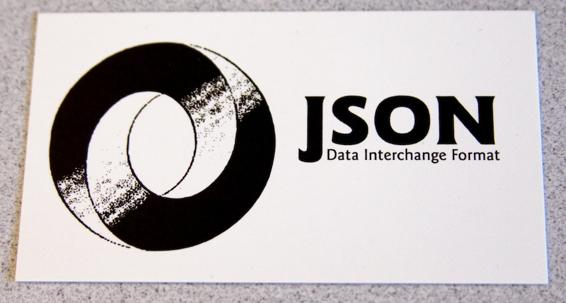
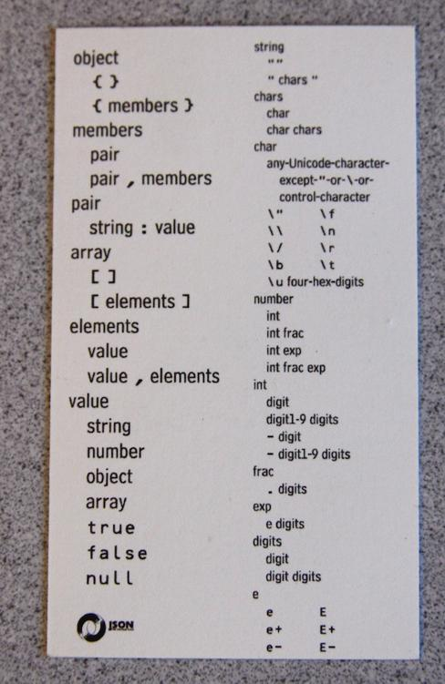

# 第二十二章：JSON

> 原文：[22. JSON](https://exploringjs.com/es5/ch22.html)
> 
> 译者：[飞龙](https://github.com/wizardforcel)
> 
> 协议：[CC BY-NC-SA 4.0](https://creativecommons.org/licenses/by-nc-sa/4.0/)

JSON（JavaScript 对象表示）是一种用于数据存储的纯文本格式。它已经成为 Web 服务、配置文件等数据交换格式的一种流行选择。ECMAScript 5 有一个 API，用于将 JSON 格式的字符串转换为 JavaScript 值（*解析*）以及反之（*字符串化*）。


## 背景


本节解释了 JSON 是什么以及它是如何创建的。

### 数据格式

JSON 将数据存储为纯文本。它的语法是 JavaScript 表达式语法的子集。例如：

```js
{
    "first": "Jane",
    "last": "Porter",
    "married": true,
    "born": 1890,
    "friends": [ "Tarzan", "Cheeta" ]
}
```

JSON 使用 JavaScript 表达式中的以下结构:

复合

JSON 数据的对象和 JSON 数据的数组

原子

字符串、数字、布尔值和空值


它遵循以下规则：

+   字符串必须始终用双引号括起来；例如，像`'mystr'`这样的字符串字面量是非法的。

+   属性键必须用双引号括起来

## 历史

Douglas Crockford 于 2001 年发现了 JSON。他给它起了个名字，并在[`json.org`](http://json.org)上发布了一个规范：

> 我发现了 JSON。我不主张发明 JSON，因为它已经存在于自然界中。我所做的是发现它，我给它起了名字，我描述了它的有用之处。我不主张自己是第一个发现它的人；我知道至少有其他人在我之前至少一年发现了它。我发现的最早的情况是，Netscape 有人在至少 1996 年就开始使用 JavaScript 数组文字进行数据通信，而这至少比我想到这个想法早了五年。

最初，Crockford 希望 JSON 有一个名字叫*JavaScript 标记语言*，但是 JSML 的首字母缩写已经被[JSpeech 标记语言](http://www.w3.org/TR/jsml/)使用了。

JSON 规范已经被翻译成许多人类语言，现在有许多编程语言的库支持解析和生成 JSON。


## 语法

Douglas Crockford 创建了一张 JSON 名片，正面有一个徽标（参见图 22-1），背面有完整的语法（参见图 22-2）。这使得 JSON 的简单性在视觉上显而易见。

图 22-1：JSON 名片的正面显示了一个徽标（来源：[Eric Miraglia](http://www.flickr.com/photos/equanimity/3762360637/)）。


图 22-2：JSON 名片的背面包含完整的语法（来源：[Eric Miraglia](http://www.flickr.com/photos/equanimity/3763158824/)）。

语法可以转录如下:

```js
object
    { }
    { members }

members
    pair
    pair , members

pair
    string : value
    array
    [ ]
    [ elements ]

elements
    value
    value , elements

value
    string
    number
    object
    array
    true
    false
    null

string
    ""
    " chars "

chars
    char
    char chars

char
    any-Unicode-character-except-"-or-\-or-control-character
    \" \\ \/ \b \f \n \r \t
    \u four-hex-digits

number
    int
    int frac
    int exp
    int frac exp

int
    digit
    digit1-9 digits
    - digit
    - digit1-9 digits

frac
    . digits
    exp
    e digits

digits
    digit
    digit digits

e
    e e+ e-
    E E+ E-
```

全局变量`JSON`用作生成和解析带有 JSON 数据的字符串的函数的命名空间。

## JSON.stringify(value, replacer?, space?)

`JSON.stringify(value, replacer?, space?)`将 JavaScript 值`value`转换为 JSON 格式的字符串。它有两个可选参数。

可选参数`replacer`用于在对其进行字符串化之前更改`value`。它可以是：

+   一个*节点访问者*（参见[通过节点访问者转换数据](ch22.html#node_visitors "通过节点访问者转换数据")）在将其字符串化之前转换值树。例如：

    ```js
    function replacer(key, value) {
        if (typeof value === 'number') {
            value = 2 * value;
        }
        return value;
    }
    ```

使用 replacer：

```js
> JSON.stringify({ a: 5, b: [ 2, 8 ] }, replacer)
'{"a":10,"b":[4,16]}'
```

+   隐藏所有不在列表中的属性键（非数组对象的属性）的属性白名单。例如：

    ```js
    > JSON.stringify({foo: 1, bar: {foo: 1, bar: 1}}, ['bar'])
    '{"bar":{"bar":1}}'
    ```

白名单对数组没有影响：

```js
> JSON.stringify(['a', 'b'], ['0'])
'["a","b"]'
```

可选参数`space`影响输出的格式。如果没有这个参数，`stringify`的结果将是单行文本：

```js
> console.log(JSON.stringify({a: 0, b: ['\n']}))
{"a":0,"b":["\n"]}
```

使用它，可以插入换行符，并且通过数组和对象的每个嵌套级别增加缩进。有两种指定缩进方式的方法：

一个数字

将数字乘以缩进级别并将行缩进为相同数量的空格。小于 0 的数字被解释为 0；大于 10 的数字被解释为 10：

```js
> console.log(JSON.stringify({a: 0, b: ['\n']}, null, 2))
{
  "a": 0,
  "b": [
    "\n"
  ]
}
```

一个字符串

要缩进，重复给定的字符串以表示每个缩进级别。只使用字符串的前 10 个字符：

```js
> console.log(JSON.stringify({a: 0, b: ['\n']}, null, '|--'))
{
|--"a": 0,
|--"b": [
|--|--"\n"
|--]
}
```

因此，以下对`JSON.stringify()`的调用会将对象打印为一个格式良好的树：

```js
JSON.stringify(data, null, 4)
```

### JSON.stringify()忽略的数据

在对象中，`JSON.stringify()`只考虑可枚举的自有属性（参见[属性特性和属性描述符](ch17_split_000.html#property_attributes "属性特性和属性描述符")）。以下示例演示了忽略了不可枚举的自有属性`obj.foo`：

```js
> var obj = Object.defineProperty({}, 'foo', { enumerable: false, value: 7 });
> Object.getOwnPropertyNames(obj)
[ 'foo' ]
> obj.foo
7
> JSON.stringify(obj)
'{}'
```

`JSON.stringify()`处理不受 JSON 支持的值（例如函数和`undefined`）的方式取决于它们遇到的位置。不支持的值本身导致`stringify()`返回`undefined`而不是字符串：

```js
> JSON.stringify(function () {})
undefined
```

其值不受支持的属性将被简单地忽略：

```js
> JSON.stringify({ foo: function () {} })
'{}'
```

数组中不支持的值将被字符串化为`null`：

```js
> JSON.stringify([ function () {} ])
'[null]'
```

### toJSON()方法

如果`JSON.stringify()`遇到具有`toJSON`方法的对象，则使用该方法获取要字符串化的值。例如：

```js
> JSON.stringify({ toJSON: function () { return 'Cool' } })
'"Cool"'
```

日期已经有一个产生 ISO 8601 日期字符串的`toJSON`方法：

```js
> JSON.stringify(new Date('2011-07-29'))
'"2011-07-28T22:00:00.000Z"'
```

`toJSON`方法的完整签名如下：

```js
function (key)
```

`key`参数允许您根据上下文以不同方式进行字符串化。它始终是一个字符串，并指示在父对象中找到您的对象的位置：

根位置

空字符串

属性值

属性键

数组元素

元素的索引作为字符串

我将通过以下对象演示`toJSON()`：

```js
var obj = {
    toJSON: function (key) {
        // Use JSON.stringify for nicer-looking output
        console.log(JSON.stringify(key));
        return 0;
    }
};
```

如果使用`JSON.stringify()`，则每次出现`obj`都会被替换为`0`。通知`toJSON()`方法在属性键`'foo'`和数组索引 0 处遇到了`obj`：

```js
> JSON.stringify({ foo: obj, bar: [ obj ]})
"foo"
"0"
'{"foo":0,"bar":[0]}'
```

内置的`toJSON()`方法如下：

+   `Boolean.prototype.toJSON()`

+   `Number.prototype.toJSON()`

+   `String.prototype.toJSON()`

+   `Date.prototype.toJSON()`

## JSON.parse(text, reviver?)

`JSON.parse(text, reviver?)`解析`text`中的 JSON 数据并返回 JavaScript 值。以下是一些示例：

```js
> JSON.parse("'String'") // illegal quotes
SyntaxError: Unexpected token ILLEGAL
> JSON.parse('"String"')
'String'
> JSON.parse('123')
123
> JSON.parse('[1, 2, 3]')
[ 1, 2, 3 ]
> JSON.parse('{ "hello": 123, "world": 456 }')
{ hello: 123, world: 456 }
```

可选参数`reviver`是一个*节点访问者*（参见[通过节点访问者转换数据](ch22.html#node_visitors "通过节点访问者转换数据")），可用于转换解析后的数据。在此示例中，我们将日期字符串转换为日期对象：

```js
function dateReviver(key, value) {
    if (typeof value === 'string') {
        var x = Date.parse(value);
        if (!isNaN(x)) { // valid date string?
            return new Date(x);
        }
    }
    return value;
}
```

以下是交互：

```js
> var str = '{ "name": "John", "birth": "2011-07-28T22:00:00.000Z" }';
> JSON.parse(str, dateReviver)
{ name: 'John', birth: Thu, 28 Jul 2011 22:00:00 GMT }
```

## 通过节点访问者转换数据

`JSON.stringify()`和`JSON.parse()`都允许您通过传递函数来转换 JavaScript 数据：

+   `JSON.stringify()`允许您在将其转换为 JSON 之前更改 JavaScript 数据。

+   `JSON.parse()`解析 JSON，然后让您对生成的 JavaScript 数据进行后处理。

JavaScript 数据是一个树，其复合节点是数组和对象，其叶子是原始值（布尔值，数字，字符串，`null`）。让我们将传递的转换函数称为*节点访问者*。这些方法遍历树并为每个节点调用访问者。然后可以选择替换或删除节点。节点访问者的签名如下：

```js
function nodeVisitor(key, value)
```

参数是：

`this`

当前节点的父节点。

`key`

当前节点位于其父节点内的键。`key` 总是一个字符串。

`值`

当前节点。

根节点 `root` 没有父节点。当访问 `root` 时，为其创建了一个伪父节点，并且参数具有以下值：

+   `this` 是 `{ '': root }`。

+   `key` 是 `''`。

+   `value` 是 `root`。

节点访问者有三种返回值的选项：

+   返回 `value`，然后不执行任何更改。

+   返回不同的值。然后当前节点被替换。

+   返回 `undefined`。然后移除节点。

以下是节点访问者的示例。它记录了传递给它的值。

```js
function nodeVisitor(key, value) {
    console.log([
        // Use JSON.stringify for nicer-looking output
        JSON.stringify(this), // parent
        JSON.stringify(key),
        JSON.stringify(value)
    ].join(' # '));
    return value; // don't change node
}
```

让我们使用此函数来检查 JSON 方法如何迭代 JavaScript 数据。

### JSON.stringify()

特殊的根节点首先出现在前缀迭代中（父节点在子节点之前）。访问的第一个节点始终是伪根。在每次调用后显示的最后一行是 `stringify()` 返回的字符串：

```js
> JSON.stringify(['a','b'], nodeVisitor)
{"":["a","b"]} # "" # ["a","b"]
["a","b"] # "0" # "a"
["a","b"] # "1" # "b"
'["a","b"]'

> JSON.stringify({a:1, b:2}, nodeVisitor)
{"":{"a":1,"b":2}} # "" # {"a":1,"b":2}
{"a":1,"b":2} # "a" # 1
{"a":1,"b":2} # "b" # 2
'{"a":1,"b":2}'

> JSON.stringify('abc', nodeVisitor)
{"":"abc"} # "" # "abc"
'"abc"'
```

### JSON.parse()

首先是叶子节点，在后缀迭代中（子节点在父节点之前）。访问的最后一个节点始终是伪根。在每次调用后显示的最后一行是 `parse()` 返回的 JavaScript 值：

```js
> JSON.parse('["a","b"]', nodeVisitor)
["a","b"] # "0" # "a"
["a","b"] # "1" # "b"
{"":["a","b"]} # "" # ["a","b"]
[ 'a', 'b' ]

> JSON.parse('{"a":1, "b":2}', nodeVisitor)
{"a":1,"b":2} # "a" # 1
{"a":1,"b":2} # "b" # 2
{"":{"a":1,"b":2}} # "" # {"a":1,"b":2}
{ a: 1, b: 2 }

> JSON.parse('"hello"', nodeVisitor)
{"":"hello"} # "" # "hello"
'hello'
```

