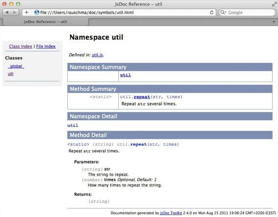

# 第二十九章：JSDoc：生成 API 文档

> 原文：[29. JSDoc: Generating API Documentation](https://exploringjs.com/es5/ch29.html)
> 
> 译者：[飞龙](https://github.com/wizardforcel)
> 
> 协议：[CC BY-NC-SA 4.0](https://creativecommons.org/licenses/by-nc-sa/4.0/)


这是一个常见的开发问题：您已经编写了 JavaScript 代码，其他人需要使用它，并且需要一个漂亮的 HTML 文档来描述其 API。在 JavaScript 世界中生成 API 文档的事实标准工具是[*JSDoc*](http://usejsdoc.org)。²¹ 它是模仿其 Java 模拟品 JavaDoc 而建立的。

JSDoc 接受带有`/** */`注释的 JavaScript 代码（以星号开头的普通块注释）并为其生成 HTML 文档。例如，给定以下代码：

```js
/** @namespace */
var util = {
    /**
 * Repeat <tt>str</tt> several times.
 * @param {string} str The string to repeat.
 * @param {number} [times=1] How many times to repeat the string.
 * @returns {string}
 */
    repeat: function(str, times) {
        if (times === undefined || times < 1) {
            times = 1;
        }
        return new Array(times+1).join(str);
    }
};
```

生成的 HTML 在 Web 浏览器中显示如[图 29-1](ch29.html#figjsdoc_screen "图 29-1. JSDoc 生成的 HTML 输出。")所示。



图 29-1. JSDoc 生成的 HTML 输出。

JSDoc 网站上的[自述文件](http://usejsdoc.org/about-jsdoc3.html)解释了如何安装和调用这个工具。

## JSDoc 的基础知识

JSDoc 的全部内容都是关于文档化*实体*（函数、方法、构造函数等）。这是通过在实体之前的注释中实现的，这些注释以`/**`开头。

### 语法

让我们回顾一下开头显示的注释：

```js
/**
 * Repeat <tt>str</tt> several times.
 * @param {string} str The string to repeat.
 * @param {number} [times=1] How many times to repeat the string.
 * @returns {string}
 */
```

这演示了一些 JSDoc 的语法，包括以下部分：

JSDoc 注释

这是一个 JavaScript 块注释，其第一个字符是星号。这会产生一个假象，即`/**`标记开始了这样的注释。

标签

您可以通过以@符号为前缀的*标签*开始行来构造注释。在前面的代码中，`@param`就是一个例子。

HTML

您可以在 JSDoc 注释中自由使用 HTML。例如，`<tt>`显示单词的等宽字体。

类型注释

您可以通过大括号中的类型名称来记录实体的类型。变化包括：

+   单一类型：`@param {string} name`

+   多种类型：`@param {string|number} idCode`

+   类型为数组：`@param {string[]} names`

名称路径

在 JSDoc 注释中，所谓的*namepaths*用于引用实体。这些路径的语法如下：

```js
myFunction
MyClass
MyClass.staticMember
MyClass#instanceMember
```

*类*通常（由）构造函数实现。静态成员是构造函数的属性。JSDoc 对*实例成员*有一个广泛的定义。它意味着可以通过实例访问的一切。因此，实例成员包括实例属性和原型属性。

### 命名类型

实体的类型要么是基本类型，要么是类。前者的名称总是以小写字母开头；后者的名称总是以大写字母开头。换句话说，基本类型的类型名称是`boolean`、`number`和`string`，就像`typeof`运算符返回的结果一样。这样，您就不会混淆字符串（基本类型）和构造函数`String`的实例（对象）。

## 基本标签

以下是基本的元数据标签：

`@fileOverview description`

标记描述整个文件的 JSDoc 注释。例如：

```js
/**
 * @fileOverview Various tool functions.
 * @author <a href="mailto:jd@example.com">John Doe</a>
 * @version 3.1.2
 */
```

`@author`

指的是谁编写了正在被记录的实体。

`@deprecated`

指示实体不再受支持。记录应该使用什么是一个很好的做法。

`@example`

包含一个代码示例，说明给定的实体应该如何使用：

```js
/**
 * @example
 * var str = 'abc';
 * console.log(repeat(str, 3)); // abcabcabc
 */
```

用于链接的基本标签如下：

`@see`

指向相关资源：

```js
/**
 * @see MyConstructor#myMethod
 * @see The <a href="http://example.com">Example Project</a>.
 */
```

`{@link ...}`

像`@see`一样工作，但可以在其他标签内使用。

`@requires resourceDescription`

指示文档实体需要的资源。资源描述可以是名称路径或自然语言描述。

版本标签包括以下内容：

`@version versionNumber`

指示文档实体的版本。例如：

```js
@version 10.3.1
```

`@since versionNumber`

指示文档实体可用的版本。例如：

```js
@since 10.2.0
```

## 文档化函数和方法

对于函数和方法，您可以记录参数、返回值和可能抛出的异常：

`@param {paramType} paramName description`

描述了参数的名称为`paramName`。类型和描述是可选的。以下是一些例子：

```js
@param str The string to repeat.
@param {string} str
@param {string} str The string to repeat.
```

高级特性：

+   可选参数：

    ```js
    @param {number} [times] The number of times is optional.
    ```

+   带有默认值的可选参数：

    ```js
    @param {number} [times=1] The number of times is optional.
    ```

`@returns {returnType} description`

描述函数或方法的返回值。类型或描述可以省略。

`@throws {exceptionType} description`

描述在函数或方法执行过程中可能抛出的异常。类型或描述可以省略。

## 内联类型信息（“内联文档注释”）

为参数和返回值提供类型信息有两种方式。首先，您可以在`@param`和`@returns`中添加类型注释：

```js
/**
 * @param {String} name
 * @returns {Object}
 */
function getPerson(name) {
}
```

其次，您可以内联类型信息：

```js
function getPerson(/**String*/ name) /**Object*/ {
}
```

## 记录变量、参数和实例属性

以下标签用于记录变量、参数和实例属性：

`@type {typeName}`

所记录的变量的类型是什么？例如：

```js
/** @type {number} */
var carCounter = 0;
```

此标签也可用于记录函数的返回类型，但在这种情况下，`@returns`更可取。

`@constant`

指示所记录的变量具有常量值的标志。

```js
/** @constant */
var FORD = 'Ford';
```

`@property {propType} propKey description`

在构造函数注释中记录实例属性。例如：

```js
/**
 * @constructor
 * @property {string} name The name of the person.
 */
function Person(name) {
    this.name = name;
}
```

另外，实例属性可以如下记录：

```js
/**
 * @class
 */
function Person(name) {
    /**
 * The name of the person.
 * @type {string}
 */
    this.name = name;
}
```

使用哪种风格取决于个人偏好。

`@default defaultValue`

参数或实例属性的默认值是什么？例如：

```js
/** @constructor */
function Page(title) {
    /**
 * @default 'Untitled'
 */
     this.title = title || 'Untitled';
}
```

## 记录类

JSDoc 区分类和构造函数。前者更像是一种类型，而构造函数是实现类的一种方式。JavaScript 内置的定义类的方法有限，这就是为什么有许多 API 来帮助完成这个任务。这些 API 有所不同，通常差异很大，因此您必须帮助 JSDoc 弄清楚发生了什么。以下标签让您可以做到这一点：

`@constructor`

将函数标记为构造函数。

`@class`

将变量或函数标记为类。在后一种情况下，`@class`是`@constructor`的同义词。

`@constructs`

记录方法设置实例数据。如果存在这样的方法，则在该类中记录。

`@lends namePath`

指定以下对象文字贡献给哪个类。有两种贡献的方式。

+   `@lends Person#`：对象文字为`Person`贡献实例成员。

+   `@lends Person`：对象文字为`Person`贡献静态成员。

`@memberof parentNamePath`

所记录的实体是指定对象的成员。`@lends MyClass#`，应用于对象文字，与使用`@memberof MyClass#`标记该文字的每个属性具有相同的效果。

定义类最常见的方式是：通过构造函数、通过对象文字以及通过具有`@constructs`方法的对象文字。

### 通过构造函数定义类

要通过构造函数定义类，必须标记构造函数；否则，它将不会被文档化为类。仅仅大小写不足以标记函数为构造函数：

```js
/**
 * A class for managing persons.
 * @constructor
 */
function Person(name) {
}
```

### 通过对象文字定义类

要通过对象文字定义类，需要两个标记。首先，您需要告诉 JSDoc 给定的变量持有一个类。其次，您需要标记一个对象文字为定义类。您可以通过`@lends`标签来实现后者：

```js
/**
 * A class for managing persons.
 * @class
 */
var Person = makeClass(
    /** @lends Person# */
    {
        say: function(message) {
            return 'This person says: ' + message;
        }
    }
);
```

### 通过具有@constructs 方法的对象文字定义类

如果对象文字有一个`@constructs`方法，您需要告诉 JSDoc 关于它，这样它才能找到实例属性的文档。类的文档移到该方法中：

```js
var Person = makeClass(
    /** @lends Person# */
    {
        /**
 * A class for managing persons.
 * @constructs
 */
        initialize: function(name) {
            this.name = name;
        },
        say: function(message) {
            return this.name + ' says: ' + message;
        }
    }
);
```

如果省略`@lends`，则必须指定方法属于哪个类：

```js
var Person = makeClass({
        /**
 * A class for managing persons.
 * @constructs Person
 */
        initialize: function(name) {
            this.name = name;
        },
        /** @memberof Person# */
        say: function(message) {
            return this.name + ' says: ' + message;
        }
    }
);
```

### 子类化

JavaScript 没有内置的子类化支持。当您在代码中进行子类化（无论是手动还是通过库），您必须告诉 JSDoc 发生了什么：

`@extends namePath`

指示所记录的类是另一个类的子类的标志。例如：

```js
/**
 * @constructor
 * @extends Person
 */
function Programmer(name) {
    Person.call(this, name);
    ...
}
// Remaining code for subclassing omitted
```

## 其他有用的标签

所有这些标签都在[JSDoc 网站](http://usejsdoc.org/)上有文档：

+   模块化：`@module`，`@exports`，`@namespace`

+   自定义类型（用于虚拟实体，如回调，其签名可以由您记录）：`@typedef`，`@callback`

+   法律事务：`@copyright`，`@license`

+   各种对象：`@mixin`，`@enum`

* * *

²¹ JSDoc 网站是本章的主要来源；其中一些示例是从该网站借用的。

